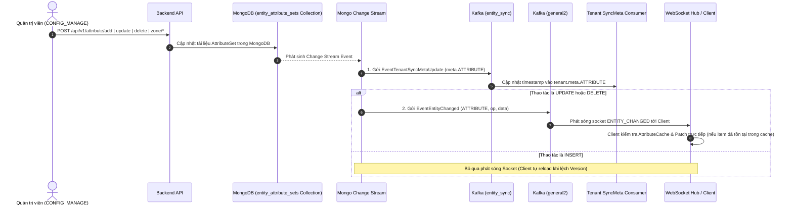

# Attribute Management Workflow Documentation

Tài liệu này đặc tả toàn bộ quy trình nghiệp vụ (Business Rules), luồng xử lý (Step-by-Step Flow), sơ đồ Mermaid và đặc tả API của phân hệ **Bộ Thuộc Tính Động (Module Attribute Set Module)** trong hệ thống Sowfkun-Verse.

---

## 1. Tổng quan & Quy tắc Nghiệp vụ Đặc thù (Business Rules)

### 1.1 Mục đích & Kiến trúc Thuộc Tính Động (Dynamic Attribute Sets)
- Cho phép mỗi Tenant linh hoạt cấu hình các trường dữ liệu tùy biến (Custom Fields / Dynamic Attributes) theo từng thực thể (`CUSTOMER`, `TICKET`, v.v.).
- Mỗi thực thể sở hữu một tài liệu `ModuleAttributeSet` gồm:
  - **Zones (`map[string]Zone`)**: Các khu vực hiển thị (như General Info, Extended Info).
  - **Attributes (`map[string]AttributeDetail`)**: Các trường dữ liệu động với các kiểu dữ liệu (`TEXT`, `NUMBER`, `DATETIME`, `SELECT`, v.v.) được ánh xạ vào từng Slot cố định (`t1`..`t10`, `n1`..`n10`, v.v.).

### 1.2 Chốt chặn Phân quyền (Authorization Barrier)
- **API Thay Đổi Cấu Hình (CUD - Add/Update/Delete Attribute/Zone)**: Bắt buộc đi qua kiểm tra quyền `CONFIG_MANAGE` thông qua `RequirePermission(string(roleDomain.PermConfigManage))`.
- **API Đọc Dữ Liệu (Read/Options/Set)**: Xác thực đăng nhập `RequireAuth` (công khai cho toàn bộ nhân sự trong Tenant để dựng Form động).

### 1.3 Quy tắc Options API (Golden Standard)
- **Endpoint**: `GET /api/v1/attribute/list-for-options`.
- **Query Parameters**: `?page=1&size=100` (không bắt buộc).
- **Không Filter Nghiệp Vụ**: Lấy toàn bộ các bộ thuộc tính đã cấu hình của Tenant.
- **Hardcoded Projection**: Ép cứng Projection tại Controller:
  ```go
  req.Projection = map[string]any{
      "entity_type": 1,
      "zones":       1,
      "attributes":  1,
  }
  ```
- **Đóng gói Response DTO**: Trả về `[]dto.AttributeSetResponse`, tuyệt đối không rò rỉ Domain Entity.

### 1.4 Cơ chế Đồng bộ Real-time & Invalidation (Kafka & WebSocket)
- **Kafka `entity_sync`**: Khi có bất kỳ thay đổi nào (`insert`, `update`, `delete`), Change Stream kích hoạt gửi sự kiện `EventTenantSyncMetaUpdate` (`entity_type = "ATTRIBUTE"`) sang Tenant module để cập nhật `tenant.meta.ATTRIBUTE = nowMs`.
- **WebSocket `general2` (Granular Realtime Patching)**:
  - Khi thao tác là `UPDATE` hoặc `DELETE`: Phát sóng sự kiện `ENTITY_CHANGED` (`entity_type = "ATTRIBUTE"`) về Client kèm dữ liệu mới để Client cập nhật trực tiếp vào `AttributeCache`.
  - Khi thao tác là `INSERT`: **Bỏ qua phát sóng Socket** để tối ưu hóa mạng (Client tự động reload khi phát hiện lệch `meta.ATTRIBUTE`).

---

## 2. Quy trình Từng bước (Step-by-Step Flow)



---

## 3. Đặc tả Kỹ thuật API (API Specification)

### 3.1 `GET /api/v1/attribute/list-for-options`
- **Mô tả**: Lấy danh sách toàn bộ Set thuộc tính động của Tenant để nạp Local Cache.
- **Headers**: `Authorization: Bearer <token>`
- **Query Params**: `page` (int, default 1), `size` (int, default 100)
- **Response `200 OK`**:
  ```json
  {
    "code": 200,
    "message": "success",
    "data": [
      {
        "id": "65c1234567890abcdef12346",
        "entity_type": "CUSTOMER",
        "zones": {
          "general": {
            "id": "general",
            "label": { "vi": "Thông tin chung", "en": "General Info" },
            "order": 1
          }
        },
        "attributes": {
          "t1": {
            "slot": "t1",
            "label": { "vi": "Mã số thuế", "en": "Tax Code" },
            "data_type": "TEXT",
            "status": "ACTIVE",
            "zid": "general"
          }
        }
      }
    ]
  }
  ```

### 3.2 `GET /api/v1/attribute/set?entity_type={CUSTOMER}`
- **Mô tả**: Lấy chi tiết bộ thuộc tính của 1 thực thể cụ thể.
- **Headers**: `Authorization: Bearer <token>`
- **Query Params**: `entity_type` (e.g. `CUSTOMER`, `TICKET`)

### 3.3 `POST /api/v1/attribute/add`
- **Mô tả**: Thêm mới một thuộc tính vào Slot trống của thực thể.
- **Headers**: `Authorization: Bearer <token>`
- **Request Body**:
  ```json
  {
    "entity_type": "CUSTOMER",
    "label": { "vi": "Mã số thuế", "en": "Tax Code" },
    "data_type": "TEXT",
    "zid": "general"
  }
  ```

### 3.4 `POST /api/v1/attribute/update`
- **Mô tả**: Cập nhật nhãn, tùy chọn hoặc trạng thái của một trường thuộc tính.
- **Headers**: `Authorization: Bearer <token>`
- **Request Body**:
  ```json
  {
    "id": "65c1234567890abcdef12346",
    "slot": "t1",
    "label": { "vi": "Mã số thuế Doanh nghiệp", "en": "Corporate Tax Code" }
  }
  ```

---

## 4. Các Mã Lỗi Thường Gặp (Common Error Codes)

| HTTP Status | Mã Lỗi (`error_code`) | Ý nghĩa & Hướng xử lý |
| :--- | :--- | :--- |
| `400 Bad Request` | `ERR_BAD_REQUEST` | Payload không hợp lệ hoặc thiếu `entity_type`. |
| `401 Unauthorized` | `ERR_UNAUTHORIZED` | Token JWT thiếu, hết hạn hoặc không hợp lệ. |
| `403 Forbidden` | `ERR_FORBIDDEN` | Tài khoản thiếu quyền `CONFIG_MANAGE`. |
| `404 Not Found` | `ERR_NOT_FOUND` | Không tìm thấy bộ thuộc tính hoặc Zone/Slot chỉ định. |
| `409 Conflict` | `ERR_DUPLICATE_KEY` | Slot thuộc tính đã bị chiếm dụng hoặc trùng ID Zone. |
| `422 Unprocessable` | `ERR_VALIDATION_FAILED` | Kiểu dữ liệu hoặc cấu hình validation của thuộc tính không hợp lệ. |
| `500 Internal Error` | `ERR_INTERNAL_SERVER` | Lỗi kết nối cơ sở dữ liệu MongoDB. |
