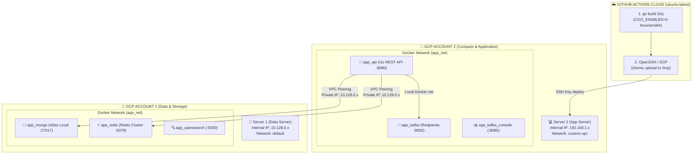

# GCP Multi-Server Deployment & VPC Peering Architecture

Tài liệu đặc tả kiến trúc triển khai hệ thống Backend API và Hạ tầng dữ liệu trên nền tảng Google Cloud Platform (GCP) với mô hình **Multi-Account / Multi-Server**, kết hợp **GitHub Actions Cloud Build CI/CD** và **VPC Network Peering** an toàn.

---

## 1. Tổng Quan Kiến Trúc Hạ Tầng (Architecture Overview)

Hệ thống được phân tách độc lập thành 2 máy chủ ảo (Compute Engine VMs) nhằm tối ưu tài nguyên và đảm bảo tính cách ly:



---

## 2. Quy Chuẩn Triển Khai & Biến Môi Trường (Golden Rules)

1. **Single-line Compact Base64 Standard:**
   * Mọi giá trị khóa bảo mật đa dòng (RSA Private Key, RSA Public Key, Certificates) trong file `.env` **BẮT BUỘC** phải được mã hóa thành 1 dòng Base64 duy nhất (`Single-line Compact Base64`), không chứa ký tự xuống dòng `\n` để tránh lỗi parse của Docker Compose.
2. **Profile-Based Resource Templates:**
   * Mỗi service sở hữu 3 file profile mẫu: `.env.mini` (1-2GB RAM), `.env.standard` (4-8GB RAM), `.env.huge` (16GB+ RAM).
   * Script `bootstrap.sh` tự động nạp cấu hình `cp .env.$PROFILE .env` mà không hardcode các thông số trong mã nguồn bash.
3. **Off Public Internet (Zero-Trust Security):**
   * Toàn bộ các cổng dịch vụ dữ liệu (`27017`, `6379`, `9092`, `9200`) **TUYỆT ĐỐI KHÔNG** mở ra ngoài Internet (`0.0.0.0/0`).
   * Chỉ cho phép truy cập qua dải IP nội bộ được ghép nối bởi VPC Peering (`192.168.1.0/24`).

---

## 3. Quy Trình Thiết Lập VPC Peering & Firewall (Step-by-Step)

### Bước 1: Khắc Phục Xung Đột CIDR Bằng Custom VPC (Tại Server 2)
Do mạng `default` của GCP tự động chiếm trước dải `10.128.0.0/9` cho tất cả các vùng trên toàn cầu, kết nối Peering giữa 2 mạng `default` sẽ bị báo lỗi trùng IP.
* **Giải pháp:** Tạo mạng VPC Custom mới trên Account 2 với dải IP riêng biệt:
  * **VPC Name:** `custom-vpc`
  * **Subnet Name:** `subnet-us-central1`
  * **Region:** `us-central1`
  * **IPv4 Range:** `192.168.1.0/24` (chuẩn RFC 1918 không bao giờ xung đột với GCP).

### Bước 2: Thiết Lập Kết Nối 2 Chiều (2-Way VPC Network Peering)
1. **Trên Project 1 (Server 1 Data):**
   * Vào `VPC network` ➡️ `VPC network peering` ➡️ `Create Connection`.
   * Tên: `peer-to-project-2` | VPC: `default`.
   * Peered project ID: *[Project ID của Account 2]* | Peered VPC: `custom-vpc`.
2. **Trên Project 2 (Server 2 App):**
   * Vào `VPC network` ➡️ `VPC network peering` ➡️ `Create Connection`.
   * Tên: `peer-to-project-1` | VPC: `custom-vpc`.
   * Peered project ID: *[Project ID của Account 1]* | Peered VPC: `default`.
3. **Kết quả:** Trạng thái chuyển sang **Active (Màu xanh lá)** ở cả 2 bên.

### Bước 3: Cấu Hình Firewall Rules Chuẩn Zero-Trust & IAP
* **Project 1 (Server 1 Data: `data-server-vpc`):**
  * `data-vpc-allow-ingress-peer-app`: Mở cổng `27017, 6379, 9092, 9200` cho App Subnet (`10.20.0.0/24`).
  * `data-vpc-allow-ingress-iap`: Mở cổng `22, 27017, 6379, 9200, 3000` cho Google IAP (`35.235.240.0/20`).
  * `data-vpc-allow-egress-peer-app`: Mở Egress phản hồi cho App Subnet (`Priority 900`).
  * `data-vpc-allow-egress-iap`: Mở Egress phản hồi cho Google IAP (`Priority 900`).
  * `data-vpc-allow-egress-ntp-dns`: Mở Egress UDP `53` (DNS) và UDP `123` (NTP) đến Google Internal Resolver (`169.254.169.254/32`) và Time Server (`216.239.35.0/24`) với `Priority 900` để đồng bộ giờ UTC tuyệt đối.
  * `data-vpc-deny-egress-internet`: Khóa cứng Egress Internet `0.0.0.0/0` (`Priority 1000`) chống Reverse Shell và rò rỉ dữ liệu.
* **Project 2 (Server 2 App: `app-server-vpc`):**
  * `app-vpc-allow-ingress-public`: Mở Public Web `80, 443, 8080, 8085`.
  * `app-vpc-allow-ingress-iap`: Mở SSH `22`, API `8080`, Console `8085`, Kafka `9092, 9094` cho Google IAP (`35.235.240.0/20`).
  * `app-vpc-allow-egress-peer-data`: Mở Egress sang Data Subnet `10.10.0.0/24` (`Priority 900`).
  * `app-vpc-allow-egress-iap`: Mở Egress phản hồi cho Google IAP (`Priority 900`).
  * `app-vpc-allow-egress-ntp-dns`: Mở Egress UDP `53` (DNS) và UDP `123` (NTP) đến Google Time Server/DNS (`Priority 900`) để đồng bộ giờ UTC.
  * `app-vpc-deny-egress-internet`: Khóa cứng Egress Internet `0.0.0.0/0` (`Priority 1000`).

---

## 4. Tự Động Hóa CI/CD Với GitHub Actions Cloud Build

Quy trình phát triển và phát hành phiên bản được tự động hóa 100% qua GitHub Actions:

### 4.1. Cấu Hình Secrets (GitHub Repository)
Thêm 3 Secrets tại `Settings -> Secrets and variables -> Actions`:
* `SERVER_HOST`: IP Public của Server 2 (ví dụ: `35.209.234.134`).
* `SERVER_USER`: Username SSH (ví dụ: `sowfkun`).
* `SSH_PRIVATE_KEY`: Nội dung OpenSSH Private Key kết nối vào máy chủ.

### 4.2. Luồng Thực Thi CI/CD (Workflow Lifecycle)
1. **Nhánh `dev` (Auto Deploy):**
   * Kích hoạt tự động mỗi khi `git push origin dev`.
   * GitHub Cloud Runner (`ubuntu-latest`) biên dịch Go API tĩnh siêu tốc (~5 giây) với `CGO_ENABLED=0 GOOS=linux GOARCH=amd64`.
   * Tải file binary `app-api` sang `/tmp/app-api-new` trên Server 2 qua SCP.
   * Thực hiện hoán đổi file nguyên tử và khởi động lại container:
     ```bash
     sudo docker compose stop api
     mv -f /tmp/app-api-new /home/sowfkun/infrastructure/api/app-api
     chmod +x /home/sowfkun/infrastructure/api/app-api
     sudo docker compose up -d api
     ```
2. **Nhánh `master` (Manual Production Release):**
   * Sử dụng workflow `deploy-prod.yml` với cơ chế xác nhận an toàn `workflow_dispatch` (yêu cầu gõ chữ `DEPLOY` để phê duyệt).
3. **Health Check Xác Thực:**
   * Sau khi khởi động, quy trình kiểm tra sức khỏe tự động qua endpoint:
     ```bash
     curl -s -f http://localhost:8080/api/v1/security/public-key
     ```
   * Trả về HTTP `200 OK` kèm RSA Public Key chứng minh router HTTP, bảo mật E2EE và kết nối Redis/DB đã hoạt động hoàn hảo.
