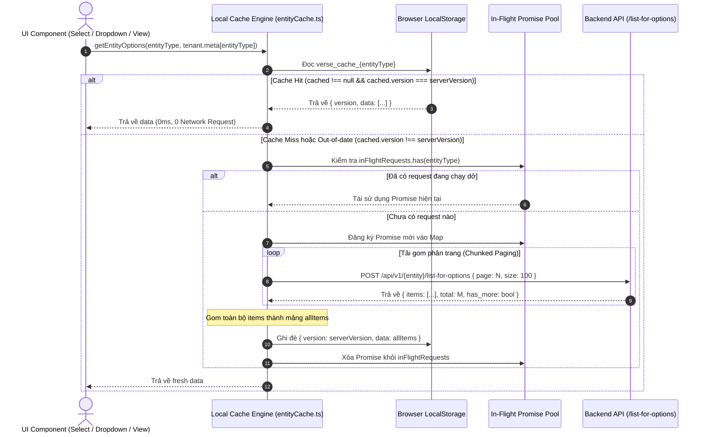
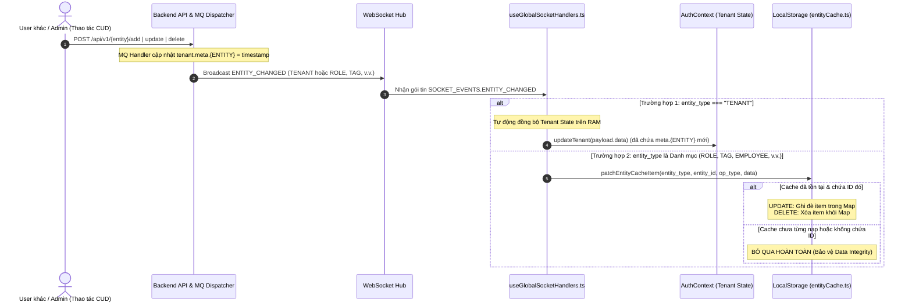

# Tài Liệu Đặc Tả Quy Trình Local Caching & Đồng Bộ Dữ Liệu Thời Gian Thực (Frontend Local Caching & Realtime Sync Specification)

Tài liệu này đặc tả toàn bộ kiến trúc, cơ chế Lazy Loading (On-Demand), so khớp phiên bản (Strict Equality Versioning), chống trùng lặp request (Request Deduping), cơ chế tải phân trang an toàn (Chunked Paging) và đồng bộ thời gian thực qua WebSocket cho các danh mục dữ liệu phía Frontend trong hệ thống Sowfkun-Verse.

---

## 1. Tổng Quan & Nguyên Lý Cốt Lõi (Core Principles)

Hệ thống Local Caching phía Frontend được thiết kế xoay quanh 5 nguyên lý cốt lõi nhằm triệt tiêu request dư thừa, tối ưu hóa băng thông mạng và loại bỏ hoàn toàn nguy cơ crash ứng dụng:

1. **Phiên Bản Tập Trung (Single Source of Truth - `tenant.meta[EntityType]`)**:
   - Mốc phiên bản (Version ETag / Timestamp) của từng danh mục (`ROLE`, `TAG`, `EMPLOYEE`, v.v.) được gắn trực tiếp vào object `Tenant` (trả về lúc đăng nhập hoặc khi làm mới token).
   - Bản chất của việc kiểm tra tính hợp lệ là **so sánh bằng nghiêm ngặt (`===`)**:
     $$\text{isCacheValid} = (\text{cached} \neq \text{null}) \land (\text{cached.version} === \text{serverVersion})$$
2. **Nạp Lười Theo Nhu Cầu (Lazy On-Demand Loading)**:
   - Khi User đăng nhập thành công, Frontend **tuyệt đối KHÔNG tải ngầm** toàn bộ các danh mục về máy.
   - Dữ liệu chỉ được fetch khi và chỉ khi có một Component giao diện thực sự yêu cầu sử dụng danh mục đó lần đầu.
3. **Chống Trùng Lặp Yêu Cầu (In-Flight Request Deduping)**:
   - Quản lý một Map các Promise đang thực thi (`inFlightRequests`). Nếu nhiều Component trên cùng một trang (hoặc cùng một thời điểm) gọi lấy cùng một danh mục, hệ thống sẽ dùng chung 1 Promise duy nhất $\rightarrow$ Server chỉ nhận đúng 1 HTTP request.
4. **Tải Gom Phân Trang An Toàn (Chunked Paged Fetching)**:
   - Khi lấy danh sách options/metadata, Frontend gọi API `POST /api/v1/{entity}/list-for-options` theo từng trang (kích thước mặc định `size = 100`) lặp tuần tự cho đến khi hết dữ liệu (`has_more = false`), sau đó gom lại thành 1 mảng hoàn chỉnh.
   - Cơ chế này bảo vệ trình duyệt khỏi nguy cơ tràn bộ nhớ RAM (Browser Heap Overflow) khi số lượng bản ghi của Tenant quá lớn.
5. **Đồng Bộ Lười Khi Nhận Socket (Lazy Realtime Invalidation)**:
   - Khi có sự kiện `ENTITY_CHANGED` từ WebSocket, Client **không gọi API tải lại ngay lập tức**.
   - Client cập nhật lại mốc `tenant.meta[EntityType]` trên RAM khi Tenant sync. Việc nạp toàn bộ danh sách mới sẽ được nhường lại cho cơ chế On-Demand ở lần truy cập tiếp theo.
6. **Vá Dữ Liệu Thời Gian Thực An Toàn (Safe Granular Realtime Patching - UPDATE & DELETE)**:
   - Khi nhận event `ENTITY_CHANGED` của một danh mục (`ROLE`, `TAG`, `EMPLOYEE`, v.v.):
   - **Quy tắc Thép về Tính Toàn Vẹn Dữ Liệu (Data Integrity)**:
     - **CHỈ** thực hiện ghi đè (`UPDATE`) hoặc xoá (`DELETE`) nếu cache của entity đó **ĐÃ TỒN TẠI** trong `localStorage` và **CHỨA CHÍNH XÁC ID ĐÓ** (`cached.data[entityId] !== undefined`).
     - Nếu cache chưa từng được nạp (người dùng chưa từng mở màn hình dùng danh mục đó), hoặc `entityId` chưa có trong cache: **TUYỆT ĐỐI KHÔNG ghi vào cache**.
     - *Lý do*: Tránh trường hợp cache rỗng bị nhét 1 item đơn lẻ, khiến các lần đọc sau hiểu lầm là "Cache Hit" nhưng thực tế bị mất sạch toàn bộ các bản ghi khác.
     - Event `CREATE` được bỏ qua có chủ đích để cơ chế Lazy Versioning tự động tải trọn bộ danh sách khi cần.

---

## 2. Sơ Đồ Tuần Tự (Sequence Diagrams)

### 2.1 Luồng Truy Vấn Dữ Liệu On-Demand (Read / Fetch Flow)



---

### 2.2 Luồng Đồng Bộ Khi Có Thay Đổi Thời Gian Thực (Realtime Invalidation & Granular Patching Flow)



---

## 3. Đặc Tả Cấu Trúc Dữ Liệu (Data Structures & Interfaces)

### 3.1 Cấu Trúc Gói Tin Lưu Trong LocalStorage
* **Tên Key Lưu Trữ**: `verse_cache_{entity_type_lowercase}`
  * Ví dụ: `verse_cache_role`, `verse_cache_tag`, `verse_cache_employee`, `verse_cache_attribute`, `verse_cache_customer_tier`.
* **Định Dạng Dữ Liệu (JSON Payload)**:

```typescript
export interface CachedEntityData<T> {
  version: number;          // Mốc phiên bản đồng bộ từ tenant.meta[entityType] (hoặc 0)
  data: Record<string, T>;  // Dictionary dữ liệu được ánh xạ theo item.id (tra cứu O(1))
}
```

* **Ví dụ thực tế trong `localStorage`**:
```json
{
  "version": 1718000000000,
  "data": {
    "65f123456789abcdef012345": {
      "id": "65f123456789abcdef012345",
      "name": "Khách hàng VIP",
      "color": "#ff0000"
    },
    "65f123456789abcdef012346": {
      "id": "65f123456789abcdef012346",
      "name": "Khách hàng Tiềm năng",
      "color": "#00ff00"
    }
  }
}
```

---

### 3.2 Định Dạng Payload Của Endpoint `/list-for-options`

* **Request Body**: `{ page: number, size: number }`
* **Response Body**: Trả về trực tiếp mảng phẳng các bản ghi tóm tắt: `T[]` (ví dụ `RoleBriefItem[]`), không cần bọc model count/paged để tiết kiệm băng thông và tối ưu hiệu suất truy vấn DB.
* **Cơ chế Dừng Fetching**: Khi `items.length === 0` hoặc `items.length < size` $\rightarrow$ Đạt tới trang cuối cùng, hoàn tất gom dữ liệu.

---

## 4. Xử Lý Các Trường Hợp Biên & Ngoại Lệ (Edge Cases & Fault Tolerance)

| Tình huống | Hành vi xử lý của hệ thống | Mục đích / Lợi ích |
| :--- | :--- | :--- |
| **Danh mục trên Server RỖNG (`items = []`)** | Vẫn lưu vào cache `{ version: serverVersion, data: [] }`. | Tránh việc mỗi lần mở giao diện đều bị gọi lại API vô ích khi danh mục chưa có bản ghi nào. |
| **`serverVersion` ban đầu bằng 0** | Lưu chính xác `version: 0` vào cache sau lần fetch đầu. | Đảm bảo `cached.version === serverVersion` (cùng bằng 0) $\rightarrow$ Cache Hit cho các lần truy cập kế tiếp. |
| **Nhiều component gọi cùng 1 lúc** | Dùng chung 1 Promise duy nhất từ `inFlightRequests` Map. | Triệt tiêu xung đột request, giảm 100% tải dư thừa lên Backend. |
| **Tắt trình duyệt / Khởi động lại máy** | `localStorage` là bộ nhớ bền vững (Persistent) trên Disk. | Khi mở lại app, nếu server chưa có thay đổi mới $\rightarrow$ Vẫn Cache Hit 0ms ngay từ giây đầu tiên. |
| **Mất mạng / Lỗi gọi API** | Bắt lỗi an toàn, fallback trả về cache cũ (nếu có) hoặc mảng rỗng `[]`. | Giao diện không bao giờ bị văng lỗi (Crash / Unhandled Exception). |
| **Chính user hiện tại thao tác CUD** | Sau khi gọi API CUD thành công $\rightarrow$ Xóa ngay cache của entity đó. | Đảm bảo dữ liệu mới nhất được nạp ngay mà không cần phụ thuộc vào độ trễ của Socket. |

---

## 5. Quy Chuẩn Đặt Tên & Tích Hợp Cho Các Module Mới (1-Line Factory Pattern)

Khi xây dựng một module mới cần áp dụng Local Caching (ví dụ: `TAG`, `ATTRIBUTE`, `CUSTOMER_TIER`):

1. **Khai báo EntityType & Whitelist**: Bổ sung mã định danh vào `ENTITY_TYPES` tại `src/lib/socket/events.ts` (ví dụ: `TAG: 'TAG'`) và thêm vào mảng `CACHED_ENTITY_TYPES` tại `src/lib/cache/entityCache.ts`.
2. **Khai báo API Client**: Viết hàm API trong `src/lib/api/tag.ts`: `listTagsForOptions({ page, size })`.
3. **Đăng ký Service trong `src/lib/cache/entityCache.ts`**: Chỉ cần đúng 1 dòng sử dụng Factory `createEntityCacheService`:
   ```typescript
   export const TagCache = createEntityCacheService<TagBriefItem>(
     'TAG',
     (page, size, options) => listTagsForOptions({ page, size }, options)
   );
   ```
4. **Sử dụng ở UI Components**:
   - Lấy Map để tra cứu $O(1)$: `const tagsMap = await TagCache.getMap(tenant);`
   - Lấy List để render Dropdown/Select: `const tagsList = await TagCache.getList(tenant);`
5. **Backend MQ Trigger**: Backend đảm bảo kích hoạt `EventTenantSyncMetaUpdate` (cập nhật `meta.[ENTITY]`) và `EventEntityChanged` khi có thay đổi dữ liệu.

