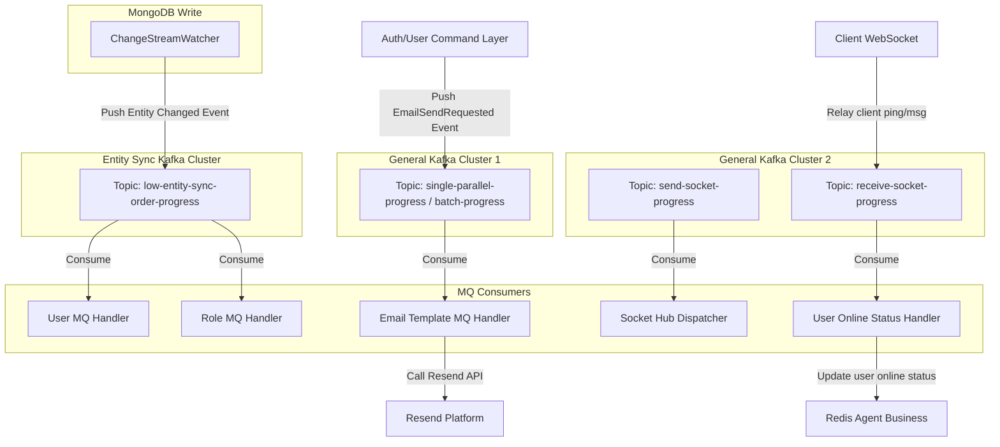

# Bản Đồ Ánh Xạ Hạ Tầng & Nghiệp Vụ (Infrastructure to Business Mapping)

Tài liệu này tổng hợp toàn bộ các kết nối hạ tầng (Databases, Caches, Event Brokers, Search/Logging Engines) tương ứng với các nghiệp vụ hiện tại đang vận hành trong dự án `core-backend`.

---

## 1. MongoDB (Persistent Database)

Hệ thống MongoDB đang sử dụng 3 database logic chính để đảm bảo cô lập dữ liệu (Multi-tenant & System isolation):

### 1.1. Database: `tenant1` (Dữ liệu doanh nghiệp)
Lưu trữ thông tin nghiệp vụ cốt lõi của từng Tenant (Khách hàng doanh nghiệp).

*   **Collection `tenants`**
    *   *Nghiệp vụ:* Quản lý thông tin doanh nghiệp (Tên, Email, Trạng thái kích hoạt, Tier sử dụng: FREE, PRO, ENTERPRISE, Cấu hình cài đặt riêng).
    *   *Chỉ mục (Indexes):*
        *   Standard Unique Index: `email` (đảm bảo mỗi tenant đăng ký bằng email duy nhất).
        *   Atlas Search Index: Hỗ trợ tìm kiếm mờ (fuzzy search) qua các trường `kws` (keywords), `status`, `email`.
*   **Collection `users`**
    *   *Nghiệp vụ:* Quản lý tài khoản người dùng/nhân viên thuộc các tenant.
    *   *Chỉ mục (Indexes):*
        *   Standard Unique Index: `email` (mỗi nhân viên đăng ký email độc nhất).
        *   Atlas Search Index: Tìm kiếm và lọc nhân viên nhanh theo `kws` (keywords), `tid` (tenant_id - lọc theo tenant), `email`, `status`, `owner_id`.
*   **Collection `roles`**
    *   *Nghiệp vụ:* Lưu trữ các vai trò (Roles) và danh sách Permission Keys đi kèm của từng tenant.
    *   *Chỉ mục (Indexes):*
        *   Atlas Search Index: Lọc danh sách roles theo `tid` (tenant_id) và tìm kiếm qua `kws`.

---

### 1.2. Database: `config1` (Cấu hình hệ thống động)
Lưu trữ các cấu hình động có thể thay đổi linh hoạt theo nhu cầu nghiệp vụ của các tenant.

*   **Collection `module_attribute_sets`**
    *   *Nghiệp vụ:* Quản lý các thuộc tính tùy chỉnh (Dynamic/Custom Fields) cho từng module (ví dụ: trường tùy biến cho Customer, Ticket) theo từng Tenant.
    *   *Chỉ mục (Indexes):*
        *   Standard Unique Index: `{tid, module}` (mỗi module của tenant chỉ có duy nhất một bộ thuộc tính tùy chỉnh).
        *   Atlas Search Index: Lọc nhanh theo `tid` và `module`.
*   **Collection `tags`**
    *   *Nghiệp vụ:* Quản lý nhãn (Tags) dùng để phân loại dữ liệu của các tenant cho các phân hệ tương ứng.
    *   *Chỉ mục (Indexes):*
        *   Atlas Search Index: Lọc theo `tid`, `modules` liên kết, và search qua `kws`.

---

### 1.3. Database: `system1` (Dữ liệu hệ thống)
Lưu trữ các tài nguyên tĩnh hoặc cấu hình vận hành nội bộ của toàn hệ thống.

*   **Collection `email_templates`**
    *   *Nghiệp vụ:* Quản lý các mẫu Email HTML dùng để gửi tự động (Mã code email, tiêu đề, nội dung HTML, các biến binding).
    *   *Chỉ mục (Indexes):*
        *   Standard Unique Index: `code` (mã định danh duy nhất của mỗi mẫu email, ví dụ: `WELCOME_TENANT`, `FORGOT_PASSWORD`).
        *   Atlas Search Index: Lọc nhanh mẫu email theo `code`.

---

## 2. Redis (Cache, Rate Limit & Job Queue)

Dự án chia nhỏ Redis thành 4 cụm độc lập (logical connections) để tối ưu hiệu suất, tránh tắc nghẽn Pool:

| Tên biến cấu hình | Cụm/Mục đích | Key Pattern | Nghiệp vụ cụ thể | TTL / Cách dọn dẹp |
| :--- | :--- | :--- | :--- | :--- |
| `REDIS_GENERAL_URL` | **General Cache** | `mail_quota:{apiKeyHash}:{date}` | Tracking quota (số lượng) email gửi đi trong ngày của từng API key để chống spam. | Tự hết hạn sau 24h |
| `REDIS_GATEWAY_URL` | **Gateway Redis** | `session:{sessionID}` | Lưu trữ AES Session Key giải mã payload E2EE (Hybrid Encryption). | 30 phút - 1 giờ |
| | | `rate_limit:{path}:{ip}:tokens` | Theo dõi token bucket để giới hạn số request/phút của mỗi IP. | Tự hết hạn ngắn |
| | | `rate_limit:{path}:{ip}:ts` | Lưu timestamp của request cuối cùng phục vụ thuật toán Token Bucket. | Tự hết hạn ngắn |
| `REDIS_JOB_URL` | **Asynq Task Queue** | `asynq:*` | Quản lý hàng đợi công việc nền chạy bất đồng bộ (Background Jobs) thông qua thư viện Asynq. | Quản lý tự động bởi Asynq |
| `REDIS_AGENT_BUSINESS_URL` | **Agent Business** | `role:profile:{roleID}` | Cache thông tin chi tiết quyền hạn của một Role. | 24 giờ. Bị xóa chủ động khi Role được cập nhật qua Kafka. |
| | | `user:acc_users:{userID}:{permission}` | Cache danh sách IDs các user cấp dưới/cùng bộ phận mà user hiện tại có quyền truy cập. | 24 giờ. Bị xóa hàng loạt khi User đổi phân cấp/chức vụ qua Kafka. |
| | | `user:activation:{token}` | Cache token tạm thời khi mời nhân viên mới làm việc. | 24 giờ. Xóa ngay khi kích hoạt xong. |
| | | `user:online:{userID}` | Lưu trạng thái online của user phục vụ websocket ping/pong và kiểm tra trạng thái online. | 120 giây (tự động gia hạn bởi sự kiện CLIENT_PING hoặc nhận Pong). |

---

## 3. Apache Kafka (Event-Driven Broker)

Hệ thống sử dụng **3 cụm Kafka vật lý độc lập** để tách biệt luồng xử lý nghiệp vụ thông thường, luồng truyền tin socket thời gian thực và luồng đồng bộ trạng thái thực thể tải cao:

### 3.1. Cụm 1: General Kafka Cluster 1 (`KAFKA_GENERAL1_BROKERS`)
*   *Mục đích:* Trao đổi sự kiện nội bộ giữa các module nghiệp vụ (bất đồng bộ hóa các tác vụ gửi email, logging, hoặc job nền).
*   *Các Topics:*
    *   `low-traffics-order-progress` (FIFO per Key): Xử lý các sự kiện yêu cầu độ tuần tự chính xác cao, lưu lượng thấp.
    *   `single-parallel-progress` (Parallel High-throughput): Xử lý các sự kiện song song hiệu suất cao, không yêu cầu chặt chẽ về thứ tự.
    *   `batch-progress` (Batching): Gom nhóm sự kiện (tối đa 50 tin nhắn hoặc 2 giây timeout) để xử lý hàng loạt nhằm giảm tải database/API ngoài.

### 3.2. Cụm 2: General Kafka Cluster 2 (`KAFKA_GENERAL2_BROKERS`)
*   *Mục đích:* Xử lý các sự kiện truyền thông tin thời gian thực qua socket (realtime socket progress synchronization).
*   *Các Topics:*
    *   `send-socket-progress` (FIFO per Key - Ordered): Chiều Server phát tin xuống Client. Đồng bộ trạng thái và nội dung tin nhắn socket trên toàn hệ thống đa server, đảm bảo thứ tự gói tin theo trình tự thời gian.
    *   `receive-socket-progress` (FIFO per Key - Ordered): Chiều Client gửi tin lên Server. Thu nhận các sự kiện như ping/heartbeat hoặc các action từ client đẩy qua socket để đưa lên Kafka xử lý nghiệp vụ bất đồng bộ.

### 3.3. Cụm 3: Entity Sync Kafka Cluster (`KAFKA_ENTITY_SYNC_BROKERS`)
*   *Mục đích:* Truyền tải luồng thay đổi dữ liệu thời gian thực (CDC - Change Data Capture) từ MongoDB phục vụ việc cập nhật và dọn dẹp cache.
*   *Các Topics:*
    *   `low-entity-sync-order-progress`: Nơi `ChangeStreamWatcher` đẩy các sự kiện thay đổi dữ liệu từ MongoDB `tenant1`.

### 3.4. Ánh xạ Event & MQ Handlers
1.  **Sự kiện `EMAIL_SEND_REQUESTED` (General Cluster 1)**
    *   *Nguồn phát (Publishers):* Các usecase gửi email (`auth.Register`, `auth.ForgotPassword`, `user.AddEmployee`).
    *   *Nơi tiêu thụ (Consumers):* `internal/email_template/presentation/mq/handler.go` lắng nghe, phân giải template HTML từ DB `system1.email_templates`, binding data và gọi Resend SDK để gửi mail thật.
2.  **Sự kiện Thay đổi Thực thể (`ENTITY_CHANGED:USERS`, `ENTITY_CHANGED:TENANTS`, `ENTITY_CHANGED:ROLES`) (Entity Sync Cluster)**
    *   *Nguồn phát:* `mongodb.ChangeStreamWatcher` tự động lắng nghe transaction log của MongoDB `tenant1` và push lên Kafka.
    *   *Nơi tiêu thụ:* 
        *   **User MQ Handler:** Lọc tin nhắn của collection `users`, tiến hành dọn dẹp hoặc invalidate cache hierarchy phân cấp của user bị ảnh hưởng.
        *   **Role MQ Handler:** Lọc tin nhắn của collection `roles`, tự động gọi `redisClient.Del` xóa key cache `role:profile:{roleID}` để buộc lần truy vấn sau phải đọc lại quyền mới nhất từ MongoDB.
3.  **Sự kiện Socket Progress (`SOCKET_PROGRESS_DISPATCH`) (General Cluster 2 - Topic `send-socket-progress`)**
    *   *Nguồn phát:* Các nghiệp vụ phát thông báo realtime (Chat, Notification, Progress update).
    *   *Nơi tiêu thụ:* Đăng ký trực tiếp `GlobalHub.HandleKafkaMessage` vào Event Dispatcher. Consumer của `send-socket-progress` nhận được tin nhắn và dispatch xuống các local WebSocket connection tương ứng.
4.  **Sự kiện Client Ping (`CLIENT_PING`) (General Cluster 2 - Topic `receive-socket-progress`)**
    *   *Nguồn phát:* Client gửi sự kiện `"CLIENT_PING"` lên qua WebSocket connection. Gateway Server nhận được sẽ tự động gán `Source = "CLIENT:" + UserID` và relay lên Kafka.
    *   *Nơi tiêu thụ:* `HandleClientPing` của `UserMQHandler` lắng nghe sự kiện này và cập nhật TTL online status của User lên Redis Agent Business.

---

## 4. OpenSearch (System Logging & Search Analytics)

OpenSearch được cấu hình làm nơi thu thập log tập trung và hỗ trợ phân tích hệ thống mà không ảnh hưởng tới Database nghiệp vụ MongoDB:

*   **Index / Alias `general_logs`**
    *   *Nghiệp vụ:* Lưu trữ toàn bộ Audit Logs và các LogRecord của hệ thống (lịch sử hoạt động của API, các request lỗi HTTP 500, các thay đổi bảo mật nhạy cảm).
    *   *Infrastructure Repository:* `openSearchLogRepository` kế thừa `AbstractOpenSearchRepository`.
*   **Job dọn dẹp log (`cleanup_os_indices`)**
    *   *Nghiệp vụ:* Một background job lập lịch chạy định kỳ (qua Asynq Task Manager) để xóa các index log quá cũ (ví dụ: log lưu trữ quá 30 ngày) nhằm giải phóng không gian ổ đĩa của cụm OpenSearch.
