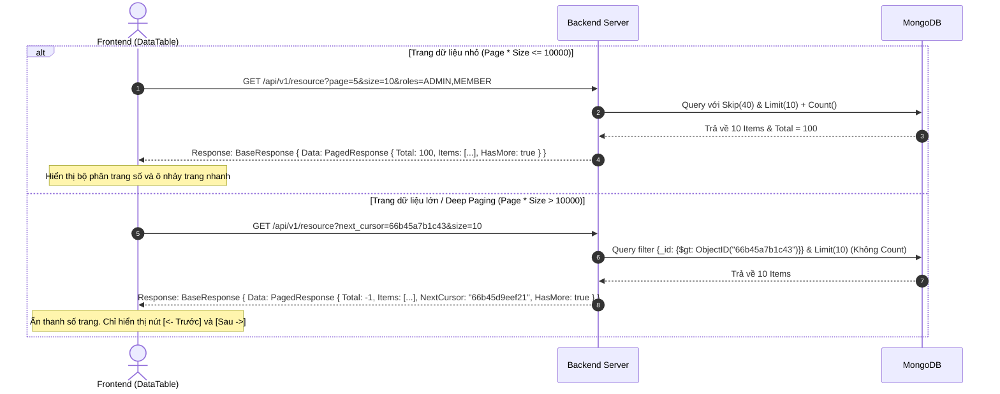

# Tài Liệu Đặc Tả Quy Trình Phân Trang & Lọc Dữ Liệu Nâng Cao (Pagination & Advanced Filtering Specification)

Tài liệu này mô tả chi tiết cơ chế phân trang kết hợp (Hybrid Pagination), cấu trúc dữ liệu API của Backend, danh sách các thành phần giao diện Frontend của List, cùng các dữ liệu mẫu props đi kèm để đảm bảo tính đồng bộ trên toàn dự án.

---

## 1. Tổng Quan & Sơ Đồ Sequence (Overview & Sequence Diagram)

Hệ thống áp dụng cơ chế phân trang kết hợp (Offset-based cho các trang đầu và Cursor-based cho Deep Paging) để bảo vệ tài nguyên cơ sở dữ liệu khi truy vấn sâu (vượt quá 10,000 bản ghi), kết hợp với bộ lọc thuộc tính Capsule Pill.



---

## 2. Phân Vùng Trách Nhiệm Của Frontend (Frontend Responsibilities & UI/UX Layout)

Frontend đảm nhiệm việc dựng giao diện, xử lý state cục bộ, thực hiện kiểm tra biên Client-side và định hình các cấu phần giao diện (UI Components) của List.

### 2.1 Các Thành Phần Của Một Giao Diện List Phía Frontend
Một trang danh sách dữ liệu (List page) hoàn chỉnh bao gồm 4 cấu phần chính:
1. **Thanh tìm kiếm (SearchBar):** Ô input rộng tối đa `320px` với biểu tượng kính lúp, hỗ trợ debounce tìm kiếm text.
2. **Hàng bộ lọc (FilterRow):** Nằm ngay dưới SearchBar, chứa các nút lọc dạng capsule nhỏ gọn (`Filter Pill Badge` cao `38px`):
   * **MultiSelect (Lọc mảng - Query IN):** Click hiển thị checkbox popover phủ đè lên UI, hỗ trợ cập nhật nhãn động (ví dụ: `Vai trò: Admin, Owner`) và nút clear `x` nhanh.
   * **DateRangePicker (Lọc khoảng ngày):** Click mở popover chứa datetime pickers, hỗ trợ lưu trữ giờ UTC dưới dạng timestamp.
3. **Bảng dữ liệu (DataTable):** Grid hiển thị thông tin gồm:
   * Trình quản lý ẩn hiện cột (⚙️ Settings SVG Icon).
   * Co giãn kích thước cột (Resize) bù trừ tỷ lệ zoom `scaleRef`.
   * Tràn chữ bảo vệ (`truncate` và `min-w-0`).
4. **Phần phân trang (Pagination Footer):** Bộ điều hướng cuối bảng:
   * Bộ chevron chuyển trang trước/sau.
   * Dropdown chọn kích thước trang (`Select` size: 10, 30, 50).
   * Ô nhảy trang nhanh (Page Jump Input) kiểm tra biên chặn cứng `page * size <= 10000`.

### 2.2 Đặc Tả TypeScript Props Chuẩn Của Các Thành Phần Frontend

```typescript
// 1. SearchBar Component Props
export interface SearchBarProps {
  placeholder?: string;
  onChange: (value: string) => void;
  debounceMs?: number; // Mặc định: 300ms
}

// 2. MultiSelect (Filter Pill) Component Props
export interface MultiSelectOption {
  value: string; // Raw ID hoặc Enum (VD: "ACTIVE", "usr-admin-01")
  label: string; // Tên hiển thị (VD: "Hoạt động", "Quản trị viên")
}

export interface MultiSelectProps {
  label: string;                  // Tên thuộc tính hiển thị ở Pill (VD: "Trạng thái")
  options: MultiSelectOption[];
  value: string[];                // Danh sách ID/Enum đang chọn
  onChange: (newValue: string[]) => void;
  containerClassName?: string;
  allowSelectAll?: boolean;       // Tự động có tùy chọn "Tất cả" - Mặc định: true
}

// 3. DateRangePicker (Filter Pill) Component Props
export interface DateRangeValue {
  from: number; // Unix timestamp bằng mili-giây chuẩn UTC (VD: 1785542400000)
  to: number;   // Unix timestamp bằng mili-giây chuẩn UTC
}

export interface DateRangePickerProps {
  label: string;
  value: DateRangeValue;
  onChange: (val: DateRangeValue) => void;
}

// 4. Cấu hình Filter Item trong DataTable
export interface AvailableFilterItem {
  id: string;        // Khớp với Column.key (VD: 'c_at', 'status', 'owner_id')
  label?: string;    // Tùy chọn: Tự động kế thừa column.header nếu để trống
  visible?: boolean; // Trạng thái hiển thị mặc định
  component: React.ReactNode;
}

// 5. Cấu hình Column Schema trong DataTable
export interface Column<T> {
  key: string;
  header: string;
  initialWidth?: number;
  type?: 'text' | 'title-subtitle' | 'double-text' | 'badge';
  visible?: boolean;
  isPrimary?: boolean;
  getSubtitle?: (item: T) => string | undefined;
  getIndex?: (item: T) => string | number | undefined;
  getLine2?: (item: T) => string | undefined;
  getBadgeVariant?: (val: any) => BadgeVariant;
  render?: (item: T) => React.ReactNode;
}

// 6. DataTable Component Props (Tích hợp trọn bộ Toolbar, Settings, Grid & Pagination)
export interface DataTableProps<T> {
  columns: Column<T>[];
  data: T[];
  total: number;
  page: number;
  size: number;
  hasMore?: boolean;
  onPageChange?: (newPage: number) => void;
  onSizeChange?: (newSize: number) => void;
  onSearchChange?: (val: string) => void;
  searchPlaceholder?: string;
  
  // Bộ lọc tương tác (Capsule Filter Pills)
  availableFilters?: AvailableFilterItem[];
  filterComponent?: React.ReactNode;
  
  // Nút hành động chính (Dùng <AddButton />)
  actionComponent?: React.ReactNode;
  
  // Tùy chọn ẩn/hiện thành phần
  hideSearch?: boolean;          // Ẩn thanh tìm kiếm (SearchBar)
  hidePagination?: boolean;      // Ẩn thanh phân trang (Pagination Footer)
  hideColumnSettings?: boolean;  // Ẩn nút cài đặt hiển thị (⚙️ Settings)
  hideFilterRow?: boolean;       // Ẩn hàng bộ lọc (FilterRow)
  hideAction?: boolean;          // Ẩn nút hành động (actionComponent)

  // Callback nhận kết quả cấu hình từ TableSettingsModal
  onSettingsChange?: (settings: TableSettingsResult) => void;
}
```

### 2.3 Cấu Hình Ẩn Hiện Các Thành Phần (Component Visibility Options)

Để tối ưu không gian hiển thị và đáp ứng linh hoạt các nghiệp vụ khác nhau (ví dụ: màn hình mini-list, xem nhanh không phân trang, hoặc danh sách tĩnh không tìm kiếm), `DataTable` hỗ trợ các props tuỳ chọn ẩn hiện sau:

* **`hideSearch` (boolean):** Khi nhận giá trị `true`, thanh tìm kiếm (`SearchBar`) sẽ bị ẩn khỏi giao diện.
* **`hidePagination` (boolean):** Khi nhận giá trị `true`, phần phân trang cuối bảng (`Pagination Footer`) bao gồm cả dropdown size và ô page jump sẽ bị ẩn hoàn toàn.
* **`hideColumnSettings` (boolean):** Khi nhận giá trị `true`, biểu tượng cài đặt hiển thị bảng (Sliders Icon) sẽ không hiển thị.
* **`hideFilterRow` (boolean):** Khi nhận giá trị `true`, hàng chứa `availableFilters` (hoặc `filterComponent`) sẽ bị ẩn.
* **`hideAction` (boolean):** Khi nhận giá trị `true`, nút hành động (`actionComponent`) sẽ bị ẩn khỏi giao diện.


---

## 3. Phân Vùng Trách Nhiệm Của Backend (Backend Responsibilities & API Model)

Backend **chỉ cần chịu trách nhiệm trả về đúng mô hình dữ liệu (Model)** theo đặc tả JSON đã chuẩn hóa. Backend không cần quan tâm đến cách thức render giao diện hay vị trí hiển thị của các nút bấm trên Frontend.

### 3.1 Cấu Trúc Model JSON Trả Về Chuẩn (Unified API Response Model)
Mọi API danh sách phía Backend bắt buộc phải trả về dữ liệu thành công (`SUCCESS`) bọc trong Generic BaseResponse dưới định dạng JSON sau:

```json
{
  "data": {
    "items": [
      {
        "id": "emp-1",
        "name": "Nhân viên số 1",
        "email": "employee.1@verse.com",
        "role": "OWNER",
        "c_at": 1785542400000,
        "u_at": 1785542400000,
        "is_del": false
      }
    ],
    "total": 100,      // Trả về -1 nếu là chế độ Cursor (Deep Paging)
    "page": 1,         // Trang hiện tại
    "size": 10,        // Số lượng item trên một trang
    "has_more": true,  // Cờ báo hiệu còn dữ liệu trang sau không
    "next_cursor": "", // ID cursor tiếp theo (omitempty)
    "prev_cursor": ""  // ID cursor trước đó (omitempty)
  },
  "error_code": "SUCCESS",
  "error_detail": ""
}
```

### 3.2 Đặc Tả Tầng Go DTOs (Model Go Structs)

```go
package dto

// PagedResponse là model phân trang dùng chung cho mọi API List trong hệ thống
type PagedResponse[T any] struct {
	Total      int64  `json:"total" example:"100"`       // Tổng số bản ghi (Trả về -1 nếu dùng cursor)
	Page       int    `json:"page" example:"1"`          // Trang hiện tại
	Size       int    `json:"size" example:"10"`         // Số lượng bản ghi trên một trang
	Items      []T    `json:"items"`                     // Danh sách dữ liệu trang
	NextCursor string `json:"next_cursor,omitempty"`     // Con trỏ lấy trang tiếp theo (Deep Paging)
	PrevCursor string `json:"prev_cursor,omitempty"`     // Con trỏ lấy trang trước đó
	HasMore    bool   `json:"has_more"`                  // Cờ báo hiệu còn trang kế tiếp không
}
```

```go
package dto

// CommonQuery định nghĩa các tham số lọc và phân trang cơ bản Backend nhận từ HTTP Query String
type CommonQuery struct {
	Page       int    `form:"page" default:"1"`
	Size       int    `form:"size" default:"10"`
	NextCursor string `form:"next_cursor"`
	PrevCursor string `form:"prev_cursor"`
}
```

---

## 4. Quy Tắc & Logic Đặc Biệt Khi Phối Hợp Trọn Bộ List (Global List Integration Logic)

Khi tích hợp đầy đủ các thành phần, lập trình viên cả hai đội FE và BE bắt buộc tuân thủ 4 logic đặc biệt:

1. **Tự động reset trang về 1 khi lọc (Reset Page on Filter Change - FE):** 
   Khi người dùng đổi tiêu chí lọc (search key, multi-select roles, date range), Frontend bắt buộc reset `page = 1` trước khi gửi request API mới.
2. **Tìm kiếm Tối thiểu 3 Ký tự & Nhấn Enter (Min 3 Chars & Enter-to-Search - FE):** 
   Spam request trên từng phím gõ bị cấm. Tìm kiếm chỉ được kích hoạt khi người dùng nhập từ 3 ký tự trở lên (`trimmed.length >= 3`) và nhấn phím **ENTER**. Khi xóa rỗng ô tìm kiếm (`""`), tự động reset tìm kiếm để tải lại danh sách đầy đủ.
3. **Đồng bộ hóa State lên URL Query Parameters (FE):** 
   Tất cả state lọc (`page`, `size`, `search`, `filters`) cần được map vào URL query params để khi người dùng tải lại trang (`F5`) hoặc chia sẻ URL, giao diện sẽ tự khôi phục chính xác trạng thái cũ.
4. **Lọc ẩn hệ thống phía Backend (Invisible System Filters - BE):** 
   Frontend không tự gửi các điều kiện bảo mật/hệ thống. Backend tự động tiêm filter cô lập Multi-tenant (`tid`) và loại bỏ xóa mềm (`is_del: false`) trực tiếp ở tầng Repository của Go.

---

## 5. Các Mã lỗi Thường gặp & Payload ví dụ (Error Codes & Payload Examples)

| HTTP Status | error_code | Ý nghĩa & Hướng xử lý |
| :--- | :--- | :--- |
| `400` | `ERR_INVALID_CURSOR` | Giá trị `next_cursor` gửi lên không đúng định dạng Hex ObjectID hoặc bị chỉnh sửa. |
| `400` | `ERR_PAGING_LIMIT_EXCEEDED` | Client cố tình offset sâu (`page * size > 10000`) mà không dùng `next_cursor`. |

---

## 6. Quy Trình Tích Hợp Chuẩn 1 Module Danh Sách (Step-by-Step List Integration Standard)

Để xây dựng một màn hình danh sách mới (VD: Khách hàng, Đơn hàng, Phiếu hỗ trợ, Nhân viên,...) tuân thủ 100% Golden Standard và tái sử dụng toàn bộ hệ sinh thái List, lập trình viên thực hiện theo **quy trình 5 bước chuẩn hóa** dưới đây:

### Bước 1: Khai báo Entity Model kế thừa `BaseAuditEntity`
Mọi interface entity ở Frontend bắt buộc phải kế thừa `BaseAuditEntity` (phản chiếu trực tiếp từ `BaseEntity` của Backend Go):
```typescript
import { BaseAuditEntity } from '@/types/baseEntity';

export interface Customer extends BaseAuditEntity {
  id: string;          // _id hoặc UID
  name: string;        // Tên khách hàng (Primary)
  email: string;       // Email
  phone: string;       // Số điện thoại
  status: 'ACTIVE' | 'INACTIVE'; // Trạng thái
  owner_id?: string;   // Người phụ trách
  // ...các trường đặc thù khác của module
}
```

---

### Bước 2: Khai báo Schema Cột với `commonColumns`
Sử dụng các hàm builder có sẵn từ `@/components` để khởi tạo cột chỉ trong 1 dòng code, tự động liên kết đa ngôn ngữ và tối ưu hiệu năng:
```typescript
import {
  Column,
  getNameColumn,
  getEmailColumn,
  getPhoneColumn,
  getStatusColumn,
  getOwnerColumn,
  getBaseAuditColumns,
} from '@/components';

const allColumns: Column<Customer>[] = useMemo(() => [
  // 1. Cột định danh chính (Tên + ID Subtitle) - Cố định vị trí đầu
  getNameColumn<Customer>(t, { header: t('col_customer_name') }),

  // 2. Các cột thông dụng (Tự động Alias Resolution & Zero-Allocation)
  getEmailColumn<Customer>(t),
  getPhoneColumn<Customer>(t),
  getStatusColumn<Customer>(t),
  getOwnerColumn<Customer>(t),

  // 3. Cột đặc thù riêng của module (nếu có)
  {
    key: 'loyalty_points',
    header: 'Điểm tích lũy',
    initialWidth: 140,
    render: (item) => <Typo variant="body" className="font-mono">{item.loyalty_points || 0}</Typo>,
  },

  // 4. Trọn bộ 4 cột Audit hệ thống (c_at, u_at, c_by, u_by)
  ...getBaseAuditColumns<Customer>(t),
], [t, language]);
```

---

### Bước 3: Khai báo Bộ Lọc `availableFilters` (Tuân thủ Filter Priority Order)
* **Quy tắc thứ tự**: Bộ lọc khoảng thời gian (`c_at` / `DateRangePicker`) **BẮT BUỘC LUÔN NẰM Ở VỊ TRÍ ĐẦU TIÊN (INDEX 0)**.
* **Tự động đồng bộ**: Bỏ trống `label` để `<DataTable />` tự động kế thừa `column.header` từ mảng cột.
```typescript
import { AvailableFilterItem, MultiSelect, DateRangePicker } from '@/components';

const availableFilters: AvailableFilterItem[] = useMemo(() => [
  // Vị trí 1 (BẮT BUỘC): Bộ lọc thời gian tạo
  {
    id: 'c_at',
    visible: true,
    component: (
      <DateRangePicker
        label={t('col_created_at')}
        value={dateRange}
        onChange={(val) => { setDateRange(val); setPage(1); }}
      />
    ),
  },
  // Vị trí 2: Bộ lọc Trạng thái (Tự động có nút "Tất cả")
  {
    id: 'status',
    visible: true,
    component: (
      <MultiSelect
        label={t('col_status')}
        options={statusOptions}
        value={selectedStatuses}
        onChange={(val) => { setSelectedStatuses(val); setPage(1); }}
      />
    ),
  },
  // Vị trí 3: Bộ lọc Người phụ trách
  {
    id: 'owner_id',
    visible: true,
    component: (
      <MultiSelect
        label={t('col_owner')}
        options={ownerOptions}
        value={selectedOwners}
        onChange={(val) => { setSelectedOwners(val); setPage(1); }}
      />
    ),
  },
], [t, dateRange, selectedStatuses, selectedOwners, statusOptions, ownerOptions]);
```

---

### Bước 4: Xây dựng Payload Gọi API (Zero-Waste Payload Rule)
Tuân thủ nguyên tắc bỏ qua (omit) các trường không lọc hoặc chọn tất cả:
```typescript
// Chỉ gửi các trường thực sự có lọc tập con lên API
const queryParams: Record<string, any> = {
  page,
  size,
};

if (searchQuery.trim()) {
  queryParams.search = searchQuery.trim();
}

// Bỏ qua nếu là 0 hoặc chọn tất cả options
if (selectedStatuses.length > 0 && selectedStatuses.length < statusOptions.length) {
  queryParams.status = selectedStatuses;
}

if (selectedOwners.length > 0 && selectedOwners.length < ownerOptions.length) {
  queryParams.owner_id = selectedOwners;
}

if (dateRange.from > 0 && dateRange.to > 0) {
  queryParams.from_date = dateRange.from;
  queryParams.to_date = dateRange.to;
}
```

---

### Bước 5: Render Component `<DataTable />`
Lắp ráp các thành phần lại với Action Button chuẩn thuần chữ (`<AddButton />`):
```tsx
import { DataTable, AddButton } from '@/components';

<DataTable
  columns={allColumns}
  data={customers}
  total={totalCount}
  page={page}
  size={size}
  hasMore={hasMore}
  onPageChange={setPage}
  onSizeChange={(newSize) => { setSize(newSize); setPage(1); }}
  onSearchChange={(val) => { setSearchQuery(val); setPage(1); }}
  searchPlaceholder={t('header_search_placeholder')}
  availableFilters={availableFilters}
  actionComponent={<AddButton onClick={handleOpenCreateModal} />}
  onSettingsChange={(settings) => {
    // Lưu projection fields hoặc tùy biến hiển thị
    setProjectionFields(settings.visibleColumnKeys);
  }}
/>
```

