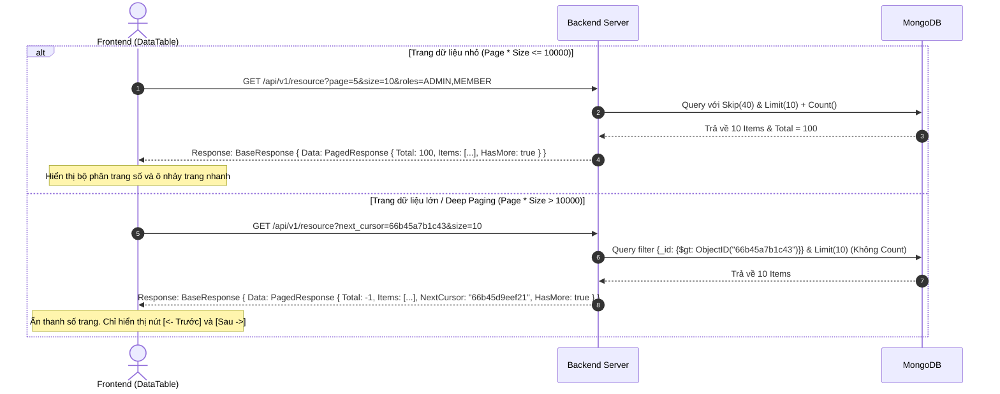

# Tài Liệu Đặc Tả Quy Trình Phân Trang & Lọc Dữ Liệu Nâng Cao (Pagination & Advanced Filtering Specification)

Tài liệu này mô tả chi tiết cơ chế phân trang kết hợp (Hybrid Pagination), cấu trúc dữ liệu API của Backend, danh sách các thành phần giao diện Frontend của List, cùng các dữ liệu mẫu props đi kèm để đảm bảo tính đồng bộ trên toàn dự án.

---

## 1. Tổng Quan & Sơ Đồ Sequence (Overview & Sequence Diagram)

Hệ thống áp dụng cơ chế phân trang kết hợp (Offset-based cho các trang đầu và Cursor-based cho Deep Paging) để bảo vệ tài nguyên cơ sở dữ liệu khi truy vấn sâu (vượt quá 10,000 bản ghi), kết hợp với bộ lọc thuộc tính Capsule Pill.



---

## 2. Phân Vùng Trách Nhiệm Của Frontend (Frontend Responsibilities & UI/UX Layout)

Frontend đảm nhiệm việc dựng giao diện, xử lý state cục bộ, thực hiện kiểm tra biên Client-side và định hình các cấu phần giao diện (UI Components) của List.

### 2.1 Các Thành Phần Của Một Giao Diện List Phía Frontend
Một trang danh sách dữ liệu (List page) hoàn chỉnh bao gồm 4 cấu phần chính:
1. **Thanh tìm kiếm (SearchBar):** Ô input rộng tối đa `320px` với biểu tượng kính lúp, hỗ trợ debounce tìm kiếm text.
2. **Hàng bộ lọc (FilterRow):** Nằm ngay dưới SearchBar, chứa các nút lọc dạng capsule nhỏ gọn (`Filter Pill Badge` cao `38px`):
   * **MultiSelect (Lọc mảng - Query IN):** Click hiển thị checkbox popover phủ đè lên UI, hỗ trợ cập nhật nhãn động (ví dụ: `Vai trò: Admin, Owner`) và nút clear `x` nhanh.
   * **DateRangePicker (Lọc khoảng ngày):** Click mở popover chứa datetime pickers, hỗ trợ lưu trữ giờ UTC dưới dạng timestamp.
3. **Bảng dữ liệu (DataTable):** Grid hiển thị thông tin gồm:
   * Trình quản lý ẩn hiện cột (⚙️ Settings SVG Icon).
   * Co giãn kích thước cột (Resize) bù trừ tỷ lệ zoom `scaleRef`.
   * Tràn chữ bảo vệ (`truncate` và `min-w-0`).
4. **Phần phân trang (Pagination Footer):** Bộ điều hướng cuối bảng:
   * Bộ chevron chuyển trang trước/sau.
   * Dropdown chọn kích thước trang (`Select` size: 10, 30, 50).
   * Ô nhảy trang nhanh (Page Jump Input) kiểm tra biên chặn cứng `page * size <= 10000`.

### 2.2 Dữ Liệu Mẫu Props Cho Các Thành Phần Frontend (TypeScript Props & Mock Data)

```typescript
// 1. SearchBar Component Props
interface SearchBarProps {
  placeholder?: string;
  onChange: (value: string) => void;
}

const sampleSearchBarProps: SearchBarProps = {
  placeholder: "Tìm kiếm nhân viên",
  onChange: (val) => console.log("Tìm kiếm từ khóa: ", val)
};

// 2. MultiSelect (Filter Pill) Component Props
interface MultiSelectOption {
  value: string;
  label: string;
}

interface MultiSelectProps {
  label: string; // Tên thuộc tính hiển thị ở Pill (Ví dụ: "Vai trò")
  options: MultiSelectOption[];
  value: string[]; // Danh sách ID đang được chọn
  onChange: (newValue: string[]) => void;
}

const sampleMultiSelectProps: MultiSelectProps = {
  label: "Vai trò",
  options: [
    { value: "OWNER", label: "Owner" },
    { value: "ADMIN", label: "Admin" },
    { value: "MEMBER", label: "Member" }
  ],
  value: ["OWNER", "ADMIN"],
  onChange: (selected) => console.log("Các vai trò đã chọn: ", selected)
};

// 3. DateRangePicker (Filter Pill) Component Props
interface DateRangeValue {
  from: number; // Unix timestamp bằng mili-giây chuẩn UTC (Ví dụ: 1785542400000)
  to: number;   // Unix timestamp bằng mili-giây
}

interface DateRangePickerProps {
  label: string;
  value: DateRangeValue;
  onChange: (val: DateRangeValue) => void;
}

const sampleDateRangePickerProps: DateRangePickerProps = {
  label: "Ngày tham gia",
  value: {
    from: 1785542400000, // 01/08/2026 UTC
    to: 1786752000000    // 15/08/2026 UTC
  },
  onChange: (range) => console.log("Khoảng ngày lọc: ", range)
};

// 4. DataTable Component Props (Bao gồm Table Grid và Pagination Footer)
interface Column<T> {
  key: string;
  header: string;
  render?: (item: T) => React.ReactNode;
  initialWidth?: number;
}

interface DataTableProps<T> {
  columns: Column<T>[];
  data: T[];
  total: number;
  page: number;
  size: number;
  hasMore: boolean;
  onPageChange: (newPage: number) => void;
  onSizeChange: (newSize: number) => void;
  onSearchChange?: (value: string) => void;
  searchPlaceholder?: string;
  filterComponent?: React.ReactNode; // Nơi truyền FilterRow chứa các Pill lọc
  actionComponent?: React.ReactNode; // Nút tạo mới hoặc export
}

// Ví dụ mock data truyền vào DataTable trong trang Employees
const sampleDataTableProps: DataTableProps<any> = {
  columns: [
    { key: "name", header: "Nhân viên", initialWidth: 240 },
    { key: "email", header: "Liên hệ", initialWidth: 260 },
    { key: "role", header: "Vai trò", initialWidth: 120 }
  ],
  data: [
    { id: "emp-1", name: "Nhân viên số 1", email: "employee.1@verse.com", role: "OWNER" },
    { id: "emp-2", name: "Nhân viên số 2", email: "employee.2@verse.com", role: "ADMIN" }
  ],
  total: 2,
  page: 1,
  size: 10,
  hasMore: false,
  onPageChange: (newPage) => console.log("Chuyển sang trang: ", newPage),
  onSizeChange: (newSize) => console.log("Đổi size trang: ", newSize),
  onSearchChange: (searchVal) => console.log("Gõ tìm kiếm table: ", searchVal),
  searchPlaceholder: "Tìm kiếm",
  filterComponent: (
    <div className="flex items-center gap-2 flex-wrap">
      <MultiSelect {...sampleMultiSelectProps} />
      <DateRangePicker {...sampleDateRangePickerProps} />
    </div>
  ),
  actionComponent: (
    <button className="px-4 h-10 bg-indigo-600 text-white rounded font-semibold text-xs">
      + Thêm nhân viên
    </button>
  )
};
```

---

## 3. Phân Vùng Trách Nhiệm Của Backend (Backend Responsibilities & API Model)

Backend **chỉ cần chịu trách nhiệm trả về đúng mô hình dữ liệu (Model)** theo đặc tả JSON đã chuẩn hóa. Backend không cần quan tâm đến cách thức render giao diện hay vị trí hiển thị của các nút bấm trên Frontend.

### 3.1 Cấu Trúc Model JSON Trả Về Chuẩn (Unified API Response Model)
Mọi API danh sách phía Backend bắt buộc phải trả về dữ liệu thành công (`SUCCESS`) bọc trong Generic BaseResponse dưới định dạng JSON sau:

```json
{
  "data": {
    "items": [
      {
        "id": "emp-1",
        "name": "Nhân viên số 1",
        "email": "employee.1@verse.com",
        "role": "OWNER",
        "c_at": 1785542400000,
        "u_at": 1785542400000,
        "is_del": false
      }
    ],
    "total": 100,      // Trả về -1 nếu là chế độ Cursor (Deep Paging)
    "page": 1,         // Trang hiện tại
    "size": 10,        // Số lượng item trên một trang
    "has_more": true,  // Cờ báo hiệu còn dữ liệu trang sau không
    "next_cursor": "", // ID cursor tiếp theo (omitempty)
    "prev_cursor": ""  // ID cursor trước đó (omitempty)
  },
  "error_code": "SUCCESS",
  "error_detail": ""
}
```

### 3.2 Đặc Tả Tầng Go DTOs (Model Go Structs)

```go
package dto

// PagedResponse là model phân trang dùng chung cho mọi API List trong hệ thống
type PagedResponse[T any] struct {
	Total      int64  `json:"total" example:"100"`       // Tổng số bản ghi (Trả về -1 nếu dùng cursor)
	Page       int    `json:"page" example:"1"`          // Trang hiện tại
	Size       int    `json:"size" example:"10"`         // Số lượng bản ghi trên một trang
	Items      []T    `json:"items"`                     // Danh sách dữ liệu trang
	NextCursor string `json:"next_cursor,omitempty"`     // Con trỏ lấy trang tiếp theo (Deep Paging)
	PrevCursor string `json:"prev_cursor,omitempty"`     // Con trỏ lấy trang trước đó
	HasMore    bool   `json:"has_more"`                  // Cờ báo hiệu còn trang kế tiếp không
}
```

```go
package dto

// CommonQuery định nghĩa các tham số lọc và phân trang cơ bản Backend nhận từ HTTP Query String
type CommonQuery struct {
	Page       int    `form:"page" default:"1"`
	Size       int    `form:"size" default:"10"`
	NextCursor string `form:"next_cursor"`
	PrevCursor string `form:"prev_cursor"`
}
```

---

## 4. Quy Tắc & Logic Đặc Biệt Khi Phối Hợp Trọn Bộ List (Global List Integration Logic)

Khi tích hợp đầy đủ các thành phần, lập trình viên cả hai đội FE và BE bắt buộc tuân thủ 4 logic đặc biệt:

1. **Tự động reset trang về 1 khi lọc (Reset Page on Filter Change - FE):** 
   Khi người dùng đổi tiêu chí lọc (search key, multi-select roles, date range), Frontend bắt buộc reset `page = 1` trước khi gửi request API mới.
2. **Trì hoãn gọi API Tìm kiếm (Debounced Search - FE):** 
   Spam request trên từng phím gõ bị cấm. Áp dụng debounce trì hoãn gọi API `300ms` trên SearchBar.
3. **Đồng bộ hóa State lên URL Query Parameters (FE):** 
   Tất cả state lọc (`page`, `size`, `search`, `filters`) cần được map vào URL query params để khi người dùng tải lại trang (`F5`) hoặc chia sẻ URL, giao diện sẽ tự khôi phục chính xác trạng thái cũ.
4. **Lọc ẩn hệ thống phía Backend (Invisible System Filters - BE):** 
   Frontend không tự gửi các điều kiện bảo mật/hệ thống. Backend tự động tiêm filter cô lập Multi-tenant (`tid`) và loại bỏ xóa mềm (`is_del: false`) trực tiếp ở tầng Repository của Go.

---

## 5. Các Mã lỗi Thường gặp & Payload ví dụ (Error Codes & Payload Examples)

| HTTP Status | error_code | Ý nghĩa & Hướng xử lý |
| :--- | :--- | :--- |
| `400` | `ERR_INVALID_CURSOR` | Giá trị `next_cursor` gửi lên không đúng định dạng Hex ObjectID hoặc bị chỉnh sửa. |
| `400` | `ERR_PAGING_LIMIT_EXCEEDED` | Client cố tình offset sâu (`page * size > 10000`) mà không dùng `next_cursor`. |
