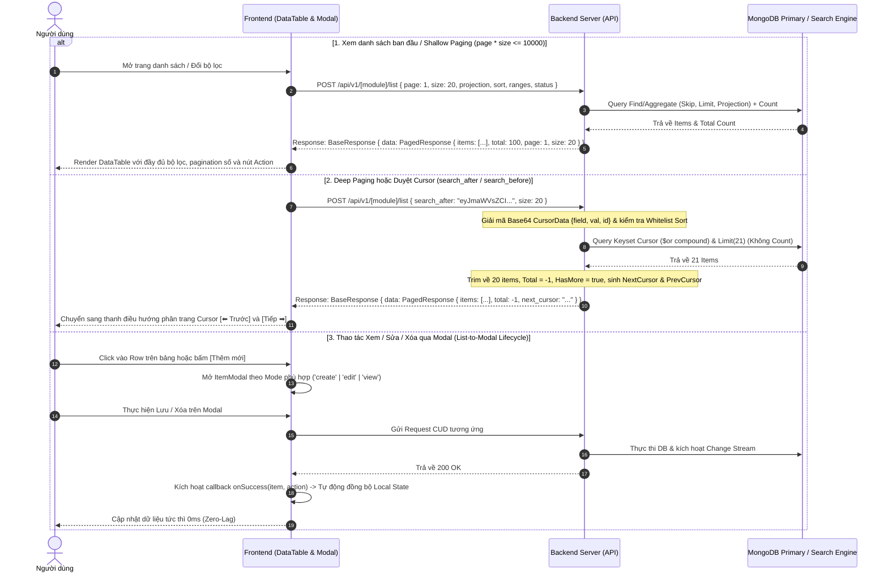

# Tài Liệu Đặc Tả Quy Trình Phân Trang & Bảng Dữ Liệu Toàn Diện (Pagination, DataTable & List-to-Modal Flow)

Tài liệu này đặc tả toàn bộ quy trình nghiệp vụ (Business Rules), luồng xử lý (Step-by-Step Flow), sơ đồ Sequence, cấu trúc dữ liệu Backend/Frontend, và vòng đời tương tác 2 chiều giữa **Danh sách (`DataTable`)** và **Hộp thoại Chi tiết (`ItemModal`)** trên toàn hệ thống Sowfkun-Verse.

---

## 1. Tổng Quan & Sơ Đồ Sequence (Overview & Architecture)

Hệ thống áp dụng cơ chế phân trang kết hợp (**Hybrid Pagination**: Offset-based cho các trang đầu `<= 10,000` bản ghi và Cursor-based Keyset Paging cho Deep Paging) nhằm bảo vệ tài nguyên cơ sở dữ liệu và tối ưu hóa trải nghiệm người dùng với tốc độ phản hồi tức thì.



---

## 2. Quy Trình Từng Bước & Vòng Đời Tương Tác (Step-by-Step & Lifecycle)

### 2.1 Sơ Đồ Vòng Đời Tương Tác Giữa Danh Sách & Modal (List-to-Modal Flow)

```mermaid
flowchart TD
    A[Bảng Danh Sách - DataTable] -->|1. Bấm nút Thêm mới| B[Mở Modal: Chế độ 'create']
    A -->|2. Click vào Row / Icon Xem| C{Kiểm tra Quyền?}
    C -->|Có quyền MANAGE| D[Mở Modal: Chế độ 'edit']
    C -->|Chỉ có quyền VIEW| E[Mở Modal: Chế độ 'view' - ReadOnly]
    
    B -->|Tạo thành công| F[Callback: onSuccess(item, 'create')]
    D -->|Lưu thành công| G[Callback: onSuccess(item, 'update')]
    D -->|Xóa thành công| H[Callback: onSuccess(item, 'delete')]
    
    F -->|Cập nhật List| I[Thêm vào đầu danh sách & Total + 1]
    G -->|Cập nhật List| J[Cập nhật trực tiếp bản ghi trong Local State]
    H -->|Cập nhật List| K[Lọc bỏ bản ghi trong Local State & Total - 1]
```

---

### 2.2 Đặc Tả 3 Chế Độ Xem Của Modal (Modal Modes Specification)

Mọi form chi tiết thực thể (`ItemModal`) trên hệ thống bắt buộc phải hỗ trợ đúng **3 chế độ xem (Mode)**:

| Chế độ (`mode`) | Điều kiện kích hoạt | Trạng thái Form & Inputs | Nút Hành Động (Action Buttons) |
|---|---|---|---|
| **`create`** *(Thêm mới)* | Người dùng bấm nút `<AddButton />` ở thanh công cụ phía trên bảng | Form rỗng hoàn toàn, các trường cho phép nhập liệu | • **Nút Tạo mới (Primary CTA)**: Gọi API `addX`<br>• **Nút Hủy (Secondary)**: Đóng modal<br>❌ *Không có nút Xóa* |
| **`edit`** *(Chỉnh sửa)* | Người dùng click vào dòng trên bảng và **có quyền `*_MANAGE`** | Form nạp dữ liệu từ row được chọn, các trường cho phép chỉnh sửa | • **Nút Lưu thay đổi (Primary CTA)**: Áp dụng **Dirty Check (Rule 9)**, bị `disabled` nếu chưa có thay đổi nào hiệu dụng<br>• **Nút Xóa (Danger)**: Nằm góc trái modal, click mở Mini Confirm Dialog xác nhận trước khi xóa<br>• **Nút Hủy**: Đóng modal |
| **`view`** *(Chỉ xem / Read-only)* | Người dùng click vào dòng trên bảng nhưng **chỉ có quyền `*_VIEW`** (hoặc item hệ thống bị khóa) | Toàn bộ inputs/checkboxes bị `disabled` hoặc `readOnly` | • **Nút Đóng (Secondary CTA)**: Đóng modal<br>❌ *Ẩn toàn bộ nút Lưu và nút Xóa* |

---

### 2.3 Cơ Chế Đồng Bộ State Ngược Lại List Sau Thao Tác (`onSuccess Callback`)

Khi Modal thực hiện thành công một thao tác CUD, Modal sẽ gọi callback `onSuccess(item, actionType)` truyền ngược về List View để cập nhật giao diện mà **không cần reload toàn bộ trang**:

```typescript
const handleModalSuccess = (item: EntityResponse, action: 'create' | 'update' | 'delete') => {
  if (action === 'create') {
    // 1. Thêm mới: Đưa bản ghi lên đầu danh sách và tăng total
    setItems((prev) => [item, ...prev]);
    setTotal((prev) => prev + 1);
  } else if (action === 'update') {
    // 2. Cập nhật: Map trực tiếp vào bản ghi tương ứng trong Local State (Zero Network Re-fetch)
    setItems((prev) => prev.map((it) => (it.id === item.id ? { ...it, ...item } : it)));
  } else if (action === 'delete') {
    // 3. Xóa: Nếu danh sách chưa đầy trang -> xóa trực tiếp trong state
    if (items.length < size || total <= size) {
      setItems((prev) => prev.filter((it) => it.id !== item.id));
      setTotal((prev) => Math.max(0, prev - 1));
    } else {
      // Đang ở trang đầy đủ -> gọi lại API fetch để kéo bản ghi trang kế tiếp lên
      fetchData();
    }
  }
};
```

---

### 2.4 Quy Trình Tích Hợp Chuẩn 5 Bước Cho 1 Module Danh Sách Mới

Để xây dựng một màn hình danh sách mới (Roles, Users, Customers, Tags,...) tuân thủ 100% Golden Standard:

#### Bước 1: Khai báo Entity Model & API DTOs
Định nghĩa model DTOs đồng bộ tag ngắn với Backend (`id`, `name`, `desc`, `c_at`, `u_at`, `c_by`, `u_by`):
```typescript
import { apiFetch } from './client';

export interface CustomerResponse {
  id: string;
  name: string;
  email: string;
  phone?: string;
  status: 'ACTIVE' | 'INACTIVE';
  c_at?: number;
  u_at?: number;
}

export const DEFAULT_CUSTOMER_PROJECTION: Record<string, number> = {
  name: 1, email: 1, phone: 1, status: 1, c_at: 1, u_at: 1, c_by: 1, u_by: 1,
};

export async function listCustomers(params?: any) {
  return apiFetch<PagedResponse<CustomerResponse>>('/api/v1/customer/list', {
    method: 'POST',
    body: JSON.stringify({ projection: DEFAULT_CUSTOMER_PROJECTION, sort: { c_at: -1 }, ...params }),
  });
}
```

#### Bước 2: Khai báo Schema Cột với `commonColumns`
Sử dụng các helper builders chuẩn để khởi tạo cột chỉ trong 1 dòng code:
```typescript
import { Column, getNameColumn, getEmailColumn, getStatusColumn, getBaseAuditColumns } from '@/components';

const columns: Column<CustomerResponse>[] = useMemo(() => [
  getNameColumn<CustomerResponse>(t, { header: t('col_customer_name') }),
  getEmailColumn<CustomerResponse>(t),
  getStatusColumn<CustomerResponse>(t),
  ...getBaseAuditColumns<CustomerResponse>(t),
], [t]);
```

#### Bước 3: Khai báo Bộ Lọc `availableFilters`
* **Vị trí 0 (BẮT BUỘC)**: Luôn là `DateRangePicker` (`c_at`).
* Tự động kế thừa nhãn cột `col_*`:
```typescript
const availableFilters: AvailableFilterItem[] = useMemo(() => [
  {
    id: 'c_at',
    visible: true,
    component: <DateRangePicker label={t('col_created_at')} value={dateRange} onChange={setDateRange} />,
  },
  {
    id: 'status',
    visible: true,
    component: <MultiSelect label={t('col_status')} options={statusOptions} value={selectedStatuses} onChange={setSelectedStatuses} />,
  },
], [t, dateRange, selectedStatuses, statusOptions]);
```

#### Bước 4: Khởi tạo State & Fetch List Data
```typescript
const [items, setItems] = useState<CustomerResponse[]>([]);
const [total, setTotal] = useState(0);
const [page, setPage] = useState(1);
const [size, setSize] = useState(20);
const [searchQuery, setSearchQuery] = useState('');
const [loading, setLoading] = useState(false);

const fetchData = useCallback(async () => {
  setLoading(true);
  try {
    const res = await listCustomers({ page, size, keyword: searchQuery });
    setItems(res.items || []);
    setTotal(res.total || 0);
  } finally {
    setLoading(false);
  }
}, [page, size, searchQuery]);

useEffect(() => { fetchData(); }, [fetchData]);
```

#### Bước 5: Render Component `<DataTable />` & Lắp Ráp Modal
```tsx
<DataTable
  columns={columns}
  data={items}
  total={total}
  page={page}
  size={size}
  loading={loading}
  onPageChange={setPage}
  onSizeChange={(s) => { setSize(s); setPage(1); }}
  onSearchChange={(q) => { setSearchQuery(q); setPage(1); }}
  availableFilters={availableFilters}
  actionComponent={<AddButton onClick={() => handleOpenModal('create')} />}
  onRowClick={(row) => handleOpenModal(hasManagePerm ? 'edit' : 'view', row)}
/>

{modalOpen && (
  <CustomerModal
    isOpen={modalOpen}
    mode={modalMode}
    customer={selectedCustomer}
    onClose={() => setModalOpen(false)}
    onSuccess={handleModalSuccess}
  />
)}
```

---

## 3. Đặc Tả Kỹ Thuật API & Data Contracts (API Specification)

### 3.1 Cấu Trúc Unified API Response Model
Mọi API danh sách phía Backend bắt buộc trả về dữ liệu chuẩn bọc qua `BaseResponse[PagedResponse[T]]`:

```json
{
  "data": {
    "items": [
      {
        "id": "6a89514207c9b9ce08f1656c",
        "name": "Quản lý kinh doanh",
        "desc": "Phụ trách phòng ban kinh doanh",
        "c_at": 1785542400000,
        "u_at": 1785542400000,
        "c_by": "usr-1",
        "u_by": "usr-1"
      }
    ],
    "total": 100,      // Trả về -1 nếu dùng cơ chế Cursor (Deep Paging)
    "page": 1,         // Trang hiện tại
    "size": 20,        // Số bản ghi / trang
    "has_more": true,  // Cờ báo hiệu còn dữ liệu trang sau
    "has_prev": false, // Cờ báo hiệu còn dữ liệu trang trước
    "next_cursor": "eyJmaWVsZCI6ImNfYXQiLCJ2YWwiOjE3ODU1NDI0MDAwMDAsImlkIjoiNmE4OTUxNDIwN2M5YjljZTA4ZjE2NTZjIn0",
    "prev_cursor": ""
  },
  "error_code": "SUCCESS",
  "error_detail": ""
}
```

### 3.2 Backend Core DTOs (Golang)

```go
// PagedResponse là model phân trang dùng chung cho mọi API List trong hệ thống
type PagedResponse[T any] struct {
	Total      int64  `json:"total" example:"100"`
	Page       int    `json:"page" example:"1"`
	Size       int    `json:"size" example:"20"`
	Items      []T    `json:"items"`
	NextCursor string `json:"next_cursor,omitempty"`
	PrevCursor string `json:"prev_cursor,omitempty"`
	HasMore    bool   `json:"has_more"`
	HasPrev    bool   `json:"has_prev"`
}

// CommonQuery chứa các tham số dùng chung cho mọi truy vấn Read-only
type CommonQuery struct {
	TenantID     string               `json:"tid,omitempty" swaggerignore:"true"`
	SkipIsDel    bool                 `json:"skip_is_del,omitempty" swaggerignore:"true"`
	IncludeIDs   []string             `json:"include_ids,omitempty"`
	ExcludeIDs   []string             `json:"exclude_ids,omitempty"`
	Ranges       map[string]TimeRange `json:"ranges,omitempty"`
	Keyword      string               `json:"keyword,omitempty" validate:"omitempty,min=3,max=100"`
	Page         int                  `json:"page"`
	Size         int                  `json:"size"`
	SearchAfter  string               `json:"search_after,omitempty"`
	SearchBefore string               `json:"search_before,omitempty"`
	Projection   map[string]any       `json:"projection,omitempty"`
	Sort         map[string]any       `json:"sort,omitempty"`
	Role         QueryRole            `json:"-" swaggerignore:"true"`
	ParsedCursor *CursorData          `json:"-" swaggerignore:"true"`
}
```

### 3.3 Công Thức Truy Vấn Keyset Compound Cursor (MongoDB)
Khi Client truyền `search_after` hoặc `search_before`, Backend tự động tạo điều kiện BSON `$or` kết hợp tie-breaker `_id`:
* **Sort DESC (`sortDir = -1`):**
  * `SearchAfter`: `$or: [{ Field: { $lt: Value } }, { Field: Value, _id: { $lt: ID } }]`
  * `SearchBefore`: `$or: [{ Field: { $gt: Value } }, { Field: Value, _id: { $gt: ID } }]` (DB sort đảo ngược `{ Field: 1, _id: 1 }` và đảo mảng kết quả sau khi fetch).
* **Sort ASC (`sortDir = 1`):**
  * `SearchAfter`: `$or: [{ Field: { $gt: Value } }, { Field: Value, _id: { $gt: ID } }]`
  * `SearchBefore`: `$or: [{ Field: { $lt: Value } }, { Field: Value, _id: { $lt: ID } }]` (DB sort đảo ngược `{ Field: -1, _id: -1 }` và đảo mảng kết quả sau khi fetch).

---

## 4. Quy Tắc Tối Ưu & Kỹ Thuật Thực Chiến (Best Practices & Gotchas)

Dưới đây là các "luật thép" kỹ thuật bắt buộc phải tuân thủ khi làm việc với phân hệ List:

### 4.1 Chống Duplicate API Fetch Khi Mount Component (Frontend)
* **Lỗi Reference Object**: Khai báo `projection`, `sort`, `defaultFilters` inline trong component khiến mỗi lần render tạo ra object reference mới $\rightarrow$ `useEffect` bị trigger gọi API lặp nhiều lần.
* **Quy chuẩn**: Khai báo `DEFAULT_PROJECTION` thành **hằng số tĩnh ở cấp module** bên ngoài Component và luôn bọc `useMemo` cho query params động.

### 4.2 Tối Ưu State Khi Xóa & Khắc Phục Độ Trễ Index Lag (Zero-Lag Delete)
* **Vấn đề**: Search Engine bên Backend (Atlas Search `$search`, OpenSearch) có độ trễ re-indexing từ **500ms đến 2 giây** (Eventual Consistency). Nếu vừa xóa xong mà gọi lại `fetchList()` ngay, Backend có thể vẫn trả về bản ghi vừa xóa do index chưa kịp đồng bộ.
* **Quy chuẩn**: Khi xóa thành công và `items.length < size` (chưa đầy 1 trang) $\rightarrow$ **TUYỆT ĐỐI KHÔNG gọi lại `fetchList()`**. Chỉ lọc trực tiếp trong state (`setItems(prev => prev.filter(...))`) và giảm `total - 1`.

### 4.3 Xử Lý Filter `_id` với MongoDB Atlas Search (Backend)
* **Vấn đề**: Atlas Search `$search` không hỗ trợ lọc `_id: { $in: [...] }` bên trong `$search.compound.filter` (dẫn tới query trả về 0 bản ghi gây lỗi 404).
* **Quy chuẩn**: Trong `ConvertQueryToAtlasSearch` và `AbstractMongoRepository`, các filter theo `_id` (từ `IncludeIDs`) **bắt buộc phải tách ra `$match` stage riêng biệt** đặt ngay sau `$search` stage trong Aggregate Pipeline.

### 4.4 Quy Tắc Tìm Kiếm Enter-to-Search (Frontend)
* Thanh tìm kiếm `<SearchBar />` chỉ kích hoạt tìm kiếm khi người dùng nhập từ 3 ký tự trở lên (`trimmed.length >= 3`) và **nhấn phím ENTER**. Cấm gọi API liên tục theo từng phím gõ. Khi ô tìm kiếm rỗng (`""`), tự động reset tìm kiếm.

### 4.5 Kiểm Tra Xung Đột Biên & Safe `$or` Merger (Backend)
* **Range Conflict Check**: Nếu cursor gửi mốc thời gian nằm ngoài khoảng `ranges[field]`, Backend lập tức từ chối với lỗi `ERR_CURSOR_OUT_OF_RANGE`.
* **Safe `$or` Merger**: Khi kết hợp thêm điều kiện phân quyền `$or`, bắt buộc dùng `mongodb.AppendOrClause(baseQuery, clauses)` để tự động gom vào `$and` mà không ghi đè điều kiện Cursor của hệ thống.

### 4.6 Quy Chuẩn Nạp Options Lười (Lazy On-Demand Options & Cache 0ms)
* **3 Trigger DUY NHẤT**: Chỉ nạp options khi (1) Cột đang hiển thị trên bảng, (2) Click mở Filter Popover (`onOpen`), hoặc (3) Mở Modal Thêm/Sửa. Nếu cột ẩn và filter chưa mở $\rightarrow$ Tuyệt đối 0 request.
* **Ổn định tham chiếu**: Hàm nạp options (`ensureRolesLoaded`, `ensureEmployeesLoaded`) bắt buộc dùng `useRef(tenant)` để không bị gọi lại mỗi khi `tenant` thay đổi state.

### 4.7 Vá Cache Cục Bộ `patchEntityCacheItem` & Cấm `invalidateEntityCache`
* Mọi thao tác `CREATE`, `UPDATE`, `DELETE` bắt buộc dùng `patchEntityCacheItem(type, id, op, data)` để vá trực tiếp vào `localStorage`.
* **TUYỆT ĐỐI CẤM gọi `invalidateEntityCache`** trong các luồng CUD thông thường để không làm các dropdown khác bị Cache Miss.

### 4.8 Đồng Bộ Thời Gian Thực Không Refetch (Zero-Refetch WebSocket)
* Khi nhận WebSocket `ENTITY_CHANGED` của thực thể đang xem trên bảng: Cập nhật trực tiếp vào State trên RAM và gọi `patchEntityCacheItem`.
* **TUYỆT ĐỐI CẤM gọi `fetchList()`** từ sự kiện WebSocket.

---

## 5. Các Mã Lỗi Thường Gặp (Common Error Codes)

| HTTP Status | error_code | Ý nghĩa & Hướng xử lý |
| :--- | :--- | :--- |
| `400` | `ERR_BAD_REQUEST` | Tham số payload không hợp lệ, thiếu `include_ids` khi không chọn `is_sel_all`, hoặc vừa chọn `is_sel_all = true` vừa truyền `include_ids`. |
| `400` | `ERR_INVALID_CURSOR` | Token cursor Base64 không hợp lệ, sai cấu trúc JSON, sai ObjectID hex, hoặc field sort không khớp với cursor. |
| `400` | `ERR_CURSOR_OUT_OF_RANGE` | Giá trị con trỏ cursor vượt ra ngoài biên của bộ lọc khoảng thời gian `ranges[field]`. |
| `400` | `ERR_PAGING_LIMIT_EXCEEDED` | Client cố tình offset sâu (`page * size > 10000`) mà không dùng con trỏ cursor. |
| `404` | `ERR_NOT_FOUND` | Không tìm thấy bản ghi thỏa mãn điều kiện lọc hoặc bản ghi đã bị xóa mềm trước đó (`is_del: true`). |
| `403` | `ERR_FORBIDDEN` | Người dùng không đủ quyền hạn thực thi thao tác trên tài nguyên. |
