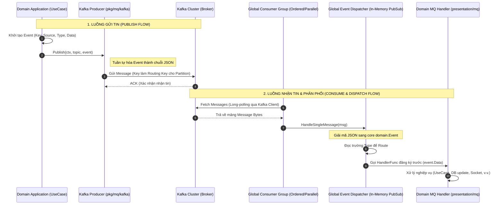

# MQ Kafka & Global Event Dispatcher Flow

Tài liệu này đặc tả quy trình vận hành, kiến trúc và luồng dữ liệu của hệ thống Message Queue (Kafka) kết hợp với bộ phân phối sự kiện toàn cục (Global Event Dispatcher) trong dự án `core-backend`.

---

## 1. Tổng quan & Quy tắc Thiết kế (Overview & Core Rules)

Hệ thống được thiết kế theo mô hình **Pub/Sub bất đồng bộ** dựa trên nền tảng Apache Kafka. Để giải quyết bài toán tối ưu hóa kết nối (connection pooling) và kiểm soát chặt chẽ tài nguyên, dự án áp dụng các luật thép sau:

### Quy tắc 1: Kiểm soát Topic nghiêm ngặt (Strict Topic Control)
*   **KHÔNG tự ý tạo thêm topic mới:** Toàn bộ hệ thống chỉ sử dụng các topic dùng chung được quy định sẵn trong [topics.go](file:///f:/Coding/Project/sowfkun.verse.v2/sowfkun-verse-api/pkg/mq/kafka/topics.go).
*   **Phân hoạch theo chiến lược xử lý (Processing Strategy):** Thay vì tạo topic cho từng domain (như `user-topic`, `tenant-topic`), hệ thống gom nhóm theo cách thức xử lý sự kiện:
    1.  `low-traffics-order-progress`: Xử lý tuần tự (FIFO) dựa trên Partition Key.
    2.  `single-parallel-progress`: Xử lý song song đa luồng bằng Worker Pool.
    3.  `batch-progress`: Gom lô (Batching) theo thời gian/số lượng trước khi ghi bulk xuống DB.
    4.  `send-socket-progress`: Gửi tin realtime xuống Client qua Hub.
    5.  `receive-socket-progress`: Nhận tin realtime gửi lên từ Client.
    6.  `low-entity-sync-order-progress`: Đồng bộ dữ liệu dựa trên MongoDB Change Stream.

### Quy tắc 2: Consumer Group tập trung (Global Event Dispatcher)
*   **KHÔNG tự tạo Consumer Group riêng lẻ:** Mỗi topic chỉ được đăng ký bởi **một Consumer duy nhất** chạy ngầm ở file khởi tạo hệ thống [setup_kafka.go](file:///f:/Coding/Project/sowfkun.verse.v2/sowfkun-verse-api/cmd/api/setup_kafka.go).
*   **Định tuyến trong RAM (In-Memory Dispatching):** Consumer toàn cục nhận tin, bóc tách payload, đọc trường `Type` (Event Type) và định tuyến tới MQ Handler tương ứng của từng Domain đã đăng ký trước thông qua hàm `dispatcher.Register(...)`.

---

## 2. Quy trình từng bước & Sơ đồ Flow (Step-by-Step Flow)

Quy trình xuất bản và phân phối tin nhắn được mô phỏng chi tiết thông qua sơ đồ sau:



### Chi tiết các bước thực hiện:
1.  **Tạo Event:** Tầng Application khởi tạo struct `domain.Event` chứa `Key` (dùng cho ordered partition, thường là ID), `Source` (domain phát), `Type` (hằng số sự kiện) và `Data` (payload chi tiết).
2.  **Publish:** Sử dụng Producer dùng chung gọi hàm `Publish(ctx, topic, event)` để serialize JSON và gửi lên Kafka Broker.
3.  **Fetch Message:** Consumer Group toàn cục liên tục pull message từ Broker về RAM.
4.  **Phân phối (Dispatch):** Hàm xử lý của Consumer gọi `dispatcher.HandleSingleMessage(msg)`. Tại đây, dispatcher giải mã JSON sang struct `Event`, đọc trường `Type` để tìm Handler đã đăng ký.
5.  **Xử lý (Handle):** Domain MQ Handler nhận dữ liệu thô (`any`), thực hiện parse ngược lại sang DTO nghiệp vụ của domain đó và gọi UseCase tương ứng để xử lý.

---

## 3. Đặc tả Kỹ thuật (Technical Specification)

### 3.1 Cấu trúc model sự kiện (Event Struct)
Tất cả các tin nhắn truyền qua Kafka bắt buộc phải có chung cấu trúc được định nghĩa tại [event.go](file:///f:/Coding/Project/sowfkun.verse.v2/sowfkun-verse-api/pkg/core/domain/event.go):

```go
type Event struct {
	Key         string    `json:"-"`                   // Dùng định tuyến Partition, ẩn khỏi JSON
	Topic       string    `json:"topic,omitempty"`     // Tên topic (chỉ dùng cho job hoặc debug)
	Source      string    `json:"source"`              // Nguồn phát sinh sự kiện (ví dụ: "auth", "user")
	Type        string    `json:"type"`                // Loại sự kiện (Event Type để dispatch)
	TenantID    string    `json:"tenant_id,omitempty"` // ID Tenant (phục vụ Multi-tenant isolation)
	UserID      string    `json:"user_id,omitempty"`   // ID User thực hiện thao tác (Actor context)
	TraceID     string    `json:"trace_id,omitempty"`  // ID dùng để trace vết qua các log (Tracing context)
	MessageTime time.Time `json:"message_time"`        // Thời điểm gửi (chuẩn UTC)
	Data        any       `json:"data"`                // Dữ liệu payload của sự kiện (Struct/Map tự do)
}
```

### 3.2 Khai báo Event Type
Hằng số Event Type bắt buộc khai báo tập trung tại [event.go](file:///f:/Coding/Project/sowfkun.verse.v2/sowfkun-verse-api/pkg/core/domain/event.go). Tên hằng số tuân theo dạng chữ hoa gạch dưới (`UPPER_SNAKE_CASE`):

```go
const (
	// Yêu cầu gửi email thông báo
	EventEmailSendRequested = "EMAIL_SEND_REQUESTED"

	// Đồng bộ Socket nội bộ
	EventSocketProgressSend = "SOCKET_PROGRESS_SEND"
    
	// Thay đổi trạng thái User
	EventUserChanged = "ENTITY_CHANGED_EVENT_USERS"
)
```

### 3.3 Cách thức đăng ký Handler (MQ Route)
Tại thư mục `internal/[domain_name]/presentation/mq/route.go`, lập trình viên đăng ký handler với dispatcher bằng hằng số chuẩn:

```go
func RegisterMQHandlers(
	dispatcher *kafkaPkg.EventDispatcher,
	userRepo domain.IUserRepository,
	generalRedisClient *redis.Client,
	general1Producer kafkaPkg.Producer,
	entitySyncProducer kafkaPkg.Producer,
) {
	userHandler := NewUserMQHandler(userRepo, generalRedisClient, general1Producer, entitySyncProducer)
	
	// Đăng ký sử dụng hằng số chuẩn, cấm hardcode chuỗi string
	dispatcher.Register(coreDomain.EntityChangedEventPrefix+strings.ToUpper(domain.User{}.CollectionName()), userHandler.HandleUserChanged)
	dispatcher.Register(coreDomain.EventClientPing, userHandler.HandleClientPing)
}
```

### 3.4 Change Stream Zero-Waste & Consumer-Side Projection
- **MongoDB ChangeStreamWatcher**: Không sử dụng `SetFullDocument(options.UpdateLookup)` để tránh overhead lookup ngầm trên MongoDB Oplog. Payload phát ra Kafka chỉ chứa metadata tối giản: `id`, `op`, `collection`, `updateDescription`.
- **Consumer Projection**: Các MQ Consumer khi cần dữ liệu để xử lý socket notification hoặc xóa cache bắt buộc gọi `repo.GetByID(ctx, id, projection)` với `projection` chỉ định đích danh các trường cần thiết (cấm `SELECT *`).
- **Kafka Producer Configuration**: `NewProducer` được cấu hình `Async: true` kết hợp nạp động các tham số gom batch từ biến môi trường (`KAFKA_PRODUCER_BATCH_BYTES`, `KAFKA_PRODUCER_BATCH_SIZE`, `KAFKA_PRODUCER_BATCH_TIMEOUT_MS`) để tối ưu hóa theo từng profile phần cứng (`mini`, `standard`, `huge`).
- **Dynamic Consumer Worker Scaling**:
  - `OrderedConsumer`: Tự động cấp phát số lượng Reader Instances bằng số lượng partition (`KAFKA_DEFAULT_PARTITIONS`, mặc định `4`), bảo đảm tỷ lệ 1 Reader : 1 Partition (1 Goroutine đồng bộ/partition).
  - `ParallelConsumer`: Hỗ trợ tùy biến `StartParallelConsumers(ctx, cluster, topic, groupID, numPartitions, workersPerPartition, handler)` — khởi tạo `numPartitions` Readers (khớp partitions 1:1), mỗi Reader sở hữu một Bounded Worker Pool gồm `workersPerPartition` Goroutines (ví dụ: 4 partitions x 3 workers = 12 concurrent threads) giúp xử lý song song tốc độ cao và kiểm soát RAM tuyệt đối (chống Goroutine explosion).

---

## 4. Các lỗi thường gặp & Giải pháp (Common Pitfalls)

| STT | Lỗi Thường Gặp | Nguyên Nhân | Giải Pháp Phòng Ngừa |
|---|---|---|---|
| 1 | **Nhận thiếu hoặc mất tin nhắn** | Đăng ký trùng `Consumer Group ID` ở các domain khác nhau. | Tuyệt đối không tự định nghĩa Consumer Group. Chỉ sử dụng 3 group ID toàn cục khai báo tại `setup_kafka.go`. |
| 2 | **Xử lý sai thứ tự sự kiện (FIFO)** | Không truyền trường `Key` khi push vào topic tuần tự `low-traffics-order-progress`. | Bắt buộc gán `Key` là ID của đối tượng (TenantID, UserID) để Kafka định tuyến vào chung một partition. |
| 3 | **Lỗi Compile khi import chéo** | Khai báo hằng số Event ở các file nghiệp vụ cụ thể nằm trong `internal/`. | Bắt buộc khai báo Event Type tại file dùng chung [event.go](file:///f:/Coding/Project/sowfkun.verse.v2/sowfkun-verse-api/pkg/core/domain/event.go). |
| 4 | **Sập Consumer (Crash) do Panic** | Handler nghiệp vụ phát sinh panic (ví dụ: pointer nil) nhưng không có `recover` bảo vệ. | Hệ thống `Dispatcher` đã bọc hàm `recover` tại vòng lặp xử lý chính, nhưng trong handler song song nên có cơ chế tự quản lý an toàn. |
| 5 | **Tắc nghẽn Change Stream (1s/event)** | `BatchTimeout` của `kafka.Writer` mặc định là 1s ở chế độ Synchronous. | Cấu hình `Async: true` và `BatchTimeout: 10 * time.Millisecond` trong `NewProducer()`. |
| 6 | **Stale hoặc chậm do `fullDocument`** | Watcher bật `UpdateLookup` ép MongoDB lookup ngầm cho mỗi update event. | Bỏ `UpdateLookup` tại Watcher, chuyển sang gọi `GetByID` kèm `projection` tại từng Consumer. |
