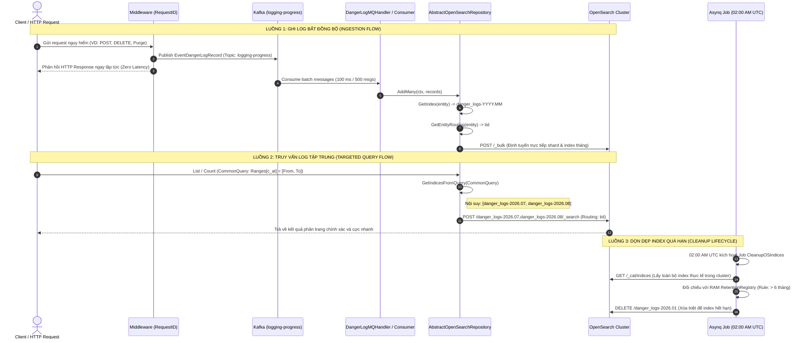

# OPENSEARCH ARCHITECTURE & TIME-SERIES FLOW

Tài liệu đặc tả toàn diện kiến trúc tích hợp **OpenSearch**, cơ chế phân vùng thời gian động (**Time-Series Dynamic Partitioning**), luồng ghi bất đồng bộ qua **Kafka Queue**, luồng truy vấn tối ưu **Targeted Shard Query**, và hệ thống tự động dọn dẹp dữ liệu quá hạn (**Index Retention & Asynq Job**).

---

## 1. Tổng quan & Quy tắc Nghiệp vụ (Overview & Architectural Rules)

1. **Chuẩn hoá Thời gian Quốc tế (UTC Standard):** Toàn bộ việc sinh tên index (`general_logs-YYYY.MM.DD`, `danger_logs-YYYY.MM`), parse timestamp, và tính toán ngày hết hạn đều thực hiện theo giờ chuẩn **UTC**.
2. **Không xoá lẻ từng Document Time-Series:** Dữ liệu log/audit/events không bao giờ xoá từng dòng lẻ (tránh phân mảnh cluster và tốn tài nguyên I/O). Việc xoá được thực hiện theo chu kỳ ngày bằng cách xoá triệt để toàn bộ index quá hạn (`DELETE /<expired-index>`).
3. **Phân vùng động theo Entity (Dynamic Partitioning):**
   - Khi ghi dữ liệu (`Add` / `AddMany`), `AbstractOpenSearchRepository` tự động trích xuất `ITimeSeriesEntity.GetTimestamp()` để định tuyến vào đúng index ngày/tháng cụ thể.
   - OpenSearch tự động liên kết index mới vào Alias chung nhờ Composable Templates (`_index_template`).
4. **Truy vấn thu hẹp phạm vi Shard (Targeted Range Query):**
   - Khi tìm kiếm/đếm (`List` / `Count`), Domain Repository sử dụng `GetIndicesFromQuery` để nội suy các index nằm trong khoảng thời gian `From` - `To` của `CommonQuery.Ranges[timeField]`.
   - Nếu không có bộ lọc thời gian, truy vấn sẽ fallback về Alias chung của toàn bộ domain.
5. **Ghi bất đồng bộ 100% qua Kafka (Non-blocking Ingestion):**
   - Các API/Middleware không bao giờ ghi trực tiếp OpenSearch đồng bộ. Toàn bộ log được đẩy vào Kafka topic `logging-progress`.
   - Worker Consumer gom batch và thực hiện `AddMany` (OpenSearch Bulk API) để đạt throughput tối đa.
6. **Hệ thống Quản lý Vòng đời Tập trung (RAM Retention Registry & Cron Job):**
   - Thay vì phụ thuộc vào ISM Policy (dễ lỗi 403 trên các cụm Cloud Aiven/AWS), hệ thống quản lý chính sách lưu giữ tập trung tại `cmd/indexer/opensearch.go`.
   - Cron Job tự động kích hoạt hằng ngày lúc `02:00 AM UTC` để dọn dẹp các index quá hạn.

---

## 2. Quy trình Xử lý & Luồng Dữ liệu (Step-by-Step Flows)



---

## 3. Đặc tả Cấu trúc & Tầng Hạ tầng (Technical Specification)

### 3.1. `AbstractOpenSearchRepository[T]` (`pkg/database/opensearch/abstract_repository.go`)
Cung cấp cổng Gateway hợp nhất thao tác với OpenSearch:

```go
type AbstractOpenSearchRepository[T any] struct {
    Client    *opensearch.Client
    IndexName string
    Partition PartitionType
    TimeField string
}

func NewAbstractOpenSearchRepository[T any](
    client *opensearch.Client,
    indexName string,
    partition PartitionType, // osPkg.PartitionDay | PartitionMonth | PartitionYear | PartitionNone
    timeField string,        // "timestamp" | "c_at"
) *AbstractOpenSearchRepository[T]
```

### 3.2. Chữ ký Hàm 3 Zone Chuẩn
```go
// ================= READ ZONE =================
func (r *AbstractOpenSearchRepository[T]) GetByID(ctx context.Context, id string, routingKey string, unixTs ...int64) *T
func (r *AbstractOpenSearchRepository[T]) List(ctx context.Context, indices []string, query map[string]any, sort map[string]any, page, size int, routingKey ...string) []*T
func (r *AbstractOpenSearchRepository[T]) Count(ctx context.Context, indices []string, query map[string]any, routingKey ...string) int64

// ================= WRITE ZONE =================
func (r *AbstractOpenSearchRepository[T]) Add(ctx context.Context, id string, entity *T) *T
func (r *AbstractOpenSearchRepository[T]) AddMany(ctx context.Context, entities []*T) bool
func (r *AbstractOpenSearchRepository[T]) Update(ctx context.Context, id string, doc map[string]any, routingKey string, unixTs ...int64) bool
func (r *AbstractOpenSearchRepository[T]) Delete(ctx context.Context, id string, routingKey string, unixTs ...int64) bool

// ================= HELPERS ZONE =================
func (r *AbstractOpenSearchRepository[T]) GetIndex(entity *T) string
func (r *AbstractOpenSearchRepository[T]) GetIndicesFromQuery(query appDto.CommonQuery) []string
func (r *AbstractOpenSearchRepository[T]) GetEntityRouting(entity *T) string
```

---

## 4. Bảng Định dạng Index & Chính sách Lưu giữ (Retention Policies)

| Domain / Alias | Phân vùng (`Partition`) | Tên Index Mẫu | Time Field | Routing Key | Chu kỳ Lưu giữ (`Retention`) |
|---|---|---|---|---|---|
| `general_logs` | `PartitionDay` | `general_logs-YYYY.MM.DD` | `timestamp` | Không (Cluster-wide) | **7 ngày** (Xoá sau 7 ngày) |
| `danger_logs` | `PartitionMonth` | `danger_logs-YYYY.MM` | `c_at` | `TenantID` (`tid`) | **6 tháng** (Xoá sau 180 ngày) |
| *Entity tĩnh* | `PartitionNone` | `entity_name` | `""` | `TenantID` (`tid`) | Không áp dụng (Lưu vĩnh viễn) |

---

## 5. Quy trình Đăng ký Module OpenSearch Mới (Step-by-Step Integration)

Khi cần tạo một Domain mới lưu trữ dữ liệu vào OpenSearch (ví dụ `audit_logs`):

1. **Bước 1: Khai báo Entity (`domain/entity.go`)**
   - Kế thừa `coreDomain.BaseEntity` (có sẵn `c_at`, `TenantID`).
   - Cài đặt `GetTimestamp() int64 { return r.CreatedDate }`.
   - Cài đặt `GetRouting() string { return r.TenantID }`.
   - Thêm comment cảnh báo `// ⚠️ WARNING: THIS ENTITY USES OPENSEARCH.`
2. **Bước 2: Đăng ký Template & Retention (`cmd/indexer/opensearch.go`)**
   - Khai báo Template JSON trong `getOpenSearchConfigs()` với pattern `audit_logs-*` và alias `audit_logs`.
   - Khai báo `RetentionRule` với số ngày lưu giữ mong muốn.
3. **Bước 3: Khởi tạo Repository (`infrastructure/opensearch_repository.go`)**
   - Nhúng `*osPkg.AbstractOpenSearchRepository[domain.AuditLogRecord]`.
   - Khởi tạo qua `osPkg.NewAbstractOpenSearchRepository(...)`.
   - Trong `List` / `Count`, gọi `indices := r.GetIndicesFromQuery(q.CommonQuery)` và truyền vào abstract methods.
