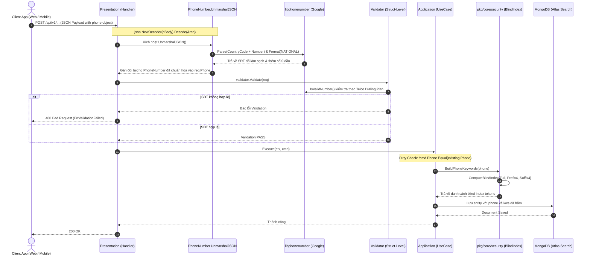

# Phone & Email Encryption & Searchable Encryption Flow

*Tài liệu đặc tả toàn diện về cấu trúc dữ liệu PhoneNumber (Value Object), Email (Value Object), quy trình tự động chuẩn hoá (Auto-Normalization), xác thực (Validation) và mã hóa an toàn (AES-256-GCM + e_hash + Searchable Encryption Blind Indexing) trong hệ thống.*

---

## 1. Tổng quan & Quy tắc Nghiệp vụ Đặc thù (Overview & Business Rules)

### 1.1. Triết lý Thiết kế Value Object
- **Cấu trúc dữ liệu SĐT**: `PhoneNumber` là một Value Object bất biến (Immutable Value Object) gồm 2 thuộc tính:
  - `country_code`: Mã quốc gia theo chuẩn viễn thông quốc tế (VD: `"+84"`, `"+1"`).
  - `number`: Số điện thoại nội địa (VD: `"0901234567"`, `"4155552671"`).
- **On-Premise & Country-Agnostic**: Hệ thống không hardcode quốc gia mặc định, tự động phân tích và áp dụng định dạng viễn thông của 200+ quốc gia thông qua Google `libphonenumber`.
- **Lưu trữ SĐT chuẩn (Storage Standard)**:
  - Số điện thoại được lưu với số `0` ở đầu (đối với các quốc gia dùng tiền tố nội địa trunk prefix như Việt Nam, Anh, Úc).
  - BSON tag trên MongoDB là `phone`, JSON tag là `phone`.
- **Value Object Email (`coreDomain.Email`)**:
  - Tự động chuyển về dạng viết thường (lowercase) và làm sạch khoảng trắng (trim whitespace) tại cửa ngõ API (`UnmarshalJSON`).
  - Underlying type là `string` để lưu trữ native BSON string trong MongoDB.
- **Mã hoá bảo mật dữ liệu gốc (AES Encryption)**: Dữ liệu SĐT gốc (`number`) và Email gốc (`email`) được mã hoá tự động bằng **AES-256-GCM** thông qua khoá `DATABASE_ENCRYPTION_KEY` tại tầng Repository trước khi lưu xuống MongoDB. Tầng Domain và UseCase luôn làm việc với bản rõ nhờ cơ chế tự giải mã trong suốt khi đọc lên.
- **Ranh giới Bảo mật (Security Boundary):** TUYỆT ĐỐI KHÔNG gọi các hàm mã hoá/giải mã (`Encrypt()` / `Decrypt()`) của Email/SĐT ở bên ngoài tầng Repository (như UseCase, Handler, Controller). Tầng Domain & UseCase chỉ tương tác với dữ liệu bản rõ; việc mã hóa/giải mã là nhiệm vụ khép kín bên trong lớp Repository.
- **Chống mã hóa đè (Idempotent Encryption Safeguard)**: Cả `Email` và `PhoneNumber` đều tích hợp bước thử giải mã trước khi thực thi mã hóa mới. Nếu giải mã thành công, trả về nguyên bản để tránh lỗi dữ liệu rác.

### 1.2. Tìm kiếm Mã Hóa An Toàn (Searchable Encryption) & Chỉ mục Duy nhất (e_hash)
- **Mảng tìm kiếm keywords (`kws`)**: Hệ thống áp dụng cơ chế **HMAC-SHA256 Blind Indexing** với Pepper Key bí mật (`BLIND_INDEX_PEPPER`) để băm các trường nhạy cảm (SĐT, Email) bản rõ trước khi lưu vào chỉ mục tìm kiếm `kws` (Keywords):
  - **Đối với Số điện thoại** (3 tokens):
    1. `Hash(Full Number)` (VD: `"0901234567"`)
    2. `Hash(Prefix 4 Digits)` (VD: `"0901"`)
    3. `Hash(Suffix 4 Digits)` (VD: `"4567"`)
  - **Đối với Email** (1 token):
    1. `Hash(Full Email)` (VD: `"admin@sowfkun.com"`)
- **Chỉ mục Duy nhất Email (`e_hash`)**:
  - Do trường `email` lưu chuỗi AES-GCM ngẫu nhiên không thể đặt unique index, hệ thống khai báo thêm trường `e_hash` (BSON tag `e_hash`, JSON tag `"-"`) lưu trữ duy nhất mã băm Blind Index của email.
  - Cấu hình chỉ mục `unique index` trên cột `e_hash` ở MongoDB để thực thi kiểm tra trùng lặp mức Database.
  - Các truy vấn tìm chính xác (`GetByEmail`) sẽ tự động so khớp trên `e_hash` thay vì quét mảng `kws`.
- **Luồng tìm kiếm (Search Flow)**: Khi Client gửi từ khóa tìm kiếm lên, hệ thống gọi hàm `text.TransformSearchKeywords(keyword)` để tự động phân tích và trả về danh sách các token tìm kiếm (bao gồm cả plain-text và băm Blind Index của SĐT/Email nếu khớp định dạng). Nhờ đó, người dùng vừa có thể tìm kiếm tên có chứa số, vừa có thể tìm kiếm SĐT/Email bằng cơ chế băm an toàn.

---

## 2. Quy trình Từng bước (Step-by-Step Flow)

### 2.1. Sơ đồ Luồng Xử lý Toàn trình (End-to-End Sequence Diagram)



---

## 3. Đặc tả Kỹ thuật API (API Specification)

### 3.1. Cấu trúc Object Phone trong Payload Request

Mọi API nhận số điện thoại (như Đăng ký, Cập nhật thông tin Tenant, Thêm nhân viên) đều nhận object `phone` theo cấu trúc:

| Trường | Kiểu dữ liệu | Bắt buộc | Ràng buộc Validate | Mô tả & Ví dụ |
| :--- | :--- | :---: | :--- | :--- |
| `country_code` | `string` | Có | `+` kèm mã vùng quốc tế | Ví dụ: `"+84"`, `"+1"`, `"84"` (tự bù `+`) |
| `number` | `string` | Có | Chuỗi số thuê bao | Ví dụ: `"0901234567"`, `"981341899"` (tự bù `0`), `"098-134-1899"` (tự làm sạch) |

#### Ví dụ JSON Request (Cập nhật Tenant Info):
```json
{
  "name": "Sowfkun Technology Corp",
  "phone": {
    "country_code": "+84",
    "number": "0981341899"
  },
  "language": "vi"
}
```

#### Ví dụ JSON Response (Đăng nhập / Xem thông tin):
```json
{
  "data": {
    "id": "66b1a9f...",
    "name": "Sowfkun Technology Corp",
    "email": "admin@sowfkun.com",
    "phone": {
      "country_code": "+84",
      "number": "0981341899"
    },
    "status": "ACTIVE",
    "tier": "FREE",
    "language": "vi"
  },
  "error_code": 0,
  "error_detail": ""
}
```

---

## 4. Các Mã Lỗi Thường Gặp (Common Error Codes)

| HTTP Status | Mã Lỗi (`error_code`) | Nguyên nhân | Hướng xử lý cho Client |
| :--- | :--- | :--- | :--- |
| `400 Bad Request` | `VALIDATION_FAILED` | Định dạng số điện thoại không hợp lệ (không đúng chuẩn viễn thông của quốc gia đó). | Kiểm tra lại độ dài, mã vùng quốc gia và đầu số viễn thông. |
| `400 Bad Request` | `BAD_REQUEST` | Payload JSON bị sai định dạng cú pháp. | Kiểm tra cú pháp JSON gửi lên. |
| `401 Unauthorized` | `UNAUTHORIZED` | Token xác thực hết hạn hoặc không hợp lệ. | Đăng nhập lại hoặc làm mới Access Token qua Refresh Token. |
| `403 Forbidden` | `FORBIDDEN` | Tài khoản không có quyền thao tác (chỉ Owner mới được cập nhật SĐT Tenant). | Đăng nhập bằng tài khoản Owner hoặc yêu cầu cấp quyền. |
