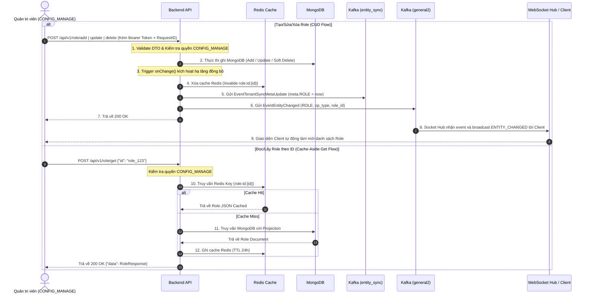

# Role & RBAC Management Workflow Documentation

Tài liệu này đặc tả toàn bộ quy trình nghiệp vụ (Business Rules), luồng xử lý (Step-by-Step Flow), sơ đồ Mermaid và đặc tả API của phân hệ Vai trò & Phân quyền (Role Module) trong hệ thống Sowfkun-Verse.

---

## 1. Tổng quan & Quy tắc Nghiệp vụ Đặc thù (Business Rules)

Phân hệ Role đóng vai trò trung tâm trong việc quản lý hệ thống phân quyền theo vai trò (RBAC - Role-Based Access Control) kết hợp phạm vi truy cập (Scopes), tuân thủ các luật thép sau:

### 1.1 Chốt chặn Phân quyền (Authorization Barrier)
- **Quyền Quản lý Cấu hình (`CONFIG_MANAGE`)**: Toàn bộ các API của phân hệ Role (bao gồm Create, Read, Update, Delete, List, Options) **bắt buộc** phải đi qua middleware kiểm tra quyền `CONFIG_MANAGE`.
- **Đặc quyền Chủ sở hữu (Owner Privilege)**: Tài khoản Owner (`is_owner = true`) luôn mặc định sở hữu toàn quyền cao nhất trên toàn bộ tính năng và phạm vi `ALL`.

### 1.2 Cấu trúc Phân quyền & Ràng buộc Tính nhất quán (Permission Matrix & Consistency Rules)
- Mỗi Role đại diện cho một vai trò trong Tenant và chứa một ma trận quyền: `map[PermissionKey][]PermissionScope`.
  - **PermissionKey**: Mã định danh tính năng (VD: `USER_VIEW`, `USER_MANAGE`, `CONFIG_MANAGE`).
  - **PermissionScope**: Phạm vi truy cập của quyền Xem (`ALL`, `SUBORDINATES`, `SAME_DEPT`, `OWN_ONLY`, `NONE`).
  - **Quy ước Scope**:
    - **Quyền Xem (`*_VIEW`)**: Bắt buộc phải có Scope hợp lệ để hệ thống phân giải phạm vi hiển thị dữ liệu theo cấp bậc.
    - **Quyền Quản lý/Chỉnh sửa (`*_MANAGE`, `CONFIG_MANAGE`)**: Là cờ hành động (Action/Toggle), **không cần scope** (mảng scope có thể để rỗng `[]` hoặc `nil`).
- **Luật Nhất quán Phân quyền (Consistency Rules)**:
  - **Có quyền xem chưa chắc có quyền chỉnh sửa**: Role có thể chỉ sở hữu `USER_VIEW` mà không có `USER_MANAGE` (hoàn toàn hợp lệ).
  - **Có quyền chỉnh sửa bắt buộc phải có quyền xem**: Nếu Role được gán quyền chỉnh sửa (`USER_MANAGE`) thì **bắt buộc** phải được gán kèm quyền xem tương ứng (`USER_VIEW` có scope hợp lệ).
  - **Xung đột quyền (`ERR_PERMISSION_CONFLICT`)**: Nếu ma trận quyền chứa quyền quản lý/chỉnh sửa nhưng thiếu hoặc rỗng quyền xem tương ứng, hệ thống sẽ từ chối và trả về lỗi `ERR_PERMISSION_CONFLICT` ngay tại tầng UseCase.

### 1.3 Cơ chế Caching & Real-time Synchronization (Redis & MQ)
- **Redis Cache (Gateway Pattern)**: Dữ liệu Role được cache trên Redis (`role:id:{roleID}`) với TTL 24 giờ để tăng tốc độ kiểm tra quyền (Permission Checking) và đọc dữ liệu.
- **Cache Invalidation & Multi-Cluster MQ Event Bus**:
  - Khi có thao tác Create/Update/Delete Role, `onChange()` của Repository sẽ tự động gửi sự kiện đồng bộ qua Kafka.
  - **Kafka `entity_sync`**: Gửi sự kiện `EventTenantSyncMetaUpdate` để cập nhật `meta.ROLE = timestamp` vào document Tenant.
  - **Kafka `general2` (Target Tenant)**: Gửi sự kiện `EventEntityChanged` (`entity_type = "ROLE"`, `op_type = CREATE/UPDATE/DELETE`) để WebSocket Dispatcher phát sóng sự kiện `ENTITY_CHANGED` về client đang kết nối.

### 1.4 Cơ chế Cập nhật & Xóa Tối ưu (Dirty Check & Soft Delete Tracking)
- **Dirty Check (Rule 9)**: API Update so sánh dữ liệu mới với DB, nếu không có thay đổi nào thực sự khác biệt thì bỏ qua việc ghi MongoDB (Skip DB Write).
- **Audit & Soft Delete Tracking (Rule 2.8)**: Khi thực hiện xóa, hệ thống ghi vết thông tin người thao tác (`u_by`) và mã vết (`tracking_id` từ `RequestIDMiddleware`) vào bản ghi bị xóa mềm (`is_del: true`).

---

## 2. Quy trình Từng bước (Step-by-Step Flow)



---

## 3. Đặc tả Chi tiết API (API Specification)

### 3.1 Thêm vai trò mới (Add Role)
* **Endpoint:** `POST /api/v1/role/add`
* **Xác thực:** JWT Bearer Token (`Authorization: Bearer <token>`)
* **Quyền hạn:** `CONFIG_MANAGE`
* **Middleware:** `RequestIDMiddleware`
* **Request Body:**

| Tên trường | Kiểu dữ liệu | Ràng buộc | Mô tả |
| :--- | :--- | :--- | :--- |
| `name` | `string` | `required,max=100` | Tên vai trò (VD: "Trưởng phòng Kinh doanh"). |
| `desc` | `string` | `omitempty,max=255` | Mô tả nhiệm vụ của vai trò. |
| `perms` | `map[string][]string` | `omitempty` | Ma trận quyền (`{"USER_VIEW": ["ALL"], "USER_MANAGE": ["SUBORDINATES"]}`). |

* **Response (200 OK):**
```json
{
  "code": 200,
  "message": "MSG_SUCCESS",
  "data": {
    "id": "65f123456789abcdef012345"
  }
}
```

---

### 3.2 Cập nhật vai trò (Update Role)
* **Endpoint:** `POST /api/v1/role/update`
* **Xác thực:** JWT Bearer Token (`Authorization: Bearer <token>`)
* **Quyền hạn:** `CONFIG_MANAGE`
* **Middleware:** `RequestIDMiddleware`
* **Request Body:**

| Tên trường | Kiểu dữ liệu | Ràng buộc | Mô tả |
| :--- | :--- | :--- | :--- |
| `id` | `string` | `required` | ID vai trò cần cập nhật. |
| `name` | `*string` | `omitempty,max=100` | Tên vai trò mới. |
| `desc` | `*string` | `omitempty,max=255` | Mô tả mới. |
| `perms` | `map[string][]string` | `omitempty` | Ma trận quyền mới. |

* **Response (200 OK):**
```json
{
  "code": 200,
  "message": "MSG_SUCCESS",
  "data": null
}
```

---

### 3.3 Xóa vai trò (Delete Roles)
* **Endpoint:** `POST /api/v1/role/delete`
* **Xác thực:** JWT Bearer Token (`Authorization: Bearer <token>`)
* **Quyền hạn:** `CONFIG_MANAGE`
* **Middleware:** `RequestIDMiddleware`
* **Request Body:**

| Tên trường | Kiểu dữ liệu | Ràng buộc | Mô tả |
| :--- | :--- | :--- | :--- |
| `ids` | `[]string` | `omitempty` | Danh sách ID vai trò cần xóa mềm. |

* **Response (200 OK):**
```json
{
  "code": 200,
  "message": "MSG_SUCCESS",
  "data": null
}
```

---

### 3.4 Lấy chi tiết vai trò (Get Role - Cache Enabled)
* **Endpoint:** `POST /api/v1/role/get`
* **Xác thực:** JWT Bearer Token (`Authorization: Bearer <token>`)
* **Quyền hạn:** `CONFIG_MANAGE`
* **Request Body:**

| Tên trường | Kiểu dữ liệu | Ràng buộc | Mô tả |
| :--- | :--- | :--- | :--- |
| `id` | `string` | `required` | ID vai trò cần lấy thông tin. |

* **Response (200 OK):**
```json
{
  "code": 200,
  "message": "MSG_SUCCESS",
  "data": {
    "id": "65f123456789abcdef012345",
    "name": "Trưởng phòng Kinh doanh",
    "desc": "Quản lý toàn bộ nhân viên kinh doanh",
    "perms": {
      "USER_VIEW": ["ALL"],
      "USER_MANAGE": ["SUBORDINATES"]
    },
    "c_at": 1718000000,
    "u_at": 1718000000
  }
}
```

---

### 3.5 Danh sách vai trò phân trang (List Roles)
* **Endpoint:** `POST /api/v1/role/list`
* **Xác thực:** JWT Bearer Token (`Authorization: Bearer <token>`)
* **Quyền hạn:** `CONFIG_MANAGE`
* **Request Body:**

| Tên trường | Kiểu dữ liệu | Ràng buộc | Mô tả |
| :--- | :--- | :--- | :--- |
| `page` | `int` | `omitempty,min=1` | Số trang (mặc định: 1). |
| `size` | `int` | `omitempty,min=1,max=100` | Số bản ghi mỗi trang (mặc định: 20). |
| `search` | `string` | `omitempty` | Từ khóa tìm kiếm theo tên/mô tả vai trò. |
| `sorts` | `[]SortItem` | `omitempty` | Sắp xếp (`[{"field": "c_at", "order": "desc"}]`). |

* **Response (200 OK):**
```json
{
  "code": 200,
  "message": "MSG_SUCCESS",
  "data": {
    "items": [
      {
        "id": "65f123456789abcdef012345",
        "name": "Trưởng phòng Kinh doanh",
        "desc": "Quản lý kinh doanh",
        "perms": {
          "USER_VIEW": ["ALL"]
        },
        "c_at": 1718000000,
        "u_at": 1718000000
      }
    ],
    "total": 1,
    "page": 1,
    "size": 20
  }
}
```

---

### 3.6 Danh sách vai trò rút gọn cho Dropdown/Options (List Roles For Options)
* **Endpoint:** `POST /api/v1/role/list-for-options`
* **Xác thực:** JWT Bearer Token (`Authorization: Bearer <token>`)
* **Quyền hạn:** `CONFIG_MANAGE`
* **Request Body:**

| Tên trường | Kiểu dữ liệu | Ràng buộc | Mô tả |
| :--- | :--- | :--- | :--- |
| `page` | `int` | `omitempty,min=1` | Số trang. |
| `size` | `int` | `omitempty,min=1,max=1000` | Số bản ghi (nhận từ client). |
| `search` | `string` | `omitempty` | Từ khóa tìm kiếm nhanh. |

* **Response (200 OK):**
```json
{
  "code": 200,
  "message": "MSG_SUCCESS",
  "data": {
    "items": [
      {
        "id": "65f123456789abcdef012345",
        "name": "Trưởng phòng Kinh doanh",
        "perms": {
          "USER_VIEW": ["ALL"],
          "USER_MANAGE": ["SUBORDINATES"]
        }
      }
    ],
    "total": 1,
    "page": 1,
    "size": 20
  }
}
```

---

## 4. Các Mã Lỗi Thường Gặp (Common Error Codes)

| HTTP Status | Mã lỗi (`error_code`) | Ý nghĩa & Hướng xử lý |
| :--- | :--- | :--- |
| `400 Bad Request` | `ERR_BAD_REQUEST` | Payload không hợp lệ hoặc dữ liệu phân quyền sai cấu trúc. |
| `400 Bad Request` | `ERR_VALIDATION_FAILED` | Không thỏa mãn điều kiện `validate` (tên trống, vượt quá độ dài quy định). |
| `400 Bad Request` | `ERR_PERMISSION_CONFLICT` | Xung đột ma trận phân quyền (Quyền quản lý/chỉnh sửa bắt buộc phải đi kèm quyền xem). |
| `401 Unauthorized`| `ERR_UNAUTHORIZED` | Token JWT thiếu, hết hạn hoặc không hợp lệ. |
| `403 Forbidden`   | `ERR_FORBIDDEN` | Tài khoản thiếu quyền `CONFIG_MANAGE`. |
| `404 Not Found`   | `ERR_ROLE_NOT_FOUND` | Không tìm thấy vai trò chỉ định trong Tenant hiện tại. |
| `500 Internal`    | `ERR_INTERNAL_SERVER` | Lỗi thao tác MongoDB, Redis hoặc Kafka Event Bus. |
