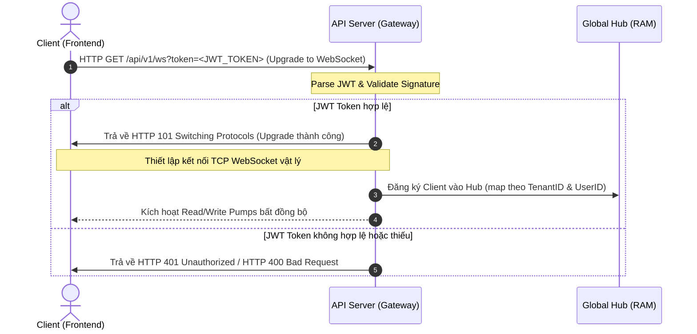
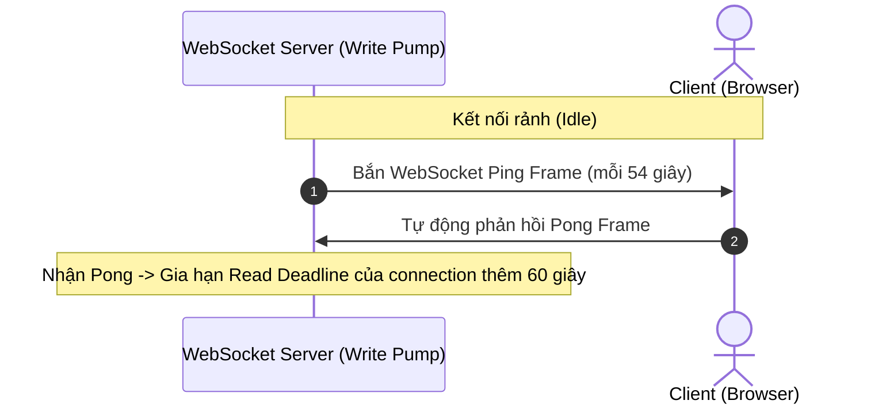
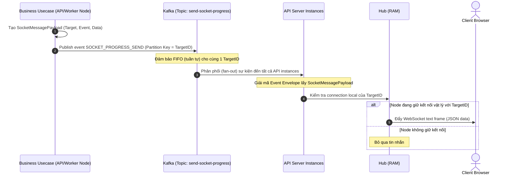
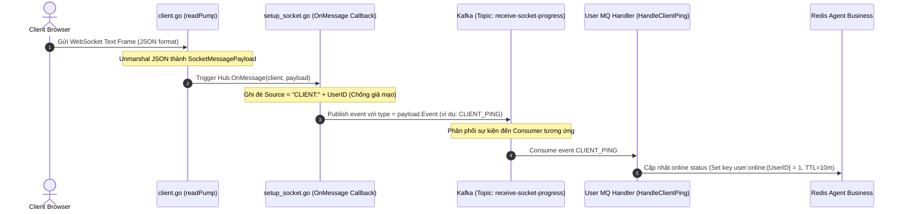

# Tài Liệu Luồng WebSocket Server (WebSocket Flow Specification)

Tài liệu này mô tả chi tiết kiến trúc, vòng đời kết nối và dòng chảy dữ liệu 2 chiều (Bidirectional Data Flow) của hệ thống Realtime WebSocket Server tích hợp với Apache Kafka đa cụm trong dự án.

---

## 1. Luồng Bắt Tay & Thiết Lập Kết Nối (Connection & Handshake Flow)

Kết nối WebSocket sử dụng cơ chế bắt tay HTTP Upgrade và xác thực thông qua JSON Web Token (JWT) truyền qua URL Query Parameter.



### 1.1. Chi tiết thực thi:
- **Endpoint:** `ws://<api-domain>/api/v1/ws?token=<JWT_TOKEN>`
- **Xác thực:** Giao thức GET không đi qua E2EE Middleware của REST API mà giải mã JWT trực tiếp trong Handler để lấy `UserID` và `TenantID` (phục vụ phân vùng Multi-tenant).
- **Lưu trữ kết nối:** Lưu vật lý in-memory trên RAM thông qua các map 2 chiều: `tenantClients` (để broadcast theo Tenant) và `userClients` (để gửi riêng tư cho cá nhân).

---

## 2. Quy tắc Nghiệp vụ Đặc thù (Business Rules)

### 2.1. Chu kỳ Ping Duy trì Trạng thái (Heartbeat & Activity Ping)
- **Chu kỳ gửi:** Client định kỳ gửi gói tin `CLIENT_PING` mỗi **5 phút** một lần (được cài đặt trong `RouteGuard.tsx`). *Lưu ý: Trong quá trình phát triển/kiểm thử, chu kỳ này có thể được cấu hình tạm thời là **5 giây** để theo dõi dòng tin nhắn trực quan.*
- **Dữ liệu tươi (Fresh Data):** Client phải lấy đường dẫn thực tế hiện tại ứng dụng đang hiển thị bằng `window.location.pathname` để truyền trong payload `active_path`.
- **Cấu trúc validate bắt buộc:** Tin nhắn gửi lên bắt buộc phải đính kèm đầy đủ `target_type: "USER"` và `target_id` là User ID của chính client đang kết nối để vượt qua lớp kiểm tra kiểu dữ liệu của Backend.

### 2.2. Cơ chế Lưu trữ & Quản lý TTL Online trên Cache
- **Cấu trúc Key:** Trạng thái online của người dùng được lưu trên Redis Agent Business dưới dạng `user:online:{UserID}`.
- **Thời gian hết hạn (TTL):** Thời gian sống (TTL) của Key online được cấu hình là **10 phút** (gấp 2 lần chu kỳ Ping 5 phút của Client). Điều này giúp tránh hiện tượng trạng thái chập chờn (toggled online/offline liên tục) khi xảy ra trễ mạng cục bộ hoặc mất gói tin ping đơn lẻ.

### 2.3. Xác nhận Phản hồi 2 chiều (Bidirectional Acknowledgement)
- **Cơ chế Pong:** Khi Backend MQ Handler tiêu thụ sự kiện `CLIENT_PING` và ghi Redis thành công, nó sẽ tự động gửi ngược gói tin xác nhận `CLIENT_PONG` thông qua Kafka `send-socket-progress` để Server WebSocket Node đẩy xuống kết nối vật lý của Client.
- **Phản hồi phía Client:** Khi nhận được sự kiện `CLIENT_PONG`, Frontend sẽ ghi vết và hiển thị phản hồi thành công (Toast thông báo màu xanh lá) để kiểm chứng kết nối thời gian thực thông suốt.

### 2.4. Bảo vệ Phòng vệ Máy chủ (Defensive Boot Sequence)
- **Thứ tự khởi chạy:** WebSocket Global Hub bắt buộc phải được khởi tạo trước khi khởi chạy các Kafka Consumers để đảm bảo việc đăng ký lắng nghe dispatcher trên topic `send-socket-progress` thành công.
- **Tránh lỗi Panic:** Handler nâng cấp `/api/v1/ws` tích hợp chốt chặn kiểm tra `GlobalHub == nil`. Nếu server chạy ở chế độ worker (hoặc không hỗ trợ socket), request nâng cấp sẽ bị từ chối với HTTP `503 Service Unavailable` thay vì gây ra lỗi panic làm tắt server.

---

## 3. Luồng Heartbeat & Ping/Pong (TCP Connection Keep-Alive)

Để duy trì kết nối TCP không bị ngắt bởi Nginx/Proxy do rảnh (Idle), server định kỳ gửi gói tin Ping ở cấp mạng.



> [!NOTE]
> Gói tin Ping/Pong ở cấp mạng (WebSocket Control Frames) chỉ có tác dụng giữ kết nối TCP không bị Timeout. 
> Trạng thái online thực tế (`user:online:{UserID}`) trên Redis được quản lý riêng biệt bởi ứng dụng thông qua tin nhắn text frame `CLIENT_PING` (Xem chi tiết tại Mục 2).

---

## 4. Chiều Gửi Tin Nhắn Từ Server Xuống Client (Send Flow - Server-to-Client)

Luồng gửi tin nhắn xuống client hoạt động theo mô hình **Fan-out qua Kafka**. Bất kỳ node nào trong hệ thống cũng có thể publish tin nhắn, Kafka sẽ phân phối đến toàn bộ API Nodes để tìm kết nối vật lý.



### 4.1. Định dạng JSON Frame Server phát xuống:
```json
{
  "event": "NOTIFICATION_RECEIVED",
  "data": {
    "title": "New Message",
    "content": "Hello World"
  }
}
```

---

## 5. Chiều Client Gửi Tin Nhắn Lên Server (Receive Flow - Client-to-Server)

Khi client gửi tin nhắn lên WebSocket, server sẽ nhận được, đóng gói và đẩy lên Kafka chiều nhận để các consumer nghiệp vụ tiêu thụ bất đồng bộ nhằm phân rã liên kết (decoupling).



### 5.1. Định dạng JSON Client gửi lên:
```json
{
  "target_type": "USER",
  "target_id": "user_recipient_id",
  "event": "CLIENT_PING",
  "data": {}
}
```

---

## 6. Danh Sách Các Event Định Sẵn (Built-in Events)

| Tên Event (payload.Event) | Chiều (Direction) | Logic Xử Lý Ở Backend |
| :--- | :--- | :--- |
| `CLIENT_PING` | Client $\rightarrow$ Server | Trigger `HandleClientPing` của User MQ Handler gia hạn trạng thái online (`user:online:{UserID}`) trên Redis Agent Business. |
| `SOCKET_PROGRESS_SEND` | Server $\rightarrow$ Client | Topic `send-socket-progress` dùng event type này làm envelope điều hướng dispatcher toàn cục chuyển tin cho Hub. |

---

## 7. Hướng Dẫn Tích Hợp Client (Frontend Integration Guide)

### 7.1. Thiết Lập Kết Nối (Connection Setup)
Client sử dụng thư viện WebSocket chuẩn của trình duyệt (hoặc các wrapper) để bắt đầu kết nối. Token JWT bắt buộc phải được truyền qua query parameter `token`.

```javascript
const JWT_TOKEN = "your_jwt_token_here";
const socketUrl = `ws://localhost:8080/api/v1/ws?token=${JWT_TOKEN}`;

const ws = new WebSocket(socketUrl);

ws.onopen = () => {
    console.log("🔌 WebSocket connected successfully!");
    // Khởi động gửi Ping định kỳ để duy trì online status
    startHeartbeat();
};

ws.onmessage = (event) => {
    try {
        const payload = JSON.parse(event.data);
        console.log(`📩 Nhận sự kiện [${payload.event}]:`, payload.data);
        
        // Xử lý logic theo từng sự kiện nhận được
        if (payload.event === "NOTIFICATION_RECEIVED") {
            showNotification(payload.data);
        }
    } catch (e) {
        console.error("❌ Lỗi parse JSON socket frame:", e);
    }
};

ws.onclose = (event) => {
    console.log("🔌 WebSocket disconnected. Reason:", event.reason);
    stopHeartbeat();
    // Thực hiện logic tự động kết nối lại (Auto Reconnect) sau 3-5 giây
};
```

### 7.2. Giao Thức Gửi Tin (Client-to-Server)
Khi client gửi tin nhắn lên, do các tag JSON của `SocketMessagePayload` ở server đã được bổ sung `omitempty`, client chỉ cần gửi đúng schema tối thiểu có chứa `event` và `data`. Backend sẽ tự động điền `source` ở gateway.

#### A. Gửi Ping Duy Trì Kết Nối (CLIENT_PING)
Client nên gửi Ping định kỳ mỗi **5 phút** (hoặc **5 giây** để test kết nối nhanh chóng) để đảm bảo TTL `user:online` trên Redis luôn được gia hạn.

```javascript
let heartbeatInterval;

function startHeartbeat() {
    heartbeatInterval = setInterval(() => {
        if (ws.readyState === WebSocket.OPEN) {
            const pingFrame = {
                target_type: "USER",
                target_id: "your_user_id",
                event: "CLIENT_PING",
                data: {
                    active_path: window.location.pathname
                }
            };
            ws.send(JSON.stringify(pingFrame));
            console.log("🛰️ Heartbeat CLIENT_PING sent.");
        }
    }, 300000); // 5 phút (hoặc 5000 cho 5 giây test)
}

function stopHeartbeat() {
    clearInterval(heartbeatInterval);
}
```

#### B. Gửi Tin Nhắn Nghiệp Vụ Khác (Ví dụ gửi Chat)
```javascript
function sendChatMessage(recipientUserId, text) {
    const chatFrame = {
        target_type: "USER",
        target_id: recipientUserId,
        event: "CHAT_MESSAGE_SENT",
        data: {
            content: text,
            sent_at: new Date().toISOString()
        }
    };
    ws.send(JSON.stringify(chatFrame));
}
```
