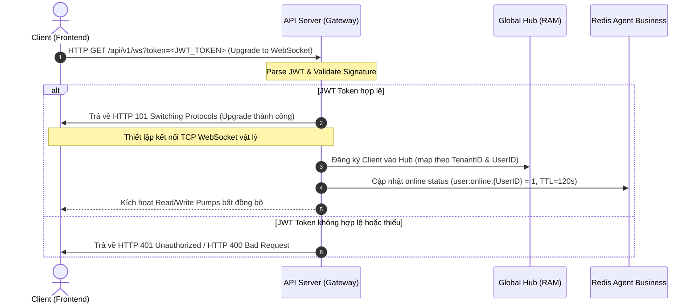
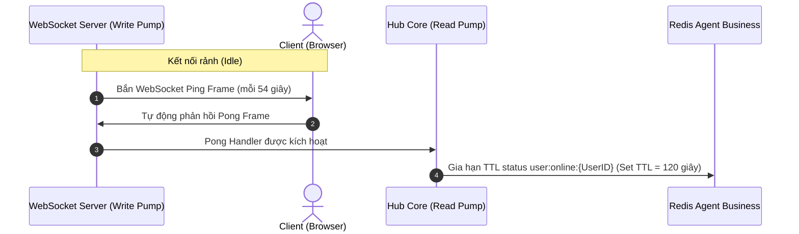
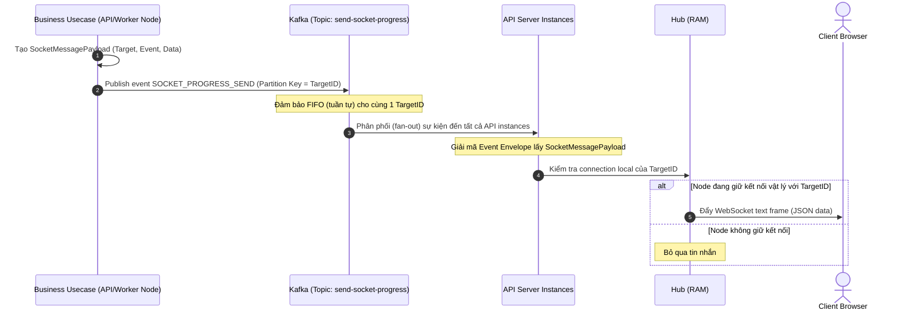

# Tài Liệu Luồng WebSocket Server (WebSocket Flow Specification)

Tài liệu này mô tả chi tiết kiến trúc, vòng đời kết nối và dòng chảy dữ liệu 2 chiều (Bidirectional Data Flow) của hệ thống Realtime WebSocket Server tích hợp với Apache Kafka đa cụm trong dự án.

---

## 1. Luồng Bắt Tay & Thiết Lập Kết Nối (Connection & Handshake Flow)

Kết nối WebSocket sử dụng cơ chế bắt tay HTTP Upgrade và xác thực thông qua JSON Web Token (JWT) truyền qua URL Query Parameter.



### 1.1. Chi tiết thực thi:
- **Endpoint:** `ws://<api-domain>/api/v1/ws?token=<JWT_TOKEN>`
- **Xác thực:** Giao thức GET không đi qua E2EE Middleware của REST API mà giải mã JWT trực tiếp trong Handler để lấy `UserID` và `TenantID` (phục vụ phân vùng Multi-tenant).
- **Lưu trữ kết nối:** Lưu vật lý in-memory trên RAM thông qua các map 2 chiều: `tenantClients` (để broadcast theo Tenant) và `userClients` (để gửi riêng tư cho cá nhân).

---

## 2. Luồng Heartbeat & Ping/Pong (Heartbeat Lifecycle)

Để duy trì kết nối TCP và cập nhật trạng thái hoạt động (online status) của người dùng lên Redis, hệ thống sử dụng cơ chế Heartbeat định kỳ.



---

## 3. Chiều Gửi Tin Nhắn Từ Server Xuống Client (Send Flow - Server-to-Client)

Luồng gửi tin nhắn xuống client hoạt động theo mô hình **Fan-out qua Kafka**. Bất kỳ node nào trong hệ thống cũng có thể publish tin nhắn, Kafka sẽ phân phối đến toàn bộ API Nodes để tìm kết nối vật lý.



### 3.1. Định dạng JSON Frame Server phát xuống:
```json
{
  "event": "NOTIFICATION_RECEIVED",
  "data": {
    "title": "New Message",
    "content": "Hello World"
  }
}
```

---

## 4. Chiều Client Gửi Tin Nhắn Lên Server (Receive Flow - Client-to-Server)

Khi client gửi tin nhắn lên WebSocket, server sẽ nhận được, đóng gói và đẩy lên Kafka chiều nhận để các consumer nghiệp vụ tiêu thụ bất đồng bộ nhằm phân rã liên kết (decoupling).


### 4.1. Định dạng JSON Client gửi lên:
```json
{
  "target_type": "USER",
  "target_id": "user_recipient_id",
  "event": "CLIENT_PING",
  "data": {}
}
```

---

## 5. Danh Sách Các Event Định Sẵn (Built-in Events)

| Tên Event (payload.Event) | Chiều (Direction) | Logic Xử Lý Ở Backend |
| :--- | :--- | :--- |
| `CLIENT_PING` | Client $\rightarrow$ Server | Trigger `HandleClientPing` của User MQ Handler gia hạn trạng thái online (`user:online:{UserID}`) trên Redis Agent Business. |
| `SOCKET_PROGRESS_SEND` | Server $\rightarrow$ Client | Topic `send-socket-progress` dùng event type này làm envelope điều hướng dispatcher toàn cục chuyển tin cho Hub. |
