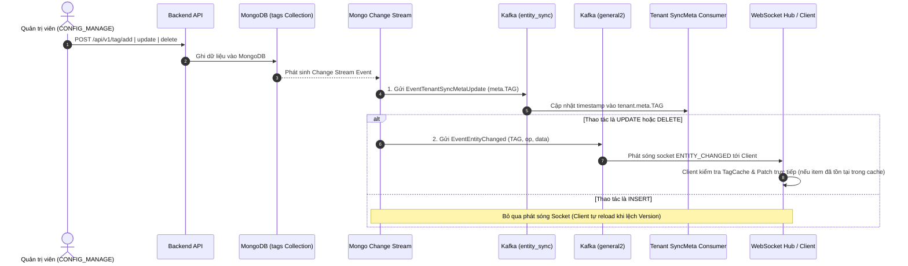

# Tag Management Workflow Documentation

Tài liệu này đặc tả toàn bộ quy trình nghiệp vụ (Business Rules), luồng xử lý (Step-by-Step Flow), sơ đồ Mermaid và đặc tả API của phân hệ **Thẻ Phân Loại (Tag Module)** trong hệ thống Sowfkun-Verse.

---

## 1. Tổng quan & Quy tắc Nghiệp vụ Đặc thù (Business Rules)

### 1.1 Mục đích & Ứng dụng
- Phân hệ Tag cung cấp cơ chế gắn nhãn màu sắc và phân nhóm dữ liệu linh hoạt trên nhiều thực thể (như `CUSTOMER`, `TICKET`, `ORDER`, v.v.).
- Mỗi Tag bao gồm: Tên (`name`), Mã màu HEX (`color`), và Danh sách thực thể được áp dụng (`entity_types`).

### 1.2 Chốt chặn Phân quyền (Authorization Barrier)
- **API Ghi Dữ liệu (CUD - Add/Update/Delete)**: Bắt buộc đi qua kiểm tra quyền `CONFIG_MANAGE` thông qua `RequirePermission(string(roleDomain.PermConfigManage))`.
- **API Đọc Dữ liệu (Read/List/Options)**: Xác thực đăng nhập `RequireAuth` (công khai cho toàn bộ nhân sự trong Tenant để hiển thị Dropdown/Filter).

### 1.3 Quy tắc Options API (Golden Standard)
- **Endpoint**: `GET /api/v1/tag/list-for-options`.
- **Query Parameters**: `?page=1&size=100` (không bắt buộc).
- **Không Filter Nghiệp Vụ**: Lấy toàn bộ Tag của Tenant để phục vụ Local Caching.
- **Hardcoded Projection**: Ép cứng Projection tại Controller:
  ```go
  req.Projection = map[string]any{
      "name":         1,
      "color":        1,
      "entity_types": 1,
  }
  ```
  *(Loại bỏ trường `desc` và các trường audit để tối ưu kích thước payload mạng)*.

### 1.4 Cơ chế Đồng bộ Real-time & Invalidation (Kafka & WebSocket)
- **Kafka `entity_sync`**: Khi có bất kỳ thay đổi nào (`insert`, `update`, `delete`), Change Stream kích hoạt gửi sự kiện `EventTenantSyncMetaUpdate` (`entity_type = "TAG"`) sang Tenant module để cập nhật `tenant.meta.TAG = nowMs`.
- **WebSocket `general2` (Granular Realtime Patching)**:
  - Khi thao tác là `UPDATE` hoặc `DELETE`: Phát sóng sự kiện `ENTITY_CHANGED` (`entity_type = "TAG"`) về Client kèm bản ghi tóm tắt hoặc ID bị xoá để Client cập nhật trực tiếp vào Local Cache.
  - Khi thao tác là `INSERT`: **Bỏ qua phát sóng Socket** để tiết kiệm tài nguyên (Client sẽ tự động reload danh mục khi phát hiện lệch `meta.TAG` ở lần truy cập kế tiếp).

---

## 2. Quy trình Từng bước (Step-by-Step Flow)



---

## 3. Đặc tả Kỹ thuật API (API Specification)

### 3.1 `GET /api/v1/tag/list-for-options`
- **Mô tả**: Lấy danh sách toàn bộ Tag của Tenant phục vụ hiển thị Dropdown, lọc danh sách và nạp Local Cache.
- **Headers**: `Authorization: Bearer <token>`
- **Query Params**: `page` (int, default 1), `size` (int, default 100)
- **Response `200 OK`**:
  ```json
  {
    "code": 200,
    "message": "success",
    "data": [
      {
        "id": "65c1234567890abcdef12345",
        "name": "VIP Customer",
        "color": "#FF5733",
        "entity_types": ["CUSTOMER"]
      },
      {
        "id": "65c1234567890abcdef12346",
        "name": "Urgent Ticket",
        "color": "#E74C3C",
        "entity_types": ["TICKET"]
      }
    ]
  }
  ```

### 3.2 `POST /api/v1/tag/add`
- **Mô tả**: Thêm mới một Tag.
- **Headers**: `Authorization: Bearer <token>`
- **Request Body**:
  ```json
  {
    "name": "VIP Customer",
    "desc": "Khách hàng ưu tiên",
    "color": "#FF5733",
    "entity_types": ["CUSTOMER"]
  }
  ```

### 3.3 `POST /api/v1/tag/update`
- **Mô tả**: Cập nhật thông tin Tag (áp dụng Dirty Check).
- **Headers**: `Authorization: Bearer <token>`
- **Request Body**:
  ```json
  {
    "id": "65c1234567890abcdef12345",
    "name": "VVIP Customer",
    "color": "#C0392B"
  }
  ```

### 3.4 `POST /api/v1/tag/delete`
- **Mô tả**: Xóa mềm một hoặc nhiều Tag.
- **Headers**: `Authorization: Bearer <token>`
- **Request Body**:
  ```json
  {
    "ids": ["65c1234567890abcdef12345"]
  }
  ```

---

## 4. Các Mã Lỗi Thường Gặp (Common Error Codes)

| HTTP Status | Mã Lỗi (`error_code`) | Ý nghĩa & Hướng xử lý |
| :--- | :--- | :--- |
| `400 Bad Request` | `ERR_BAD_REQUEST` | Payload không hợp lệ hoặc thiếu trường bắt buộc (`name`, `color`). |
| `401 Unauthorized` | `ERR_UNAUTHORIZED` | Token JWT thiếu, hết hạn hoặc không hợp lệ. |
| `403 Forbidden` | `ERR_FORBIDDEN` | Tài khoản thiếu quyền `CONFIG_MANAGE`. |
| `404 Not Found` | `ERR_NOT_FOUND` | Không tìm thấy Tag tương ứng trong Tenant. |
| `409 Conflict` | `ERR_DUPLICATE_KEY` | Tên Tag đã tồn tại trong Tenant. |
| `422 Unprocessable` | `ERR_VALIDATION_FAILED` | Định dạng màu HEX hoặc EntityType không hợp lệ. |
| `500 Internal Error` | `ERR_INTERNAL_SERVER` | Lỗi kết nối cơ sở dữ liệu MongoDB. |
