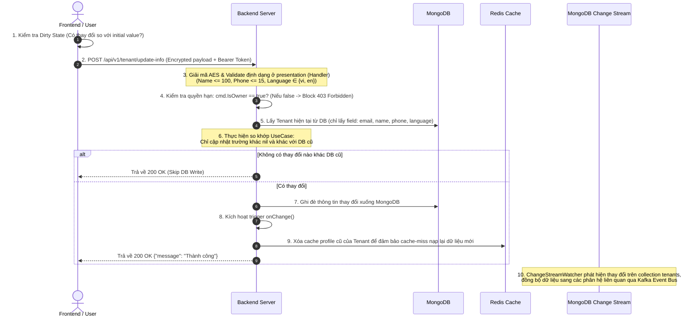

# Tenant Info Workflow Documentation

Tài liệu này đặc tả quy trình từng bước (Step-by-Step) và cấu trúc tham số chi tiết của API cập nhật thông tin doanh nghiệp (Update Tenant Info) thuộc hệ thống Sowfkun-Verse.

---

## 1. Tổng quan & Quy tắc Nghiệp vụ Đặc thù (Business Rules)

API cập nhật thông tin doanh nghiệp (`/api/v1/tenant/update-info`) áp dụng các luật thép bảo mật và tối ưu hóa hệ thống sau:

### 1.1 Chốt chặn Phân quyền (Authorization Barrier)
- **Chỉ tài khoản Owner mới được phép chỉnh sửa**: Backend kiểm tra cờ `IsOwner` trong JWT Access Token. Nếu `is_owner = false` (tài khoản Member), Backend lập tức từ chối và trả về lỗi `ERR_FORBIDDEN` (HTTP 403 Forbidden).

### 1.2 Cơ chế Cập nhật Tối ưu (Dirty Check & Skip DB Write)
- **Phía Frontend**: Chỉ gửi lên API các trường thực sự có thay đổi so với giá trị ban đầu và không rỗng (Model-driven optional update). Nếu người dùng xóa trống trường hoặc không có thay đổi nào hiệu dụng, nút Lưu sẽ bị vô hiệu hóa (disabled) và không gửi request lên API.
- **Phía Backend**: DTO nhận dữ liệu sử dụng con trỏ (`*string`) để phân biệt giữa việc "không gửi trường lên" (`nil`) và "gửi lên giá trị rỗng/mới". UseCase chỉ thực hiện cập nhật trường có giá trị khác `nil` và khác với giá trị hiện tại lưu trong DB MongoDB.
- **Tránh ghi khống DB**: Nếu payload rỗng hoặc không có thay đổi nào thực sự khác biệt so với DB hiện tại, UseCase sẽ bỏ qua và không ghi xuống MongoDB (Skip DB Write) để tiết kiệm tài nguyên I/O.

### 1.3 Bảo mật E2EE Hybrid Encryption
- API áp dụng mã hóa E2EE khi cờ `ENABLE_PAYLOAD_ENCRYPTION=true` được bật. Yêu cầu Header chứa `X-Session-ID` hợp lệ và body được mã hóa AES-256-GCM.

---

## 2. Quy trình Từng bước (Step-by-Step Flow)



---

## 3. Đặc tả Chi tiết API (API Specification)

### 3.1 Cập nhật thông tin Tenant (Update Info)

* **Endpoint:** `POST /api/v1/tenant/update-info`
* **Xác thực:** Có (Yêu cầu JWT Bearer Token trong header `Authorization`)
* **Quyền hạn:** `IsOwner = true`
* **Yêu cầu mã hóa:** Có (`X-Session-ID`)
* **Tham số Request (Sau giải mã):**

| Tên trường | Kiểu dữ liệu | Ràng buộc | Mô tả |
| :--- | :--- | :--- | :--- |
| `name` | `*string` | `omitempty, max=100` | Tên doanh nghiệp mới (chỉ truyền khi thay đổi, không được trống). |
| `phone_number` | `*string` | `omitempty, max=15` | Số điện thoại liên hệ mới (chỉ truyền khi thay đổi, không được trống). |
| `language` | `*string` | `omitempty, oneof=vi en` | Ngôn ngữ hệ thống mới (chỉ nhận `vi` hoặc `en`). |

* **Ví dụ Request Payload gửi đi (Plain Text):**
```json
{
  "name": "Công ty TNHH Sowfkun Tech",
  "language": "en"
}
```

* **Cấu trúc Response khi Thành công (200 OK):**
```json
{
  "message": "Thành công"
}
```

* **Cấu trúc Response khi Lỗi Validation (400 Bad Request):**
```json
{
  "message": "Dữ liệu không hợp lệ",
  "error_code": "ERR_VALIDATION_FAILED",
  "data": {
    "phone_number": "Vượt quá giới hạn tối đa 15"
  }
}
```

* **Cấu trúc Response khi Lỗi Quyền hạn (403 Forbidden):**
```json
{
  "message": "Bạn không có quyền thực hiện hành động này",
  "error_code": "ERR_FORBIDDEN"
}
```

---

## 4. Các Mã lỗi Thường gặp (Common Error Codes)

| HTTP Status | error_code | Ý nghĩa & Hướng xử lý |
| :--- | :--- | :--- |
| `400` | `ERR_VALIDATION_FAILED` | Dữ liệu cập nhật sai định dạng (tên > 100, sđt > 15, ngôn ngữ sai). Chi tiết lỗi trả về ở trường `data`. |
| `401` | `ERR_UNAUTHORIZED` | Token đăng nhập hết hạn hoặc không có quyền truy cập. |
| `403` | `ERR_FORBIDDEN` | Tài khoản không có quyền Owner (`IsOwner = false`). |
| `404` | `ERR_NOT_FOUND` | Doanh nghiệp (Tenant) tương ứng với tài khoản không tồn tại. |
