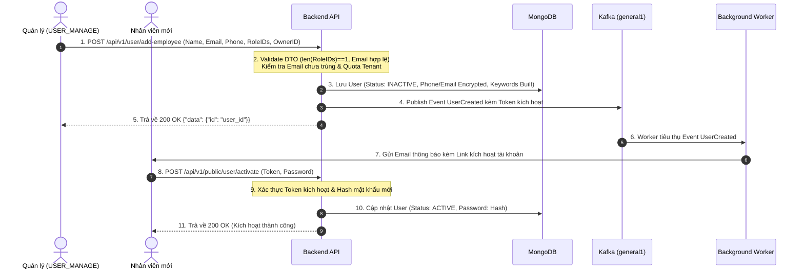
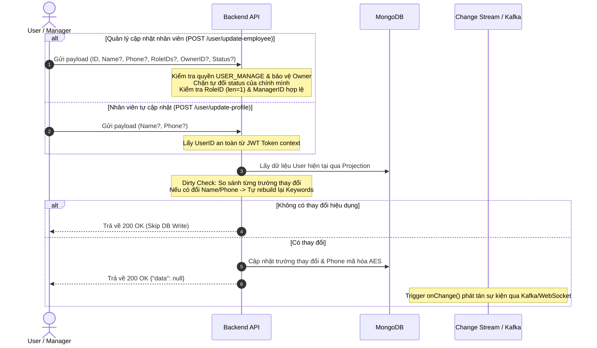

# User Management Workflow Documentation

Tài liệu này đặc tả toàn bộ quy trình nghiệp vụ (Business Rules), luồng xử lý (Step-by-Step Flow), sơ đồ Mermaid và đặc tả API của phân hệ Quản lý Người dùng / Nhân viên (User Module) trong hệ thống Sowfkun-Verse.

---

## 1. Tổng quan & Quy tắc Nghiệp vụ Đặc thù (Business Rules)

Phân hệ User áp dụng các "Luật Thép" về kiến trúc, bảo mật và phân quyền sau:

### 1.1 Phân cấp Tuyến đường API (Route Separation)
- **Public Route (`/api/v1/public/user/*`)**: Dành cho người dùng bên ngoài chưa xác thực (VD: `POST /api/v1/public/user/activate` - Kích hoạt tài khoản qua activation token).
- **Protected Route (`/api/v1/user/*`)**: Bắt buộc có JWT Token hợp lệ trong header `Authorization: Bearer <token>`.

### 1.2 Phân quyền & Bảo vệ Chủ sở hữu (RBAC & Owner Protection)
- **Quyền Quản lý (`USER_MANAGE`)**:
  - Được phép tạo nhân viên mới (`/add-employee`).
  - Được phép cập nhật thông tin (`name`, `phone`, `role_ids`, `owner_id`, `status`) của nhân viên trong cùng Tenant (`/update-employee`).
  - **Bảo vệ Owner**: Tài khoản không phải Owner (`IsOwner = false`) tuyệt đối **không được phép chỉnh sửa tài khoản Owner** (`ERR_FORBIDDEN`).
  - **Chặn tự đổi Status**: Tài khoản không được phép tự thay đổi `status` của chính mình qua API quản lý.
- **Quyền Xem (`USER_VIEW`)**:
  - Được phép xem danh sách nhân viên (`/list`, `/list-for-options`).
  - **Phân giải Hierarchy Scope**: Danh sách nhân viên hiển thị được lọc tự động qua `HierarchyService` dựa trên phạm vi quyền của Role (`ALL`, `SUBORDINATES`, `SAME_DEPT`, `OWNER`).

### 1.3 Quy tắc Phân vai trò (Single Role Assignment)
- Mỗi nhân viên chỉ được gán **đúng 1 Role** (`len(role_ids) == 1`). Hệ thống validate cả ở tầng Presentation DTO (`validate:"min=1,max=1"`) và tầng UseCase Application.

### 1.4 Bảo mật Dữ liệu & Mã hóa (E2EE & Encryption)
- **Mã hóa số điện thoại & Email**: `PhoneNumber` và `Email` được mã hóa AES trước khi lưu xuống MongoDB.
- **Blind Index**: `EmailHash` được tạo bằng hàm băm bảo mật (`security.ComputeBlindIndex`) phục vụ unique index và tìm kiếm chính xác.
- **Atlas Search Keywords**: Bắt buộc được bóc tách từ Plain Text (chưa mã hóa) của `Name`, `Email`, `PhoneNumber` trước khi lưu vào mảng `kws` để phục vụ Full-text Search.

### 1.5 Tối ưu hóa Cập nhật (Dirty Check & Skip DB Write - Rule 9)
- **Phía Client**: Chỉ gửi lên API các trường thực sự có sự thay đổi.
- **Phía Backend**: So khớp từng trường với dữ liệu hiện tại trong DB. Nếu không có thay đổi hiệu dụng nào, UseCase bỏ qua thao tác ghi DB (Skip DB Write).

---

## 2. Quy trình Từng bước (Step-by-Step Flow)

### 2.1 Luồng Thêm & Kích hoạt Nhân viên (Add & Activate Employee)



### 2.2 Luồng Cập nhật Nhân viên & Tự cập nhật Hồ sơ (Update Flows)



---

## 3. Đặc tả Chi tiết API (API Specification)

### 3.1 Kích hoạt tài khoản nhân viên (Activate User)
* **Endpoint:** `POST /api/v1/public/user/activate`
* **Xác thực:** Không (Public API)
* **Request Body:**

| Tên trường | Kiểu dữ liệu | Ràng buộc | Mô tả |
| :--- | :--- | :--- | :--- |
| `token` | `string` | `required` | Token kích hoạt nhận từ email mời. |
| `pwd` | `string` | `required,min=8` | Mật khẩu mới thiết lập cho tài khoản. |

* **Response (200 OK):**
```json
{
  "code": 200,
  "message": "MSG_SUCCESS",
  "data": null
}
```

---

### 3.2 Thêm nhân viên mới (Add Employee)
* **Endpoint:** `POST /api/v1/user/add-employee`
* **Xác thực:** JWT Bearer Token (`Authorization: Bearer <token>`)
* **Quyền hạn:** `USER_MANAGE`
* **Middleware:** `RequestIDMiddleware`
* **Request Body:**

| Tên trường | Kiểu dữ liệu | Ràng buộc | Mô tả |
| :--- | :--- | :--- | :--- |
| `email` | `string` | `required,email` | Email đăng nhập của nhân viên. |
| `name` | `string` | `required,max=100` | Họ và tên nhân viên. |
| `phone` | `*PhoneNumber` | `omitempty` | Số điện thoại (`{"country_code": "+84", "number": "0901234567"}`). |
| `role_ids` | `[]string` | `required,min=1,max=1` | Danh sách ID vai trò gán cho nhân viên (đúng 1 role). |
| `owner_id` | `string` | `required` | ID của người phụ trách / quản lý trực tiếp. |

* **Response (200 OK):**
```json
{
  "code": 200,
  "message": "MSG_SUCCESS",
  "data": {
    "id": "65f123456789abcdef012345"
  }
}
```

---

### 3.3 Cập nhật thông tin nhân viên (Update Employee)
* **Endpoint:** `POST /api/v1/user/update-employee`
* **Xác thực:** JWT Bearer Token (`Authorization: Bearer <token>`)
* **Quyền hạn:** `USER_MANAGE`
* **Middleware:** `RequestIDMiddleware`
* **Request Body:**

| Tên trường | Kiểu dữ liệu | Ràng buộc | Mô tả |
| :--- | :--- | :--- | :--- |
| `id` | `string` | `required` | ID nhân viên cần cập nhật. |
| `name` | `*string` | `omitempty,max=100` | Họ và tên mới. |
| `phone` | `*PhoneNumber` | `omitempty` | Số điện thoại mới. |
| `role_ids` | `[]string` | `omitempty,min=1,max=1` | Role ID mới (chỉ truyền đúng 1 role). |
| `owner_id` | `*string` | `omitempty` | ID của quản lý trực tiếp mới. |
| `status` | `*string` | `omitempty,oneof=ACTIVE INACTIVE` | Trạng thái mới (`ACTIVE` / `INACTIVE`). |

* **Response (200 OK):**
```json
{
  "code": 200,
  "message": "MSG_SUCCESS",
  "data": null
}
```

---

### 3.4 Tự cập nhật hồ sơ cá nhân (Update Profile)
* **Endpoint:** `POST /api/v1/user/update-profile`
* **Xác thực:** JWT Bearer Token (`Authorization: Bearer <token>`)
* **Quyền hạn:** Mọi người dùng đã đăng nhập
* **Middleware:** `RequestIDMiddleware`
* **Request Body:**

| Tên trường | Kiểu dữ liệu | Ràng buộc | Mô tả |
| :--- | :--- | :--- | :--- |
| `name` | `*string` | `omitempty,max=100` | Họ và tên mới. |
| `phone` | `*PhoneNumber` | `omitempty` | Số điện thoại mới. |

* **Response (200 OK):**
```json
{
  "code": 200,
  "message": "MSG_SUCCESS",
  "data": null
}
```

---

### 3.5 Danh sách nhân viên phân trang (List Users)
* **Endpoint:** `POST /api/v1/user/list`
* **Xác thực:** JWT Bearer Token (`Authorization: Bearer <token>`)
* **Quyền hạn:** `USER_VIEW`
* **Request Body:**

| Tên trường | Kiểu dữ liệu | Ràng buộc | Mô tả |
| :--- | :--- | :--- | :--- |
| `page` | `int` | `omitempty,min=1` | Số trang (mặc định: 1). |
| `size` | `int` | `omitempty,min=1,max=100` | Số bản ghi mỗi trang (mặc định: 20). |
| `search` | `string` | `omitempty` | Từ khóa tìm kiếm (tên, email, số điện thoại). |
| `sorts` | `[]SortItem` | `omitempty` | Quy tắc sắp xếp (`[{"field": "c_at", "order": "desc"}]`). |

* **Response (200 OK):**
```json
{
  "code": 200,
  "message": "MSG_SUCCESS",
  "data": {
    "items": [
      {
        "id": "65f123456789abcdef012345",
        "email": "employee@example.com",
        "name": "Nguyễn Văn A",
        "phone": {
          "country_code": "+84",
          "number": "0901234567"
        },
        "is_owner": false,
        "status": "ACTIVE",
        "role_ids": ["65f123456789abcdef012346"],
        "owner_id": "65f123456789abcdef012340",
        "c_at": 1718000000,
        "u_at": 1718000000
      }
    ],
    "total": 1,
    "page": 1,
    "size": 20
  }
}
```

---

### 3.6 Danh sách nhân viên rút gọn cho Dropdown/Options (List Users For Options)
* **Endpoint:** `POST /api/v1/user/list-for-options`
* **Xác thực:** JWT Bearer Token (`Authorization: Bearer <token>`)
* **Quyền hạn:** `USER_VIEW`
* **Request Body:** `{}` (Sử dụng tenant context và scope tự động)
* **Response (200 OK):**
```json
{
  "code": 200,
  "message": "MSG_SUCCESS",
  "data": [
    {
      "id": "65f123456789abcdef012345",
      "name": "Nguyễn Văn A",
      "email": "employee@example.com",
      "phone": {
        "country_code": "+84",
        "number": "0901234567"
      },
      "is_owner": false,
      "status": "ACTIVE",
      "role_ids": ["65f123456789abcdef012346"],
      "owner_id": "65f123456789abcdef012340"
    }
  ]
}
```

---

## 4. Các Mã Lỗi Thường Gặp (Common Error Codes)

| HTTP Status | Mã lỗi (`error_code`) | Ý nghĩa & Hướng xử lý |
| :--- | :--- | :--- |
| `400 Bad Request` | `ERR_BAD_REQUEST` | Payload không hợp lệ hoặc truyền quá nhiều role (`len > 1`), tự đặt mình làm quản lý của chính mình. |
| `400 Bad Request` | `ERR_VALIDATION_FAILED` | Không thỏa mãn các điều kiện `validate` (email sai format, name vượt quá 100 ký tự). |
| `400 Bad Request` | `ERR_EMAIL_REGISTERED` | Email nhân viên đã tồn tại trong hệ thống. |
| `401 Unauthorized`| `ERR_UNAUTHORIZED` | Token JWT thiếu, hết hạn hoặc không hợp lệ. |
| `403 Forbidden`   | `ERR_FORBIDDEN` | Tài khoản thiếu quyền (`USER_MANAGE`, `USER_VIEW`), tài khoản thường cố sửa Owner, hoặc tự đổi trạng thái của chính mình. |
| `404 Not Found`   | `ERR_USER_NOT_FOUND` | Không tìm thấy nhân viên mục tiêu hoặc người quản lý được chỉ định trong Tenant. |
| `404 Not Found`   | `ERR_ROLE_NOT_FOUND` | RoleID được chỉ định không tồn tại hoặc không thuộc Tenant. |
| `500 Internal`    | `ERR_INTERNAL_SERVER` | Lỗi thao tác MongoDB, mã hóa dữ liệu hoặc lỗi hệ thống không lường trước. |
