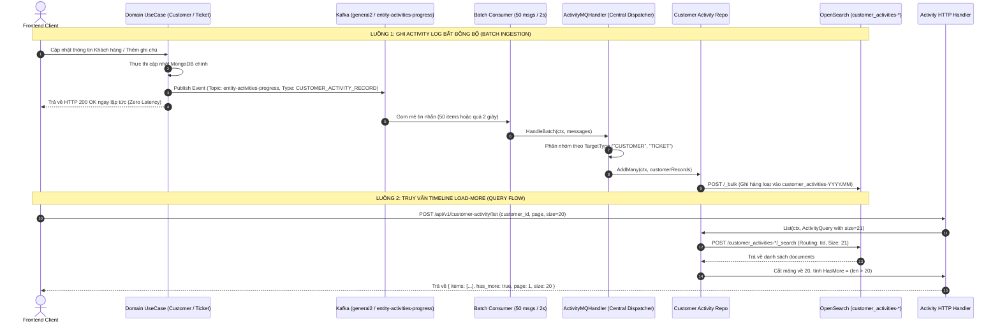

# ACTIVITY LOGS ARCHITECTURE & TIME-SERIES FLOW

Tài liệu đặc tả toàn diện kiến trúc phân hệ **Activity Logs** (Nhật ký tương tác & Lịch sử thay đổi) theo mô hình **Generic Shared Flow (Dùng chung luồng nhưng Cô lập lưu trữ)**, cơ chế phân vùng **OpenSearch Time-Series**, gom lô bất đồng bộ qua **Kafka Batch Consumer**, và cơ chế phân trang **Load-More** siêu nhẹ.

---

## 1. Tổng quan & Quy tắc Nghiệp vụ (Overview & Architectural Rules)

1. **Generic Shared Architecture (Tái sử dụng 100%):**
   - Toàn bộ logic lõi, Data Model, DTOs, UseCase Load-More, Repository Abstract, và Central MQ Handler được đặt tập trung tại `internal/activity/`.
   - Bất kỳ phân hệ nào (Customer, Ticket, Order, Deal...) đều sử dụng chung module này mà không cần nhân bản mã nguồn (Zero Code Duplication).
2. **Cô lập Lưu trữ & Đa Cụm (Multi-Cluster Storage Isolation):**
   - Các module có khối lượng log lớn (như Ticket) và log ít (như Customer) được lưu vào các Index/Cụm OpenSearch hoàn toàn độc lập (`customer_activities-*`, `ticket_activities-*`) để tránh tình trạng nuốt tài nguyên/shard của nhau.
   - Cụm kết nối OpenSearch: `customer_activities` (cấu hình qua biến môi trường `OPENSEARCH_CUSTOMER_ACTIVITIES_URL`).
3. **Phân vùng Thời gian & Retention Tự động (Time-Series Partitioning):**
   - **Customer Activities Index:** `customer_activities-YYYY.MM` (Phân vùng theo **Tháng**, UTC), gắn vào Alias `customer_activities`.
   - **Retention Policy:** Tự động lưu giữ 180 ngày (6 tháng), được đăng ký tập trung tại `cmd/indexer/opensearch.go` và dọn dẹp hàng ngày lúc `02:00 AM UTC` bởi Asynq Cron Job.
4. **Ghi Bất đồng bộ qua Kafka Batch Consumer (High Throughput):**
   - Các UseCase nghiệp vụ sau khi update DB xong chỉ việc bắn event lên Kafka topic `entity-activities-progress` trên cụm `general2`.
   - Batch Consumer gom 50 messages hoặc 2 giây window $\rightarrow$ gọi `ActivityMQHandler` để phân nhóm theo `TargetType` và thực thi ghi hàng loạt qua OpenSearch `_bulk` API.
5. **Cơ chế Phân trang Load-More (Zero Count Query):**
   - Phục vụ giao diện Timeline cuộn vô tận (Infinite Scroll / Load More).
   - API chỉ truy vấn `size + 1` phần tử để xác định `has_more`, **tuyệt đối không gọi `Count()`** để giảm tải 50% CPU/IO cho OpenSearch.
6. **Data Model Linh hoạt & Chống nổ Mapping (Zero Mapping Explosion):**
   - Schema phẳng 100%, không dùng dynamic `map[string]any`.
   - Hỗ trợ đa dạng tương tác: Chỉnh sửa (`UPDATE`), Ghi chú (`NOTE`), Đánh giá (`RATING`), Cuộc gọi (`CALL`), Hệ thống (`SYSTEM`).
   - Cặp `FieldChange` lưu trọn vẹn `RefType` + `RefID` (để tra cứu giá trị mới nhất) và `OldLabel` / `NewLabel` (Snapshot hiển thị tức thì 0ms).

---

## 2. Quy trình Xử lý & Sơ đồ Luồng (Step-by-Step Flows)



---

## 3. Đặc tả Kỹ thuật API (API Specification)

### 3.1. Phân trang Danh sách Activity Logs (Load More)
- **Endpoint:** `POST /api/v1/customer-activity/list`
- **Headers:** `Authorization: Bearer <token>`
- **Request Body:**
  ```json
  {
    "target_id": "cust_670jknr123456",
    "page": 1,
    "size": 20
  }
  ```
- **Response (200 OK):**
  ```json
  {
    "data": {
      "total": -1,
      "page": 1,
      "size": 20,
      "has_more": true,
      "has_prev": false,
      "items": [
        {
          "id": "670a1b2c3d4e5f6a7b8c9d0e",
          "target": "CUSTOMER",
          "target_id": "cust_670jknr123456",
          "type": "UPDATE",
          "summary": "Cập nhật số điện thoại và hạng khách hàng",
          "changes": [
            {
              "field": "phone",
              "data_type": "TEXT",
              "old_val": "0901234567",
              "new_val": "0987654321",
              "old_label": "0901234567",
              "new_label": "0987654321"
            },
            {
              "field": "tier",
              "ref_type": "ATTRIBUTE",
              "ref_id": "attr_tier_01",
              "data_type": "OPTION",
              "old_val": "opt_regular",
              "new_val": "opt_vip",
              "old_label": "Khách Thường",
              "new_label": "Khách VIP"
            }
          ],
          "c_at": 1771488000000,
          "c_by": {
            "id": "u_employee_01",
            "type": "USER"
          }
        },
        {
          "id": "670a1b2c3d4e5f6a7b8c9d0f",
          "target": "CUSTOMER",
          "target_id": "cust_670jknr123456",
          "type": "NOTE",
          "summary": "Thêm ghi chú cuộc gọi tư vấn",
          "body": "Khách hàng quan tâm đến gói dịch vụ Enterprise, hẹn gọi lại vào sáng thứ 2.",
          "attachments": [
            {
              "name": "proposal_v1.pdf",
              "url": "https://storage.notebookcrm.vn/docs/proposal_v1.pdf",
              "size": 2048576,
              "type": "application/pdf"
            }
          ],
          "c_at": 1771488100000,
          "c_by": {
            "id": "u_employee_01",
            "type": "USER"
          }
        }
      ]
    },
    "error_code": "",
    "error_detail": ""
  }
  ```

---

## 4. Đặc tả Message Queue & OpenSearch Indexing

### 4.1. Kafka Message Format
- **Cluster:** `general2`
- **Topic:** `entity-activities-progress`
- **Event Type:** `CUSTOMER_ACTIVITY_RECORD`
- **Payload (`Data`):** Struct `ActivityLog`

### 4.2. OpenSearch Index Template
- **Template Name:** `customer_activities_template`
- **Index Pattern:** `customer_activities-*`
- **Alias:** `customer_activities`
- **Cluster:** `customer_activities` (URL kết nối cấu hình qua `OPENSEARCH_CUSTOMER_ACTIVITIES_URL`)
- **Settings:** Shards: 1, Replicas: 0, Refresh Interval: 5s.
- **Retention:** 180 ngày (6 tháng).
