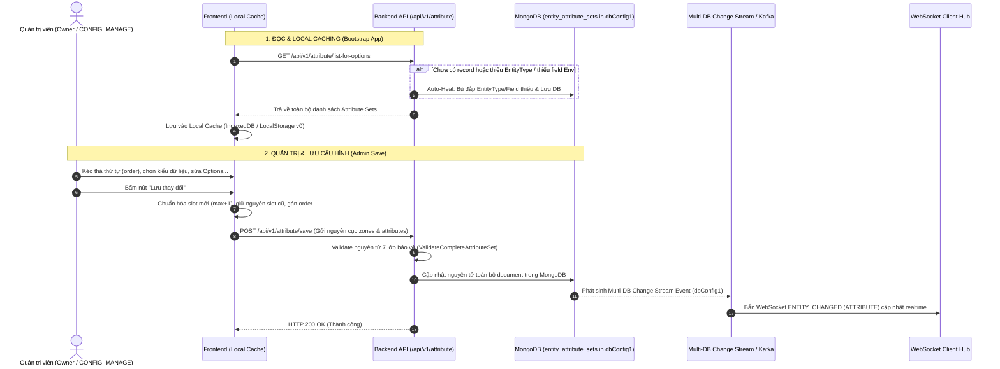

# Attribute Management Workflow Documentation

Tài liệu này đặc tả toàn bộ quy trình nghiệp vụ (Business Rules), luồng xử lý (Step-by-Step Flow), sơ đồ Mermaid và đặc tả API của phân hệ **Bộ Thuộc Tính Động (Module Attribute Set Module)** trong hệ thống Sowfkun-Verse sau khi tinh giản theo kiến trúc **1 API Save / Upsert Duy Nhất & Auto-Heal Đa Tầng**.

---

## 1. Tổng quan & Quy tắc Nghiệp vụ Đặc thù (Business Rules)

### 1.1 Mục đích & Cấu Trúc Bộ Thuộc Tính
- Cho phép mỗi Tenant quản lý các trường dữ liệu tùy biến (Custom Fields / Dynamic Attributes) theo từng thực thể (`CUSTOMER`, `TICKET`, v.v.).
- Mỗi thực thể sở hữu một tài liệu `ModuleAttributeSet` lưu trong collection `entity_attribute_sets` (`dbConfig1`):
  - **Zones (`map[string]Zone`)**: Các khu vực hiển thị form giao diện.
  - **Attributes (`map[string]AttributeDetail`)**: Các trường dữ liệu động với các kiểu dữ liệu (`TEXT_PLAIN`, `TEXT_HTML`, `NUMBER`, `DATETIME`, `SELECT_SINGLE`, `SELECT_MULTI`) được ánh xạ vào từng Slot cố định (`t_1`..`t_50`, `n_1`..`n_50`, v.v.) kèm trường thứ tự sắp xếp `order` (int, 1-based) trong từng Zone.

### 1.2 Phân Cấp 3 Zone Hệ Thống Bất Biến
1. **Zone 1: `zone_basic` ("Thông tin cơ bản", `order: 1`)**:
   - **Luôn luôn RỖNG** (0 dynamic custom attributes trong DB).
   - Dành riêng cho Frontend / App ánh xạ các trường tĩnh gốc (Tên, Mã, Email, SĐT, Trạng thái...) lên layout.
   - **CẤM** thêm mới, chuyển vào, chuyển ra, hoặc ẩn thuộc tính vào Zone này.
2. **Zone 2: `zone_filters_classification` ("Thông tin phân loại & Tra cứu", `order: 2`)**:
   - Chứa **cố định $5 \times N$ thuộc tính mẫu hệ thống** có chỉ mục (`apply_idx: true`):
     - $N$ Text Search (Keywords): `t_search_1` $\dots$ `t_search_N` (`txt_opt: { min_len, max_len }`)
     - $N$ Số (Filter & Sort): `n_filter_1` $\dots$ `n_filter_N` (`num_opt: { unit, thous_sep }`, `thous_sep`: `","`, `"."`, `"NONE"`)
     - $N$ Ngày (Filter & Sort): `d_filter_1` $\dots$ `d_filter_N` (`dt_opt: { display_type, format }`)
     - $N$ Chọn 1 (Filterable): `s_filter_1` $\dots$ `s_filter_N` (`sel_opt: [...]`)
     - $N$ Chọn nhiều (Filterable): `s_filter_N+1` $\dots$ `s_filter_2N` (`sel_opt: [...]`)
   - Số lượng $N$ được cấu hình qua biến môi trường `DEFAULT_ATTR_COUNT_PER_TYPE` (mặc định: `2` $\rightarrow$ 10 fields).
   - Cho phép đổi nhãn hiển thị (`label`) và cấu hình tùy chọn (`options`). **CẤM** thêm mới, chuyển vào, chuyển ra hoặc ẩn khỏi Zone 2.
3. **Zone 3: `zone_hidden` ("Thuộc tính đã ẩn", `order: 9999`)**:
   - Chứa các thuộc tính custom có `status: "HIDDEN"`.
   - Cấm sửa đổi cấu hình hoặc xóa Zone này.
4. **Các Zone Tùy Biến (Custom Zones)**:
   - Người dùng tự do tạo, sửa tên/thứ tự, xóa khi rỗng, thêm thuộc tính custom (`t_1..`, `n_1..`, `d_1..`, `s_1..`), di chuyển qua lại, sắp xếp thứ tự (`order`), ẩn và bỏ ẩn.

### 1.3 Quy Tắc Cấp Phát & Bảo Toàn Slot Dữ Liệu (Slot Allocation Lifecycle)
- **Bảo toàn Slot cũ (100% Immutability):** Toàn bộ thuộc tính đã tồn tại trong DB giữ nguyên mã `slot` vĩnh viễn (ví dụ: `t_1`, `n_2`) khi người dùng chỉnh sửa tên, cấu hình, kéo thả đổi Zone hoặc đổi thứ tự `order`.
- **Cấp Slot Khép Kín cho Thuộc tính Mới:** Khi thêm mới thuộc tính, hệ thống tự động tìm chỉ số lớn nhất hiện tại của prefix tương ứng (`t_`, `n_`, `d_`, `s_`) để cấp slot kế tiếp tăng dần (`max + 1`).

### 1.4 Cơ Chế Auto-Heal 2 Tầng Khi Đọc (`GET /list-for-options`)
1. **Tầng 1 (Bù EntityType):** Đối chiếu danh sách `coreDomain.EntityAttribute.GetSupportedTargets()`. Nếu Tenant (kể cả Tenant cũ) bị thiếu bất kỳ EntityType nào $\rightarrow$ Tự động sinh bộ thuộc tính mặc định chuẩn và lưu DB.
2. **Tầng 2 (Bù Field theo Env):** Đối chiếu với số lượng $N$ trong `DEFAULT_ATTR_COUNT_PER_TYPE`. Nếu thiếu field trong Zone 2 (vd tăng $N=2 \rightarrow 3$) $\rightarrow$ Tự động bổ sung field mới thiếu vào Zone 2 mà không ghi đè tên cũ mà người dùng đã đổi.

### 1.5 Chống Race Condition & Concurrency Fallback
- **Bypass Atlas Search:** Hàm `GetByEntityType` ép cờ `bypassAtlas = true` để truy vấn trực tiếp vào **Standard Unique Compound Index (`tid + entity_type`)** trên MongoDB Primary (WiredTiger Storage Engine) đảm bảo Strong Consistency.
- **Duplicate Key Fallback:** Khi 2 request cùng khởi tạo hoặc lưu trong 1 microsecond, nếu request sau bị lỗi duplicate key $\rightarrow$ Tự động truy vấn lại record vừa tạo từ Primary DB và hoàn tất luồng mà không gây lỗi sập hệ thống.
- **Multi-DB Watcher Sync:** Thay đổi trên `entity_attribute_sets` (`dbConfig1`) được Mongo Change Stream đa cụm bắt tức thì, đẩy qua Kafka và bắn WebSocket `ENTITY_CHANGED` (`entity: ATTRIBUTE`, `op: UPDATE/CREATE`) xuống các Client.

---

## 2. Sơ Đồ Luồng Nghiệp Vụ (Mermaid Workflow)



---

## 3. Đặc Tả Kỹ Thuật API (API Specification)

Toàn bộ phân hệ chỉ gồm **đúng 2 Endpoint duy nhất**:

### 3.1 `GET /api/v1/attribute/list-for-options`
- **Mô tả**: Lấy toàn bộ danh sách bộ thuộc tính của Tenant để nạp Local Cache.
- **Phân quyền**: `RequireAuth` (Mọi user đăng nhập đều đọc được).
- **Query Params**: `page` (int, default 1), `size` (int, default 100).
- **Response `200 OK`**:
  ```json
  {
    "code": 200,
    "message": "success",
    "data": [
      {
        "id": "65c1234567890abcdef12346",
        "entity_type": "CUSTOMER",
        "zones": {
          "zone_basic": { "id": "zone_basic", "label": { "vi": "Thông tin cơ bản", "en": "Basic Information" }, "order": 1 },
          "zone_filters_classification": { "id": "zone_filters_classification", "label": { "vi": "Thông tin phân loại & Tra cứu", "en": "Filters & Classification Attributes" }, "order": 2 },
          "zone_hidden": { "id": "zone_hidden", "label": { "vi": "Thuộc tính đã ẩn", "en": "Hidden Attributes" }, "order": 9999 },
          "zone_custom_1": { "id": "zone_custom_1", "label": { "vi": "Thông tin bổ sung", "en": "Additional Info" }, "order": 3 }
        },
        "attributes": {
          "t_search_1": {
            "slot": "t_search_1",
            "label": { "vi": "Mã số thuế", "en": "Tax Code" },
            "data_type": "TEXT_PLAIN",
            "status": "ACTIVE",
            "apply_idx": true,
            "zid": "zone_filters_classification",
            "order": 1,
            "txt_opt": { "min_len": 0, "max_len": 255 }
          },
          "n_filter_1": {
            "slot": "n_filter_1",
            "label": { "vi": "Doanh thu năm", "en": "Annual Revenue" },
            "data_type": "NUMBER",
            "status": "ACTIVE",
            "apply_idx": true,
            "zid": "zone_filters_classification",
            "order": 2,
            "num_opt": { "unit": "VND", "thous_sep": "," }
          },
          "t_1": {
            "slot": "t_1",
            "label": { "vi": "Ghi chú nội bộ", "en": "Internal Note" },
            "data_type": "TEXT_PLAIN",
            "status": "ACTIVE",
            "apply_idx": false,
            "zid": "zone_custom_1",
            "order": 1,
            "txt_opt": { "min_len": 0, "max_len": 500 }
          }
        }
      }
    ]
  }
  ```

---

### 3.2 `POST /api/v1/attribute/save`
- **Mô tả**: Lưu/Cập nhật toàn bộ cấu hình Zone và Attribute của một EntityType trong 1 request duy nhất.
- **Phân quyền**: `RequireAuth` + `RequirePermission(CONFIG_MANAGE)` + Owner.
- **Request Body**:
  ```json
  {
    "entity_type": "CUSTOMER",
    "zones": {
      "zone_basic": { "id": "zone_basic", "label": { "vi": "Thông tin cơ bản", "en": "Basic Information" }, "order": 1 },
      "zone_filters_classification": { "id": "zone_filters_classification", "label": { "vi": "Thông tin phân loại & Tra cứu", "en": "Filters & Classification Attributes" }, "order": 2 },
      "zone_hidden": { "id": "zone_hidden", "label": { "vi": "Thuộc tính đã ẩn", "en": "Hidden Attributes" }, "order": 9999 },
      "zone_custom_1": { "id": "zone_custom_1", "label": { "vi": "Thông tin bổ sung", "en": "Additional Info" }, "order": 3 }
    },
    "attributes": {
      "t_search_1": {
        "slot": "t_search_1",
        "label": { "vi": "Mã số thuế", "en": "Tax Code" },
        "data_type": "TEXT_PLAIN",
        "status": "ACTIVE",
        "apply_idx": true,
        "zid": "zone_filters_classification",
        "order": 1,
        "txt_opt": { "min_len": 0, "max_len": 255 }
      },
      "n_filter_1": {
        "slot": "n_filter_1",
        "label": { "vi": "Doanh thu năm", "en": "Annual Revenue" },
        "data_type": "NUMBER",
        "status": "ACTIVE",
        "apply_idx": true,
        "zid": "zone_filters_classification",
        "order": 2,
        "num_opt": { "unit": "VND", "thous_sep": "," }
      },
      "t_1": {
        "slot": "t_1",
        "label": { "vi": "Ghi chú nội bộ", "en": "Internal Note" },
        "data_type": "TEXT_PLAIN",
        "status": "ACTIVE",
        "apply_idx": false,
        "zid": "zone_custom_1",
        "order": 1,
        "txt_opt": { "min_len": 0, "max_len": 500 }
      }
    }
  }
  ```
- **Response `200 OK`**:
  ```json
  {
    "code": 200,
    "message": "success",
    "data": null
  }
  ```

---

## 4. Các Mã Lỗi Thường Gặp (Common Error Codes)

| HTTP Status | Mã Lỗi (`error_code`) | Ý nghĩa & Nguyên nhân |
| :--- | :--- | :--- |
| `400 Bad Request` | `ERR_BAD_REQUEST` | Cú pháp slot sai, lệch kiểu dữ liệu (`DataType`), slot bị gap, hoặc vi phạm trạng thái ẩn/hiện. |
| `400 Bad Request` | `ERR_VALIDATION_FAILED` | Thiếu trường bắt buộc (`entity_type`, `zones`, `attributes`). |
| `400 Bad Request` | `ERR_SLOT_LIMIT_EXCEEDED` | Tổng số thuộc tính trong bộ vượt quá quota 50. |
| `401 Unauthorized` | `ERR_UNAUTHORIZED` | Token JWT thiếu hoặc không hợp lệ. |
| `403 Forbidden` | `ERR_FORBIDDEN` | Tài khoản không phải Owner hoặc vi phạm 3 Zone hệ thống (sửa zone_basic, đổi zone field mẫu Zone 2). |
| `404 Not Found` | `ERR_NOT_FOUND` | Không tìm thấy tài nguyên thuộc Tenant. |
| `500 Internal Error` | `ERR_INTERNAL_SERVER` | Lỗi kết nối cơ sở dữ liệu MongoDB. |
