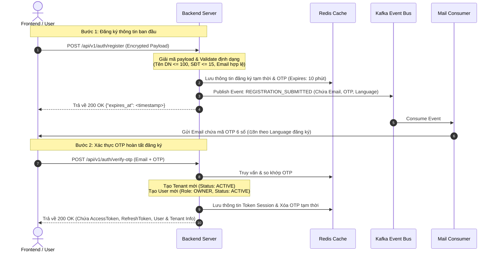

# Authentication & Registration Workflow Documentation

Tài liệu này đặc tả quy trình từng bước (Step-by-Step) và cấu trúc tham số chi tiết của từng API trong phân hệ Xác thực (Authentication) và Đăng ký doanh nghiệp (Registration) thuộc hệ thống Sowfkun-Verse.

---

## 1. Tổng quan & Luồng Bảo mật E2EE (E2EE Middleware Integration)

Tất cả các API phương thức `POST` / CUD thuộc phân hệ Auth đều được bảo vệ bởi lớp bảo mật mã hóa đầu cuối lai **Hybrid Encryption (RSA + AES-256-GCM)**, ngụy trang Header và chống Replay Attack khi biến cấu hình `ENABLE_PAYLOAD_ENCRYPTION=true`.

### Quy trình gửi Request của Client:
1. Gửi request lên `/api/v1/security/public-key` lấy khóa công khai RSA của Server.
2. Sinh khóa đối xứng AES-256 (32 bytes) ngẫu nhiên, mã hóa khóa này bằng khóa RSA nhận được.
3. Thực hiện handshake qua `/api/v1/security/handshake` (đính kèm các header chim mồi `X-Edge-Routing`, `X-Client-Fingerprint`, `X-Device-Entropy`) để nhận `Session-ID`.
4. Với mọi API Auth (`/register`, `/login`, v.v.):
   - Bọc dữ liệu thực tế vào Envelope chống tấn công phát lại (Anti-Replay Envelope):
     ```json
     {
       "ts": 1756968000000,
       "nonce": "1756968000000_a1b2c3d4e5f6",
       "payload": { ...thông tin đăng ký / đăng nhập... }
     }
     ```
   - Mã hóa toàn bộ Envelope thành chuỗi Base64 bằng thuật toán **AES-256-GCM** (sử dụng Session Key đã lưu).
   - Đóng gói request body: `{"data": "<chuỗi_mã_hóa_base64>"}`.
   - Đính kèm Header ngụy trang: `X-Trace-Context: <Session-ID>` (Session ID thật, không fallback).
   - Đính kèm các Header chim mồi bắt buộc: `X-Session-ID: <mock_id>`, `X-Edge-Routing`, `X-Client-Fingerprint`, `X-Device-Entropy`.

---

## 2. Quy tắc Nghiệp vụ Đặc thù (Business Rules)

### 2.1 Chống Trùng lặp Email (Email Deduplication)
- Khi gọi `/register`, Backend sẽ kiểm tra trong Database MongoDB (bảng `users` và `tenants`). 
- Nếu email đã tồn tại và đã kích hoạt hoạt động (`ACTIVE`), API sẽ lập tức trả về lỗi `ERR_EMAIL_REGISTERED` (Mã HTTP 400).

### 2.2 Xử lý Đăng ký Trùng lặp khi chưa Kích hoạt (Pending Registration Overwrite)
Trường hợp người dùng đã đăng ký thông tin ban đầu thành công (dữ liệu tạm thời đang được lưu trong Redis cùng mã OTP) nhưng chưa gọi `/verify-otp` để kích hoạt, nếu họ tiếp tục nhấn đăng ký lại bằng chính email đó:
- **Tái sử dụng OTP cũ**: Hệ thống sẽ lấy lại mã OTP cũ đang lưu trong Redis thay vì sinh mã mới.
- **Bảo vệ Brute-Force & Chống Spam Mail**: Hệ thống giữ nguyên số lần đã nhập sai (`AttemptCount`) và thời gian hết hạn (`ExpiresAt`) của mã OTP cũ để ngăn chặn việc spam gửi mail liên tục hoặc brute-force dò mã.
- **Cập nhật thông tin mới**: Nếu người dùng thay đổi thông tin (ví dụ: đổi mật khẩu, đổi tên doanh nghiệp, số điện thoại hoặc ngôn ngữ), Backend sẽ ghi đè các thông tin mới này vào Redis Payload để chuẩn bị cho bước kích hoạt, nhưng vẫn giữ nguyên chốt chặn bảo mật của OTP cũ.
- **Ngưỡng chặn lỗi**: Nếu số lần nhập sai mã OTP hiện tại đã chạm ngưỡng 5 lần (`AttemptCount >= 5`), hệ thống sẽ từ chối đăng ký lại và yêu cầu đợi mã hết hạn.

### 2.3 Chống dò quét thông tin đăng nhập (Login Brute-Force Protection)
Khi gọi `/login`, Backend sử dụng cơ chế đếm số lần đăng nhập lỗi lưu tạm trên Redis:
- **Ghi nhận số lần đăng nhập sai**: Mỗi khi người dùng nhập sai mật khẩu, email chưa tồn tại hoặc Tenant bị ngưng hoạt động, hệ thống sẽ tăng biến đếm lỗi trong Redis lên 1 đơn vị (`attemptsKey` lưu theo định dạng `login_attempts:email`) với thời gian hết hạn là 30 phút.
- **Khóa quyền đăng nhập tạm thời**: Nếu số lần nhập sai liên tiếp đạt ngưỡng 5 lần (`attempts >= 5`), Backend sẽ lập tức từ chối xử lý và trả về mã lỗi `ERR_MAX_LOGIN_ATTEMPTS` (Mã HTTP 400), tạm thời chặn quyền đăng nhập của email đó trong vòng 30 phút.
- **Tự động reset bộ đếm**: Khi người dùng đăng nhập thành công trước khi đạt ngưỡng chặn, biến đếm lỗi trong Redis của email đó sẽ tự động bị xóa bỏ (`Del`) để reset bộ đếm lỗi về 0.

---

## 3. Quy trình Đăng ký & Kích hoạt Doanh nghiệp (Registration Flow)

Hệ thống hoạt động theo mô hình **Multi-tenant**, mỗi lượt đăng ký mới sẽ tạo ra một **Tenant** riêng biệt và một tài khoản **Owner** quản trị doanh nghiệp đó. Quy trình bao gồm 2 bước chính:



---

## 4. Đặc tả Chi tiết API (API Endpoints Specification)

### 4.1 Đăng ký Doanh nghiệp (Register)
Khởi tạo thông tin đăng ký tạm thời và gửi mã OTP 6 số về email.

* **Endpoint:** `POST /api/v1/auth/register`
* **Xác thực:** Không (No Auth)
* **Yêu cầu mã hóa:** Có (`X-Session-ID`)
* **Tham số Request (Sau giải mã):**

| Tên trường | Kiểu dữ liệu | Ràng buộc | Mô tả |
| :--- | :--- | :--- | :--- |
| `business_name` | `string` | `required, max=100` | Tên của doanh nghiệp cần đăng ký. |
| `owner_name` | `string` | `required, max=50` | Họ và tên của người đại diện (Owner). |
| `phone` | `string` | `required, max=15` | Số điện thoại liên hệ. |
| `email` | `string` | `required, email, max=100` | Địa chỉ email nhận OTP và làm tên đăng nhập. |
| `password` | `string` | `required, min=8, max=50` | Mật khẩu tài khoản (tối thiểu 8 ký tự). |
| `language` | `string` | `required, oneof=vi en` | Ngôn ngữ mặc định hệ thống gửi mail (`vi` hoặc `en`). |

* **Ví dụ Request Payload (Plain Text):**
```json
{
  "business_name": "Công ty TNHH Giải Pháp Việt",
  "owner_name": "Nguyễn Văn A",
  "phone": "0987654321",
  "email": "owner@giaiphapviet.com",
  "password": "SecurePassword@123",
  "language": "vi"
}
```

* **Cấu trúc Response (Mã hóa partial):**
```json
{
  "message": "Mã xác thực OTP đã được gửi về email",
  "data": {
    "expires_at": 1721568600
  }
}
```

---

### 4.2 Kích hoạt tài khoản bằng OTP (Verify OTP)
Xác thực OTP từ email để hoàn tất tạo Tenant, User và cấp chứng chỉ JWT Tokens.

* **Endpoint:** `POST /api/v1/auth/verify-otp`
* **Xác thực:** Không (No Auth)
* **Yêu cầu mã hóa:** Có (`X-Session-ID`)
* **Tham số Request (Sau giải mã):**

| Tên trường | Kiểu dữ liệu | Ràng buộc | Mô tả |
| :--- | :--- | :--- | :--- |
| `email` | `string` | `required, email` | Email đăng ký nhận OTP. |
| `otp` | `string` | `required, len=6, alphanum` | Mã xác thực gồm 6 ký tự chữ/số. |

* **Ví dụ Request Payload (Plain Text):**
```json
{
  "email": "owner@giaiphapviet.com",
  "otp": "847291"
}
```

* **Cấu trúc Response (Mã hóa partial - Trường `data` bị mã hóa AES):**
```json
{
  "message": "Thành công",
  "data": {
    "access_token": "eyJhbGciOi...",
    "refresh_token": "eyJhbGciOi...",
    "user": {
      "id": "usr_987214",
      "tenant_id": "tenant_128947",
      "email": "owner@giaiphapviet.com",
      "name": "Nguyễn Văn A",
      "is_owner": true
    },
    "tenant": {
      "id": "tenant_128947",
      "name": "Công ty TNHH Giải Pháp Việt",
      "email": "owner@giaiphapviet.com",
      "phone": "0987654321",
      "status": "ACTIVE",
      "tier": "FREE",
      "language": "vi"
    }
  }
}
```

---

### 4.3 Đăng nhập (Login)
Xác thực tài khoản và cấp lại cặp khóa Access & Refresh Tokens.

* **Endpoint:** `POST /api/v1/auth/login`
* **Xác thực:** Không (No Auth)
* **Yêu cầu mã hóa:** Có (`X-Session-ID`)
* **Tham số Request (Sau giải mã):**

| Tên trường | Kiểu dữ liệu | Ràng buộc | Mô tả |
| :--- | :--- | :--- | :--- |
| `email` | `string` | `required, email` | Địa chỉ email đăng nhập. |
| `password` | `string` | `required` | Mật khẩu tài khoản. |

* **Cấu trúc Response:** Tương tự phản hồi của API **Verify OTP** (Mục 3.2), chứa tokens và thông tin chi tiết của User / Tenant.

---

### 4.4 Yêu cầu quên mật khẩu (Forgot Password)
Phát sinh OTP phục hồi mật khẩu và gửi qua mail.

* **Endpoint:** `POST /api/v1/auth/forgot-password`
* **Xác thực:** Không (No Auth)
* **Yêu cầu mã hóa:** Có (`X-Session-ID`)
* **Tham số Request:** `{ "email": "owner@giaiphapviet.com" }`
* **Cấu trúc Response:**
```json
{
  "message": "Mã OTP phục hồi đã được gửi",
  "data": {
    "expires_at": 1721568600
  }
}
```

---

### 4.5 Đặt lại mật khẩu mới (Reset Password)
Dùng OTP để xác thực và đổi sang mật khẩu mới.

* **Endpoint:** `POST /api/v1/auth/reset-password`
* **Xác thực:** Không (No Auth)
* **Yêu cầu mã hóa:** Có (`X-Session-ID`)
* **Tham số Request (Sau giải mã):**

| Tên trường | Kiểu dữ liệu | Ràng buộc | Mô tả |
| :--- | :--- | :--- | :--- |
| `email` | `string` | `required, email` | Email tài khoản cần khôi phục. |
| `otp` | `string` | `required, len=6` | Mã OTP phục hồi nhận qua email. |
| `new_password` | `string` | `required, min=8, max=50` | Mật khẩu mới thiết lập. |

* **Cấu trúc Response:**
```json
{
  "message": "Cập nhật mật khẩu thành công",
  "error_code": "MSG_SUCCESS"
}
```

---

### 4.6 Gia hạn Access Token (Refresh Token)
Dùng Refresh Token hợp lệ để đổi lấy cặp Access/Refresh Token mới mà không cần đăng nhập lại.

* **Endpoint:** `POST /api/v1/auth/refresh-token`
* **Xác thực:** Dựa trên Refresh Token gửi lên trong body
* **Yêu cầu mã hóa:** Có (`X-Session-ID`)
* **Tham số Request:** `{ "refresh_token": "eyJhbGciOi..." }`
* **Cấu trúc Response:** Tương tự API **Login** (cấp lại cặp token mới).

### 4.7 Cấu hình & Cơ chế Refresh Token (Smart Sliding Expiration)
Hệ thống sử dụng cơ chế gia hạn trượt thông minh để tối ưu tài nguyên mạng và bảo vệ chống race condition trên môi trường multi-tab:

* **Thời gian hiệu lực (Lifespans):**
  * `AccessToken`: **15 phút** (Lưu trong RAM ở client).
  * `RefreshToken` (User): **3 ngày** (Lưu trong `localStorage` để duy trì phiên).
  * `RefreshToken` (Admin): **12 giờ**.
  * `RefreshToken` (Mobile): **30 ngày**.
* **Ngưỡng Xoay vòng (Rotation Threshold - 24 giờ):**
  * Khi client gửi request refresh lên:
    * Nếu thời hạn còn lại của `RefreshToken` cũ **>= 24 giờ**: Server chỉ cấp `AccessToken` mới và **giữ nguyên** `RefreshToken` cũ (không cập nhật Redis).
    * Nếu thời hạn còn lại của `RefreshToken` cũ **< 24 giờ**: Server thực hiện xoay vòng, sinh `RefreshToken` mới trượt thêm 3 ngày và lưu vào Redis.
* **Thời gian ân hạn (Grace Period - 30 giây):**
  * Khi xoay vòng token, `RefreshToken` cũ được chuyển trạng thái thành `"rotated:<timestamp>"` thay vì xóa ngay.
  * Các tab khác hoặc request song song sử dụng token cũ này trong vòng **30 giây** vẫn được chấp nhận hợp lệ để tránh bị logout oan khi F5 hoặc mở nhiều tab cùng lúc.

---

## 5. Các Mã lỗi Thường gặp (Common Error Codes)

Hệ thống thống nhất sử dụng chuẩn BaseResponse để báo lỗi:

| HTTP Status | error_code | Ý nghĩa & Hướng xử lý |
| :--- | :--- | :--- |
| `400` | `ERR_BAD_REQUEST` | Định dạng payload bị sai hoặc thiếu trường bắt buộc. |
| `400` | `ERR_VALIDATION_FAILED` | Dữ liệu vượt quá giới hạn hoặc sai logic định dạng. Chi tiết lỗi đính kèm trong `data`. |
| `401` | `ERR_UNAUTHORIZED` | Token hết hạn, không hợp lệ hoặc sai thông tin mật khẩu. |
| `403` | `ERR_FORBIDDEN` | Tài khoản không có vai trò phù hợp hoặc bị khóa. |
| `404` | `ERR_NOT_FOUND` | Tài khoản email hoặc Tenant không tồn tại trên hệ thống. |
| `500` | `ERR_INTERNAL_SERVER_ERROR` | Lỗi phát sinh từ hệ thống lưu trữ/DB phía Backend. |
