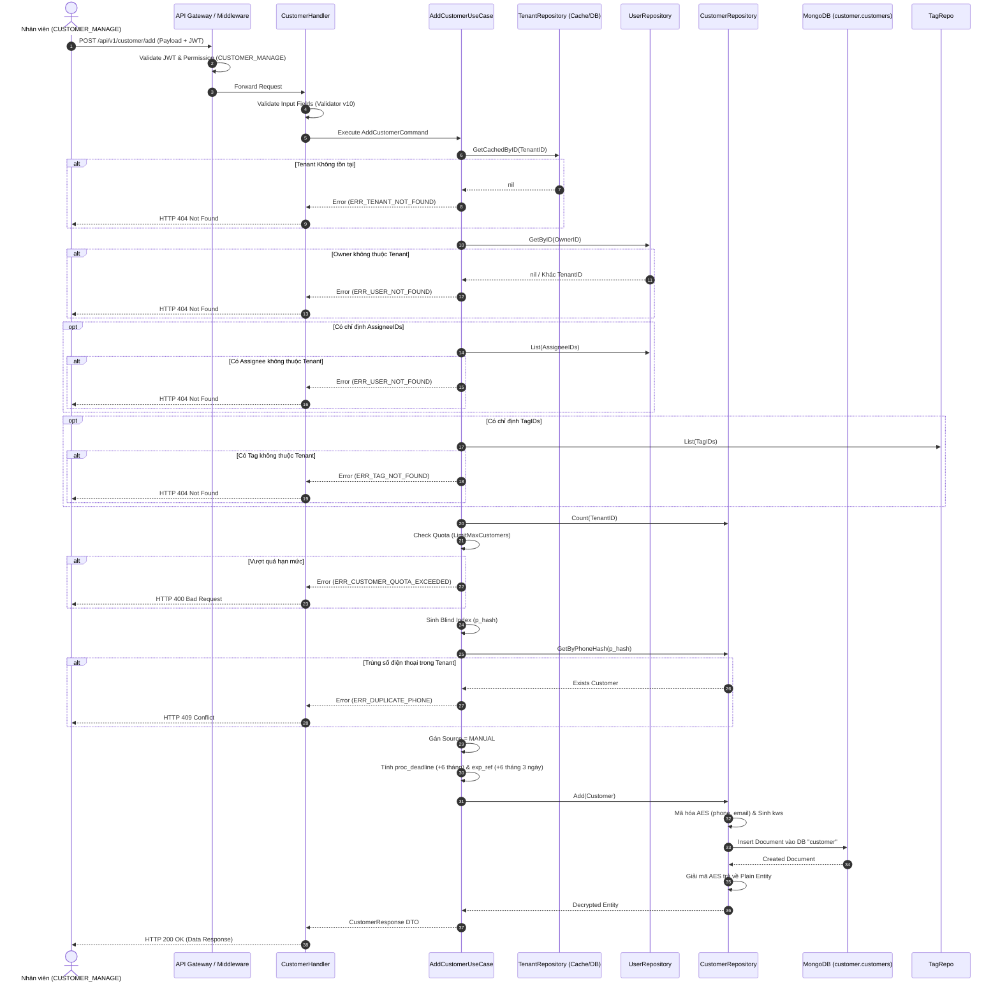
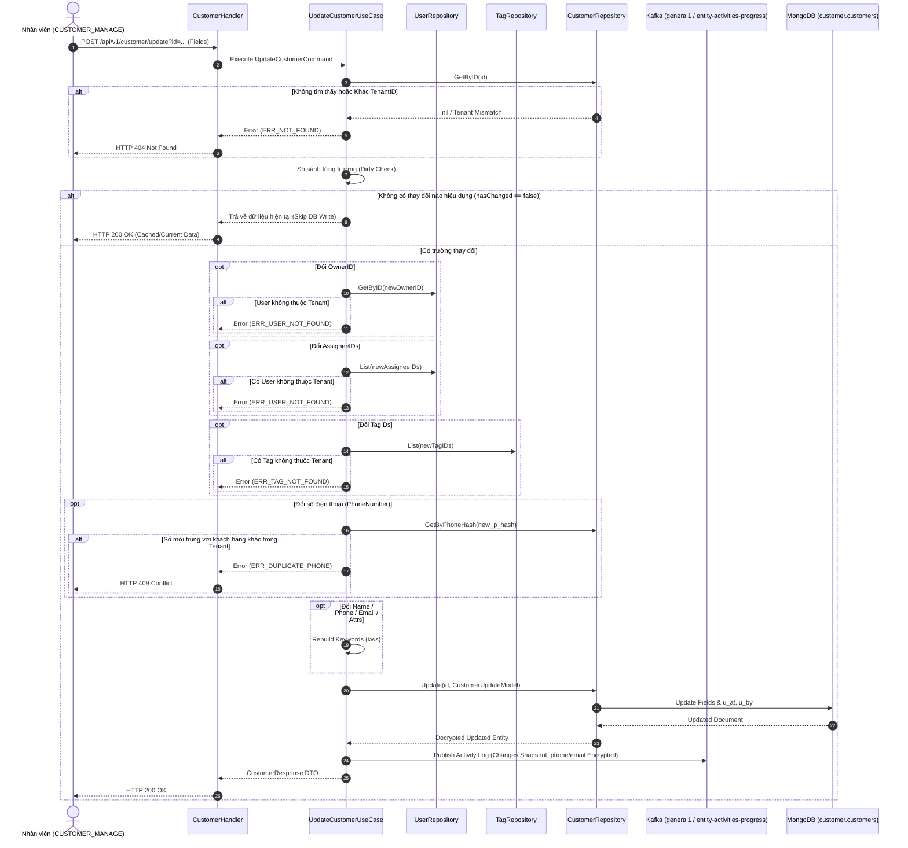

# Customer Management Workflow Documentation (Phân Hệ Quản Lý Khách Hàng)

Tài liệu này đặc tả toàn diện quy trình nghiệp vụ (Business Rules), kiến trúc mã hóa dữ liệu nhạy cảm (E2EE/Blind Index), luồng xử lý (Step-by-Step Flow), sơ đồ Mermaid và đặc tả API của phân hệ **Khách Hàng (Customer Module)** trong hệ thống Sowfkun-Verse.

---

## 1. Tổng quan & Quy tắc Nghiệp vụ Đặc thù (Business Rules)

### 1.1 Kiến Trúc Dữ Liệu & Cô Lập Multi-Tenant
- **Database độc lập**: Phân hệ Khách hàng hoạt động trên database riêng `customer` trên cụm MongoDB `primary1`.
- **Cô lập Tenant tuyệt đối**: Mọi bản ghi khách hàng đều chứa `tid` (TenantID) và `is_del` (trạng thái xóa mềm). Mọi thao tác truy vấn đơn lẻ (`GetByID`, `GetByPhoneHash`, `Update`, `Delete`) bắt buộc phải kiểm tra quyền sở hữu Tenant:
  $$\text{customer.TenantID} == \text{request.TenantID}$$
- **Phép chiếu an toàn (Projection Safety)**: Mọi hàm đọc dữ liệu có projection luôn tự động kèm `"tid": 1` và `"is_del": 1` để đảm bảo UseCase luôn có đủ thông tin kiểm tra cô lập.

### 1.2 Mã Hóa Dữ Liệu Nhạy Cảm & Chống Trùng Lặp (E2EE / Blind Index)
1. **Số Điện Thoại (`phone` - Bắt buộc)**:
   - Được lưu dưới dạng `coreDomain.PhoneNumber` gồm `country_code` (VD: `"+84"`) và `number` (VD: `"0901234567"`).
   - Tự động mã hóa AES-256-GCM khi lưu DB và giải mã khi đọc lên Repository.
   - **Blind Index `p_hash`**: Sinh mã băm một chiều HMAC-SHA256 Pepper từ số điện thoại quốc gia dạng chuẩn hóa (`PhoneNumber.National()`).
   - **Ràng buộc duy nhất (Compound Unique Index)**: Cấu hình index duy nhất `{tid: 1, p_hash: 1}` kèm partial filter `{"is_del": false}` nhằm ngăn chặn triệt để việc trùng lặp số điện thoại trong cùng một Tenant.
2. **Email (`email` - Tùy chọn)**:
   - Được lưu dưới dạng `coreDomain.Email`, chuẩn hóa chữ thường.
   - Tự động mã hóa AES-256-GCM khi lưu DB và giải mã khi đọc lên Repository.
   - **Blind Index `e_hash`**: Sinh mã băm HMAC-SHA256 để tìm kiếm chính xác qua Atlas Search.

### 1.3 Nguồn Dữ Liệu Bất Biến (Immutable Source)
- **Nguồn khách hàng (`source`)**: Enum gồm `MANUAL` (nhập tay) và `EXCEL` (import từ file).
- **Tính bất biến**: Khách hàng khi đã được tạo thì trường `Source` là cố định, **tuyệt đối không cho phép cập nhật**.
- **Tự động gán tại UseCase**: API thêm khách hàng (`AddCustomerUseCase`) tự động gán `Source = MANUAL`, Client không được phép tự truyền trường này lên request.

### 1.4 Giới Tính, Ngày Sinh & Thuộc Tính Động
- **Giới tính (`gender`)**: Enum hợp lệ gồm `MALE`, `FEMALE`, `OTHER` (*Tuyệt đối không có trạng thái UNKNOWN*).
- **Ngày sinh (`dob`)**: Lưu trữ dưới dạng Unix timestamp UTC milliseconds (`int64`).
- **Địa chỉ (`addr`)**: Chuỗi văn bản tối đa 255 ký tự.
- **Bộ thuộc tính động (`attrs`)**: Lưu trữ dạng `map[string]any` tương ứng với các slot:
  - `t_search_1..5`: Thuộc tính dạng văn bản tìm kiếm (Text Search).
  - `s_filter_1..5`: Thuộc tính dạng lựa chọn/phân loại (Select Filter).
  - `n_filter_1..5`: Thuộc tính dạng số có hỗ trợ lọc khoảng & sắp xếp (Number Filter).
  - `d_filter_1..5`: Thuộc tính dạng thời gian có hỗ trợ lọc khoảng & sắp xếp (Date Filter).
- **Thẻ phân loại (`tag_ids`)**: Danh sách Tag ID liên kết, giới hạn tối đa 10 thẻ / khách hàng.

### 1.5 Thời Hạn Xử Lý & Cơ Chế Hết Hạn Tự Động (TTL Index)
- **Thời hạn xử lý (`proc_deadline`)**: Tự động tính toán khi tạo khách hàng mới:
  $$\text{proc\_deadline} = \text{CreatedDate} + 6\text{ tháng}$$
- **MongoDB TTL Index (`exp_ref`)**:
  - Khi tạo, hệ thống tự động gán `ExpiredRef = CreatedDate + 6 tháng + 3 ngày`.
  - MongoDB TTL Monitor (`exp_ref_ttl_idx` với `expireAfterSeconds: 0`) tự động xóa vĩnh viễn document khỏi collection sau khi hết hạn 6 tháng 3 ngày.

### 1.6 Kiểm Soát Hạn Mức (Quota Check)
- Khi gọi API thêm khách hàng, UseCase đối chiếu số lượng khách hàng hiện tại của Tenant với `quota.LimitMaxCustomers`:
  - **TRIAL**: Tối đa 100 khách hàng.
  - **BASIC**: Tối đa 1.000 khách hàng.
  - **PRO**: Không giới hạn (`-1`).

### 1.7 Cơ Chế Cập Nhật Tối Ưu (Dirty Check & Partial Dot-Notation Update)
- Tầng UseCase đối chiếu từng trường trong DTO với dữ liệu hiện tại trong DB.
- **Dirty Check từng slot thuộc tính động (`attrs`)**: So khớp từng slot bằng `reflect.DeepEqual`. Chỉ thẩm định các slot thay đổi qua `AttributeValidationService` (bất kỳ slot sai quy cách hoặc HIDDEN đều bị reject `ErrBadRequest`).
- **Ghi đè trường riêng biệt (Dot-Notation)**: Khi cập nhật MongoDB, Repository sử dụng dạng `data["attrs."+slot] = val` để chỉ cập nhật đúng slot bị thay đổi mà không ghi đè hoặc làm mất các slot thuộc tính khác đã tồn tại.
- Nếu không có bất kỳ trường nào thay đổi giá trị hiệu dụng, UseCase **bỏ qua việc ghi Database (Skip DB Write)** và trả về kết quả ngay lập tức để tiết kiệm I/O.
- Khi có thay đổi về `Name`, `PhoneNumber`, `Email` hoặc bất kỳ thuộc tính searchable `t_search_*` nào, UseCase tự động tính toán lại toàn bộ `Keywords` (`kws`) phục vụ tìm kiếm.

### 1.8 Rào An Toàn Xóa Hàng Loạt (Bulk Soft Delete Safety Gate)
- Hỗ trợ xóa 1 hoặc xóa nhiều lên đến **1.000 khách hàng / 1 lần gọi** để hạn chế tối đa rủi ro thao tác nhầm.
- **Rào an toàn bắt buộc**:
  - Tại UseCase: `if !cmd.IsSelAll && len(cmd.IncludeIDs) == 0 { return ErrBadRequest }`
  - Tại Handler: Chặn xung đột nếu vừa `is_sel_all = true` vừa truyền `include_ids`.
- Lưu vết kiểm toán: Thao tác xóa ghi nhận đầy đủ `u_by` (Actor) và `tracking_id` (Request ID).

### 1.9 Cơ Chế Khôi Phục / Hoàn Tác Theo Tracking ID (Rollback Delete)
- Cho phép Quản trị viên (Admin) khôi phục (Un-delete) toàn bộ các bản ghi khách hàng bị xóa mềm trong một đợt thao tác dựa trên `tracking_id` (Request ID).
- Phục hồi lại trạng thái `is_del = false`, cập nhật `u_at`, `u_by` và gia hạn lại TTL `exp_ref` (6 tháng + 3 ngày) mà vẫn bảo toàn `tracking_id` phục vụ kiểm toán và truy vết.

### 1.10 Phân Quyền Phân Cấp Dữ Liệu (Hierarchy Scoping)
- **Cơ chế lọc phân cấp (`HierarchyService`)**: API `POST /api/v1/customer/list` tự động phân giải danh sách `accessibleIDs` dựa trên mã quyền `CUSTOMER_VIEW` và vai trò (Role) của người dùng:
  - `ScopeAll`: Xem được toàn bộ khách hàng của Tenant.
  - `ScopeSubordinates`: Xem được khách hàng do chính mình hoặc cấp dưới trực thuộc/gián tiếp phụ trách.
  - `ScopeSameDept`: Xem được khách hàng của những người cùng bộ vai trò trong Tenant.
  - `ScopeOwner`: Chỉ xem được khách hàng do chính mình phụ trách (`owner_id`) hoặc liên quan (`assignee_ids`).
- **So khớp đa trường tại Repository (`buildQuery`)**:
  - Khi `CommonQuery.Role.OwnerIDs` có dữ liệu, Repository áp dụng `mongodb.AppendOrClause` để lọc khách hàng có `owner_id` HOẶC `assignee_ids` nằm trong danh sách được cấp quyền truy cập.
- **Tự động làm sạch Cache qua Change Stream**:
  - `CUSTOMER_VIEW` được đăng ký vào `roleDomain.HierarchyPermissions`. Khi User hoặc Role thay đổi, MQ Handler tự động dọn dẹp Redis Accessible Cache (`user:accessible_users:{uid}:CUSTOMER_VIEW`).

### 1.11 Phân Quyền & Bảo Vệ Endpoint
- **API Ghi Dữ liệu Khách hàng (CUD - Add/Update/Delete)**: Đi qua `RequireAuth` + `RequirePermission("CUSTOMER_MANAGE")` + `RequestIDMiddleware`.
- **API Đọc Dữ liệu (Read/List/Get)**: Đi qua `RequireAuth` + `RequirePermission("CUSTOMER_VIEW")` (cho phép toàn bộ nhân viên có quyền xem truy cập).
- **API Quản Trị Hệ Thống (Rollback Delete)**: Đi qua `RequireAdminAuth` + `RequestIDMiddleware` dưới prefix `/api/v1/admin/customer/`.

---

## 2. Sơ Đồ Quy Trình (Mermaid Flows)

### 2.1 Luồng Thêm Khách Hàng Mới (Add Customer Flow)



---

### 2.2 Luồng Cập Nhật & Dirty Check (Update Customer Flow)



---

## 3. Đặc tả Kỹ thuật API (API Specification)

### 3.1 Thêm Mới Khách Hàng (Add Customer)
- **Endpoint**: `POST /api/v1/customer/add`
- **Headers**:
  - `Authorization: Bearer <jwt_token>` (Bắt buộc)
  - `X-Session-ID: <session_id>` (Bắt buộc nếu bật E2EE)
  - `X-Tracking-ID: <uuid>` (Tùy chọn)
- **Quyền yêu cầu**: `CUSTOMER_MANAGE`
- **Request Payload**:
  | Trường | Kiểu | Bắt buộc | Validation Rules | Mô tả |
  |---|---|---|---|---|
  | `name` | `string` | **Có** | `required,max=100` | Họ và tên khách hàng |
  | `phone` | `object` | **Có** | `required` | Đối tượng số điện thoại |
  | `phone.country_code` | `string` | Không | VD: `"+84"` | Mã quốc gia |
  | `phone.number` | `string` | **Có** | `required` | Số thuê bao nội địa |
  | `email` | `string` | Không | `omitempty,email,max=100` | Địa chỉ email |
  | `owner_id` | `string` | **Có** | `required,len=24` | ID nhân viên phụ trách chính (Bắt buộc) |
  | `assignee_ids` | `[]string` | Không | `dive,len=24` | Danh sách ID nhân viên phối hợp |
  | `gender` | `string` | Không | `omitempty,oneof=MALE FEMALE OTHER` | Giới tính |
  | `dob` | `int64` | Không | `gt=0` | Ngày sinh (Unix timestamp ms UTC) |
  | `addr` | `string` | Không | `max=255` | Địa chỉ liên hệ |
  | `attrs` | `object` | Không | `map[string]any` | Bộ thuộc tính động (`t_search_*`, `s_filter_*`,...) |
  | `tag_ids` | `[]string` | Không | `max=10,dive,len=24` | Tối đa 10 Tag ID |

- **Request Example**:
  ```json
  {
    "name": "Nguyễn Văn An",
    "phone": {
      "country_code": "+84",
      "number": "0912345678"
    },
    "email": "an.nguyen@example.com",
    "owner_id": "64f1a2b3c4d5e6f7a8b9c0d1",
    "gender": "MALE",
    "dob": 631152000000,
    "addr": "123 Đường Lê Lợi, Quận 1, TP.HCM",
    "attrs": {
      "t_search_1": "Khách hàng thân thiết",
      "s_filter_1": "VIP"
    },
    "tag_ids": ["64f1a2b3c4d5e6f7a8b9c0d2"]
  }
  ```

- **Response `200 OK`**:
  ```json
  {
    "data": {
      "id": "6740a1b2c3d4e5f6a7b8c9d0",
      "tid": "tenant_123",
      "name": "Nguyễn Văn An",
      "phone": {
        "country_code": "+84",
        "number": "0912345678"
      },
      "email": "an.nguyen@example.com",
      "owner_id": "64f1a2b3c4d5e6f7a8b9c0d1",
      "assignee_ids": [],
      "source": "MANUAL",
      "gender": "MALE",
      "dob": 631152000000,
      "addr": "123 Đường Lê Lợi, Quận 1, TP.HCM",
      "attrs": {
        "t_search_1": "Khách hàng thân thiết",
        "s_filter_1": "VIP"
      },
      "tag_ids": ["64f1a2b3c4d5e6f7a8b9c0d2"],
      "proc_deadline": 1758298000000,
      "c_at": 1742662000000,
      "u_at": 1742662000000,
      "c_by": { "id": "u1", "type": "USER", "name": "Admin" },
      "u_by": { "id": "u1", "type": "USER", "name": "Admin" }
    },
    "error_code": "MSG_SUCCESS",
    "error_detail": "Thành công"
  }
  ```

---

### 3.2 Cập Nhật Khách Hàng (Update Customer)
- **Endpoint**: `POST /api/v1/customer/update?id=<customer_id>`
- **Headers**: `Authorization: Bearer <jwt_token>`, `X-Request-ID: <uuid>`
- **Quyền yêu cầu**: `CUSTOMER_MANAGE`
- **Request Payload**: Toàn bộ các trường đều là Tùy chọn (Optional) phục vụ Dirty Check:
  | Trường | Kiểu | Ràng buộc | Mô tả |
  |---|---|---|---|
  | `name` | `string` | `omitempty,max=100` | Họ và tên mới |
  | `phone` | `object` | `omitempty` | Số điện thoại mới |
  | `email` | `string` | `omitempty,email,max=100` | Email mới (hoặc `""` để xóa email) |
  | `owner_id` | `string` | `omitempty,len=24` | ID nhân viên phụ trách mới |
  | `assignee_ids` | `[]string` | `dive,len=24` | Danh sách nhân viên phối hợp mới |
  | `gender` | `string` | `omitempty,oneof=MALE FEMALE OTHER` | Giới tính |
  | `dob` | `int64` | `gt=0` | Ngày sinh |
  | `addr` | `string` | `max=255` | Địa chỉ |
  | `attrs` | `object` | Tùy biến | Thuộc tính động mới (chỉ gửi các slot dirty) |
  | `tag_ids` | `[]string` | `max=10,dive,len=24` | Danh sách Tag ID mới |

---

### 3.3 Xóa Khách Hàng (Delete Customers)
- **Endpoint**: `POST /api/v1/customer/delete`
- **Headers**: `Authorization: Bearer <jwt_token>`, `X-Request-ID: <uuid>`
- **Quyền yêu cầu**: `CUSTOMER_MANAGE`
- **Request Payload**:
  ```json
  {
    "is_sel_all": false,
    "include_ids": ["6740a1b2c3d4e5f6a7b8c9d0"],
    "exclude_ids": []
  }
  ```
- **Response `200 OK`**:
  ```json
  {
    "data": "OK",
    "error_code": "MSG_SUCCESS",
    "error_detail": "Thành công"
  }
  ```

---

### 3.4 Chi Tiết Khách Hàng (Get Customer Detail)
- **Endpoint**: `POST /api/v1/customer/get`
- **Headers**: `Authorization: Bearer <jwt_token>`
- **Quyền yêu cầu**: `CUSTOMER_VIEW`
- **Request Payload**:
  ```json
  {
    "id": "6740a1b2c3d4e5f6a7b8c9d0",
    "projection": {
      "name": 1,
      "phone": 1,
      "email": 1,
      "attrs": 1
    }
  }
  ```
- **Response `200 OK`**: Trả về `CustomerResponse` (áp dụng projection nếu có).

---

### 3.5 Danh Sách Khách Hàng (List Customers)
- **Endpoint**: `POST /api/v1/customer/list`
- **Headers**: `Authorization: Bearer <jwt_token>`
- **Quyền yêu cầu**: `CUSTOMER_VIEW`
- **Request Payload**:
  ```json
  {
    "page": 1,
    "size": 20,
    "keyword": "An",
    "sources": ["MANUAL"],
    "genders": ["MALE"],
    "owner_ids": ["64f1a2b3c4d5e6f7a8b9c0d1"],
    "tag_ids": ["64f1a2b3c4d5e6f7a8b9c0d2"],
    "attrs": {
      "s_filter_1": "VIP"
    },
    "ranges": {
      "dob": { "from": 631152000000, "to": 946684800000 }
    },
    "sort_field": "c_at",
    "sort_dir": -1
  }
  ```
- **Allowed Sort Fields**: `c_at`, `u_at`, `name`, `dob`, `proc_deadline`, `attrs.n_filter_1`, `attrs.n_filter_2`, `attrs.d_filter_1`, `attrs.d_filter_2`.
- **Response `200 OK`**:
  ```json
  {
    "data": {
      "items": [
        {
          "id": "6740a1b2c3d4e5f6a7b8c9d0",
          "name": "Nguyễn Văn An",
          "phone": { "country_code": "+84", "number": "0912345678" },
          "email": "an.nguyen@example.com",
          "owner_id": "64f1a2b3c4d5e6f7a8b9c0d1",
          "assignee_ids": [],
          "source": "MANUAL",
          "gender": "MALE",
          "dob": 631152000000,
          "addr": "123 Đường Lê Lợi, TP.HCM",
          "attrs": { "t_search_1": "Khách VIP", "s_filter_1": "VIP" },
          "tag_ids": ["64f1a2b3c4d5e6f7a8b9c0d2"],
          "proc_deadline": 1758298000000,
          "c_at": 1742662000000,
          "u_at": 1742662000000,
          "c_by": { "id": "u1", "type": "USER", "name": "Admin" },
          "u_by": { "id": "u1", "type": "USER", "name": "Admin" }
        }
      ],
      "total": 1,
      "page": 1,
      "size": 20,
      "has_next": false,
      "next_cursor": ""
    },
    "error_code": "MSG_SUCCESS",
    "error_detail": "Thành công"
  }
  ```

---

### 3.6 Khôi Phục Khách Hàng Đã Xóa (Rollback Delete Customers - Admin Only)
- **Endpoint**: `POST /api/v1/admin/customer/rollback-delete`
- **Headers**: `Authorization: Bearer <jwt_token>`, `X-Request-ID: <uuid>`
- **Xác thực yêu cầu**: `RequireAdminAuth`
- **Request Payload**:
  ```json
  {
    "tracking_id": "req_6740a1b2c3d4e5f6a7b8c9d0"
  }
  ```
- **Response `200 OK`**:
  ```json
  {
    "data": {
      "restored_count": 5
    },
    "error_code": "MSG_SUCCESS",
    "error_detail": "Thành công"
  }
  ```

---

## 4. Các Mã Lỗi Thường Gặp (Common Error Codes)

| HTTP Status | Error Code (`error_code`) | Ý nghĩa & Nguyên nhân | Hướng xử lý / Khuyến nghị cho Client |
|---|---|---|---|
| `400 Bad Request` | `ERR_VALIDATION_FAILED` | Dữ liệu đầu vào sai định dạng (tên quá dài, SĐT sai, tag quá 10, v.v.). | Kiểm tra mảng `error_detail` trả về để highlight lỗi từng trường trên UI. |
| `400 Bad Request` | `ERR_BAD_REQUEST` | Thiếu trường bắt buộc (`name`, `phone`) hoặc payload xóa rỗng (`!is_sel_all && len(include_ids) == 0`). | Bổ sung các trường bắt buộc trước khi gửi request. |
| `400 Bad Request` | `ERR_CUSTOMER_QUOTA_EXCEEDED` | Tenant đã sử dụng hết hạn mức số lượng khách hàng của gói đăng ký. | Hiển thị modal nhắc nhở nâng cấp gói cước (`Trial` $\rightarrow$ `Basic` $\rightarrow$ `Pro`). |
| `401 Unauthorized` | `ERR_UNAUTHORIZED` | Token JWT hết hạn, không hợp lệ hoặc thiếu thông tin xác thực. | Điều hướng người dùng về màn hình Đăng nhập để làm mới token. |
| `403 Forbidden` | `ERR_FORBIDDEN` | Tài khoản không có quyền `CUSTOMER_MANAGE` hoặc `CUSTOMER_VIEW`. | Ẩn nút thao tác hoặc hiển thị thông báo "Bạn không có quyền thực hiện chức năng này". |
| `404 Not Found` | `ERR_NOT_FOUND` | Không tìm thấy khách hàng tương ứng với ID hoặc khách hàng thuộc Tenant khác. | Kiểm tra lại ID truyền lên, load lại danh sách. |
| `404 Not Found` | `ERR_TENANT_NOT_FOUND` | Không tìm thấy thông tin Tenant của người dùng trong hệ thống. | Kiểm tra trạng thái tài khoản công ty của người dùng. |
| `404 Not Found` | `ERR_USER_NOT_FOUND` | Nhân viên phụ trách (`owner_id`) không tồn tại hoặc không thuộc Tenant hiện tại. | Chỉ cho phép chọn nhân viên từ danh sách nhân viên nội bộ của Tenant. |
| `409 Conflict` | `ERR_DUPLICATE_PHONE` | Số điện thoại này đã tồn tại trong hệ thống của Tenant. | Thông báo cho nhân viên kiểm tra lại số điện thoại hoặc tìm kiếm khách hàng đã có. |
| `500 Server Error` | `ERR_INTERNAL_SERVER` | Lỗi phát sinh trong quá trình ghi dữ liệu MongoDB hoặc mã hóa. | Thử lại sau hoặc liên hệ đội ngũ kỹ thuật. |
