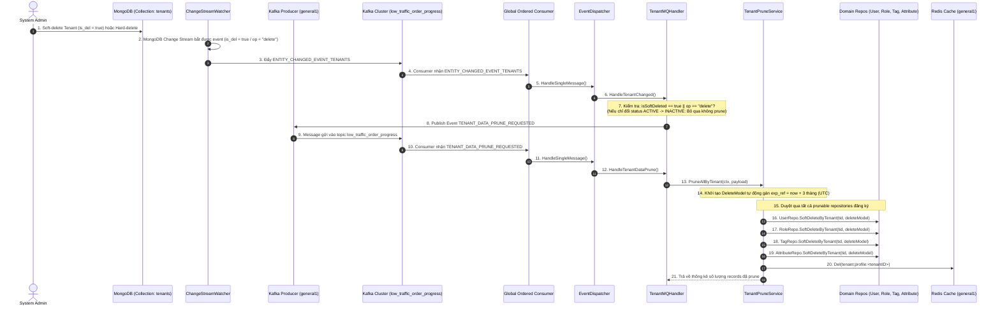
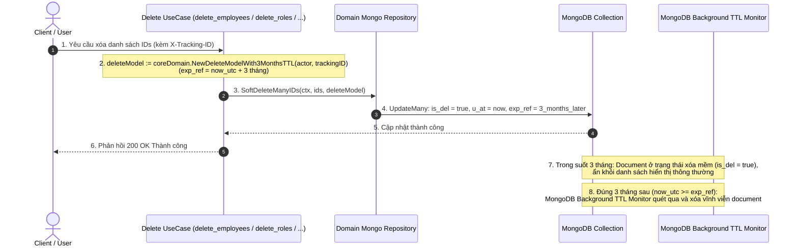

# Data Pruning & Expired TTL Workflow Documentation

Tài liệu này đặc tả quy trình vận hành, kiến trúc và cơ chế dọn dẹp dữ liệu (Data Pruning & Soft Delete) kết hợp với MongoDB TTL Expired Index trong toàn bộ hệ thống Sowfkun-Verse, được chia làm 2 phân hệ rõ rệt:
1. **Dọn dẹp dữ liệu khi Xóa Doanh nghiệp (Tenant-Level Pruning)**
2. **Dọn dẹp dữ liệu trong các Nghiệp vụ Xóa Thực thể (Domain-Level Soft Delete & TTL Purge)**

---

## PHẦN 1: DỌN DẸP DỮ LIỆU KHI XÓA DOANH NGHIỆP (TENANT-LEVEL PRUNING)

### 1.1 Tổng quan & Quy tắc Nghiệp vụ (Business Rules)
- **Ranh giới Kích hoạt Tuyệt đối:**
  - **CHỈ PRUNE** khi Tenant bị **Xóa vĩnh viễn (Hard Delete)** hoặc **Đánh dấu xóa mềm (Soft Delete: `is_del = true`)**.
  - **TUYỆT ĐỐI KHÔNG PRUNE** khi Tenant chỉ chuyển trạng thái tạm khóa/tạm dừng (**`INACTIVE`** hoặc **`SUSPENDED`**) nhằm bảo toàn 100% dữ liệu của khách hàng đang tạm khóa dịch vụ.
- **Xử lý Bất đồng bộ Hướng sự kiện (Event-Driven):** 
  - MongoDB Change Stream bắt thay đổi trên collection `tenants` $\rightarrow$ `TenantMQHandler` phát hiện `is_del == true` hoặc `op == "delete"` $\rightarrow$ Emit sự kiện `TENANT_DATA_PRUNE_REQUESTED` vào Kafka topic `low_traffic_order_progress`.
- **Database-Level Batch Soft Delete:** 
  - `TenantPruneService` duyệt qua tất cả repository đăng ký (`users`, `roles`, `tags`, `entity_attribute_sets`) và thực thi lệnh `UpdateMany` trực tiếp trên điều kiện `{ "tid": tenantID, "is_del": { "$ne": true } }`.
  - **Zero-Waste RAM**: Không tải documents lên RAM, ngăn ngừa nguy cơ Out-Of-Memory.
- **Dọn dẹp Redis Cache Hợp nhất:**
  - Tự động xóa sạch toàn bộ cache keys liên quan tới Tenant trên cụm Redis `general1` (`tenant:profile:<tenantID>`, v.v.).

### 1.2 Sơ đồ Luồng Xử lý (Tenant Prune Flow)



---

## PHẦN 2: DỌN DẸP DỮ LIỆU Ở CÁC NGHIỆP VỤ XÓA THỰC THỂ (DOMAIN-LEVEL SOFT DELETE & TTL PURGE)

### 2.1 Chuẩn hóa Cấu trúc DeleteModel (`pkg/core/domain/delete_model.go`)
Mọi nghiệp vụ xóa dữ liệu đơn lẻ hoặc hàng loạt trong hệ thống (Delete Employees, Delete Roles, Delete Tags, v.v.) **bắt buộc** sử dụng struct `coreDomain.DeleteModel` thay vì truyền `map[string]any` tự do:

```go
type DeleteModel struct {
    DeletedBy  *Actor     `bson:"u_by,omitempty" json:"u_by,omitempty"`
    TrackingID string     `bson:"tracking_id,omitempty" json:"tracking_id,omitempty"`
    DeletedAt  int64      `bson:"u_at" json:"u_at"`                          // Unix timestamp ms
    ExpiredRef *time.Time `bson:"exp_ref,omitempty" json:"exp_ref,omitempty"` // MongoDB TTL Index
}
```

### 2.2 Cơ chế Gán Thời hạn TTL (Có Điều Kiện)
- **`NewDeleteModel(actor, trackingID, expiredRef...)`**: Khởi tạo cơ bản. **Chỉ khi nào có `ExpiredRef` truyền vào mới gán giá trị**, nếu không trường `exp_ref` sẽ là `nil` và không ghi vào DB.
- **`NewDeleteModelWith3MonthsTTL(actor, trackingID)`**: Tự động tính toán mốc thời gian hết hạn sau đúng 3 tháng: `exp_ref = time.Now().UTC().AddDate(0, 3, 0)`.
- Khi cập nhật DB qua `AbstractMongoRepository.SoftDeleteManyIDs(ctx, ids, deleteModel)`:
  - Document được gán: `{ "is_del": true, "u_at": now_ms, "u_by": actor, "tracking_id": trackingID, "exp_ref": 3_months_later }`.

### 2.3 Cơ chế Tự động Hủy Vĩnh viễn (MongoDB Background TTL Monitor)
- **Cấu hình TTL Index tại `cmd/indexer/mongo.go`:**
  ```go
  mongo.IndexModel{
      Keys: bson.D{{Key: "exp_ref", Value: 1}},
      Options: options.Index().
          SetName("exp_ref_ttl_idx").
          SetExpireAfterSeconds(0).
          SetPartialFilterExpression(bson.M{"is_del": true}),
  }
  ```
- **Nguyên lý hoạt động:**
  1. Tiến trình MongoDB TTL Monitor chạy ngầm mỗi 60 giây so sánh UTC epoch: $\text{Current Server UTC} \ge \text{Document's } exp\_ref$.
  2. Khi document đã quá 3 tháng kể từ ngày xóa mềm, MongoDB tự động giải phóng (purge) vĩnh viễn bản ghi khỏi đĩa cứng.
  3. **An toàn 100%:** Nhờ `PartialFilterExpression: {"is_del": true}`, các bản ghi đang hoạt động bình thường (`is_del = false` hoặc `exp_ref = nil`) hoàn toàn không bao giờ bị TTL đụng tới.

### 2.4 Sơ đồ Vòng đời Xóa Dữ liệu (Entity Soft-Delete Lifecycle)



---

## 3. Ma trận Danh sách Entities Hỗ trợ Prune & TTL

| Domain / Collection | Database | Repository Soft-Delete Method | Hỗ trợ Prune theo Tenant | MongoDB TTL Index (`exp_ref_ttl_idx`) |
| :--- | :--- | :--- | :---: | :---: |
| `users` | `tenant` | `IUserRepository.SoftDeleteByTenant` & `SoftDeleteManyIDs` | ✅ | ✅ |
| `tenants` | `tenant` | N/A (Master Tenant Entity) | N/A | ✅ |
| `roles` | `tenant` | `IRoleRepository.SoftDeleteByTenant` & `SoftDeleteManyIDs` | ✅ | ✅ |
| `tags` | `app_config` | `ITagRepository.SoftDeleteByTenant` & `SoftDeleteManyIDs` | ✅ | ✅ |
| `entity_attribute_sets` | `app_config` | `IAttributeRepository.SoftDeleteByTenant` | ✅ | ✅ |
| `email_templates` | `app_system` | N/A (System Template) | N/A | ✅ |

---

## 4. Các Tình huống Xử lý & Kháng Lỗi (Error Scenarios & Fault Tolerance)

| Tình huống | Phân hệ | Hành vi hệ thống |
| :--- | :--- | :--- |
| **Tenant chuyển trạng thái `INACTIVE` / `SUSPENDED`** | Tenant Pruning | `HandleTenantChanged` phát hiện `is_del != true`, tuyệt đối **không** sinh event `TENANT_DATA_PRUNE_REQUESTED`. Dữ liệu được bảo toàn. |
| **Nghiệp vụ xóa không truyền `ExpiredRef`** | Domain Delete | Trường `exp_ref` không được đưa vào MongoDB payload. Document chỉ được soft-delete vĩnh viễn ở trạng thái ẩn và không bị TTL purge. |
| **Lệch múi giờ giữa các máy chủ (Timezone Divergence)** | Cả hai | MongoDB lưu BSON Date dạng UTC epoch milliseconds tuyệt đối, phép so sánh TTL độc lập với OS timezone nên luôn chính xác đúng 3 tháng sau ngày xóa. |
| **Tenant không có dữ liệu ở một số collection** | Tenant Pruning | `SoftDeleteByTenant` trả về `ModifiedCount = 0`, không gây lỗi, tiếp tục prune các entity tiếp theo. |
| **Một repository gặp lỗi DB khi prune** | Tenant Pruning | `TenantPruneService` ghi nhận warning log (`⚠️ Failed to prune...`), tiếp tục xử lý các repository còn lại mà không làm sập tiến trình chung. |
