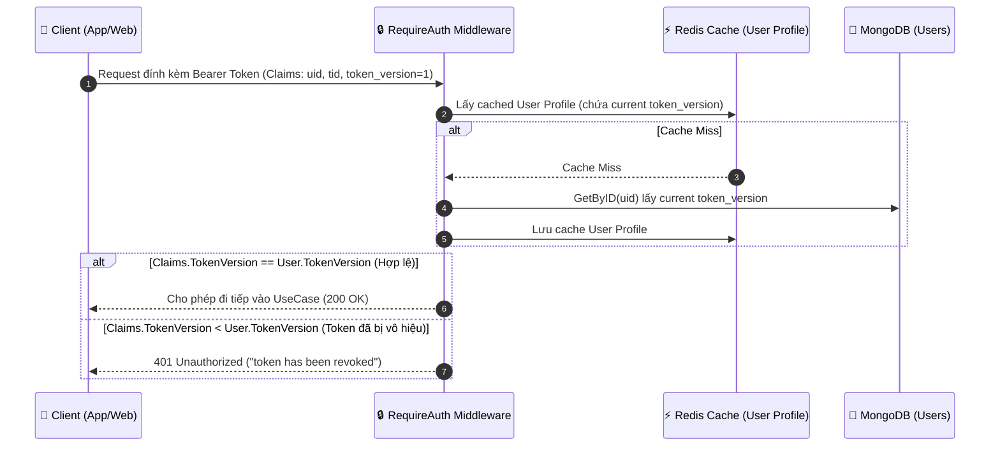
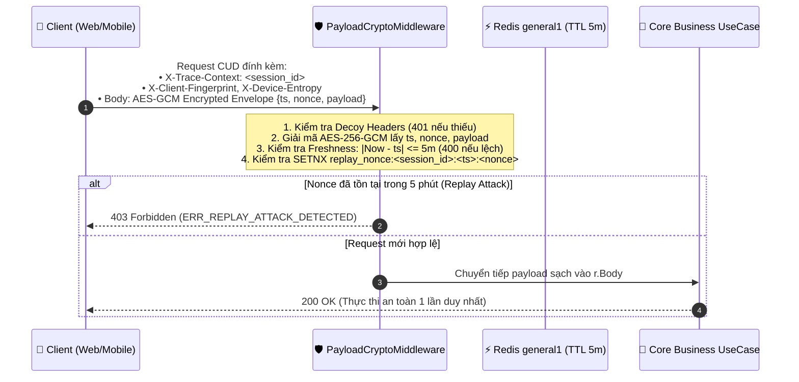

# 🛡️ Kịch Bản Tấn Công An Ninh Ứng Dụng & Kế Hoạch Phòng Thủ
## (Application Security Threat Scenarios & Defense Roadmap)

Tài liệu này đặc tả chi tiết **các kịch bản tấn công an ninh cấp ứng dụng (Application Threat Models & OWASP Top 10)** đối với mã nguồn Golang `sowfkun-verse-api`, phân tích rủi ro thực tế, cơ chế phòng thủ kỹ thuật và kế hoạch triển khai (Roadmap) cho các giai đoạn tiếp theo.

---

## 📊 Bảng Tổng Hợp Ma Trận Kịch Bản Tấn Công & Giải Pháp

| STT | Kịch Bản Tấn Công (Threat Scenario) | Mức Độ Rủi Ro | Trạng Thái | Giải Pháp Kỹ Thuật (Go Backend) | Vị Trí Triển Khai Dự Kiến |
|:---:|:---|:---:|:---:|:---|:---|
| **1** | **Instant Token Invalidation**<br/>(Dùng Token cũ sau khi đổi mật khẩu/bị đuổi việc) | 🔴 **High** | ⏳ **TODO**<br/>*(Xử lý khi làm Token)* | Bổ sung `token_version: int` trong Entity User; `RequireAuth` so khớp claim `token_version` với cache | `internal/auth/`, `pkg/middleware/` |
| **2** | **Distributed Credential Stuffing**<br/>(Dò mật khẩu bằng Botnet đa IP) | 🟡 **Medium** | ✅ **DONE** | Đếm số lần đăng nhập sai theo Email (`auth:login_attempts:{email}`) trong Redis; khóa tạm 30p sau 5 lần sai | `internal/auth/application/commands/login.go` |
| **3** | **Replay Attack on Encrypted Payload**<br/>(Phát lại gói tin mã hóa nhiều lần) | 🟡 **Medium** | ✅ **DONE** | Bọc Envelope `{ts, nonce, payload}` trong AES-256-GCM; Header `X-Trace-Context` + Decoy Headers; Redis Deduplication `replay_nonce:<session>:<ts>:<nonce>` 5 phút | `pkg/middleware/payload_crypto.go`, `src/lib/api/client.ts` |
| **4** | **Malicious File Upload & Stored SVG XSS**<br/>(Tải lên virus đổi đuôi, script lồng trong SVG) | 🟡 **Medium** | ⏳ **TODO**<br/>*(Xử lý khi làm Media)* | Kiểm tra Magic Bytes nhị phân qua `http.DetectContentType`, khử mã độc SVG, đổi tên file ngẫu nhiên UUID | `pkg/utils/file/`, `internal/media/` |
| **5** | **Missing Browser Security Headers**<br/>(Tấn công Clickjacking, MIME sniffing, XSS) | 🟢 **Low** | ✅ **DONE** | Middleware tự động chèn `X-Frame-Options: DENY`, `X-Content-Type-Options: nosniff`, `HSTS`, `Referrer-Policy` | `pkg/middleware/security_headers.go` |

---

## 🔍 Chi Tiết Kỹ Thuật Từng Kịch Bản & Thiết Kế Giải Pháp

### 1️⃣ Kịch Bản 1: Thu Hồi Token Tức Thì (Instant Token Invalidation via `token_version`)

#### 🚨 Rủi Ro & Kịch Bản Khai Thác:
- JWT Token là stateless và có thời gian sống (ví dụ: `7 ngày`).
- **Tình huống nguy hiểm**:
  1. Một nhân viên bị sa thải hoặc bị thu hồi vai trò Quản trị viên (Admin).
  2. Người dùng bị lộ mật khẩu, vào trang cá nhân bấm **"Đổi Mật Khẩu"** hoặc **"Đăng Xuất Khỏi Mọi Thiết Bị"**.
  3. Chiếc Token JWT cũ của hacker/nhân viên bị sa thải **vẫn tiếp tục gọi API thành công** cho đến khi Token hết hạn `exp`.

#### 💡 Thiết Kế Giải Pháp Kỹ Thuật (Token Versioning):


- **Thực thi khi Đổi Mật Khẩu / Đăng Xuất**:
  ```go
  // Tăng token_version trong DB và xóa cache Redis
  db.Users.UpdateOne(ctx, bson.M{"_id": uid}, bson.M{"$inc": bson.M{"token_version": 1}})
  redisClient.Del(ctx, "user:profile:" + uid)
  ```

---

### 2️⃣ Kịch Bản 2: Dò Mật Khẩu Bằng Mạng Botnet Phân Tán (Distributed Credential Stuffing)

#### 🚨 Rủi Ro & Kịch Bản Khai Thác:
- Rate Limiter theo IP không thể chặn botnet 1.000 IP (mỗi IP thử 1 lần vào 1 email cụ thể).

#### 💡 Thiết Kế Giải Pháp Kỹ Thuật (Đã Triển Khai):
- Trong `commands/login.go`:
  - Trước khi so khớp mật khẩu: Kiểm tra Redis key `auth:login_attempts:{email}`. Nếu `attempts >= 5` $\rightarrow$ chặn ngay lập tức với mã lỗi `coreDomain.ErrMaxLoginAttempts`.
  - Nếu sai mật khẩu hoặc tài khoản không hợp lệ: Tự động gọi `recordFailedAttempt` tăng biến đếm `INCR` và đặt `Expire` 30 phút.
  - Khi đăng nhập thành công: `DEL auth:login_attempts:{email}` để khôi phục trạng thái.

---

### 3️⃣ Kịch Bản 3: Tấn Công Phát Lại Gói Tin Mã Hóa & Ngụy Trang Header (Replay Attack, Camouflage & Noise Headers)

#### 🚨 Rủi Ro & Kịch Bản Khai Thác:
- Toàn bộ Body JSON được mã hóa AES-256-GCM (E2EE). Hacker không thể đọc được nội dung bên trong.
- Tuy nhiên, hacker trên cùng mạng LAN/Wifi có thể **bắt trộm toàn bộ chuỗi Ciphertext** của một giao dịch CUD (POST/PUT/DELETE/PATCH) và **bấm gửi lại gói tin đó 50 lần**.
- Ngoài ra, nếu header `X-Session-ID` quá lộ liễu, kẻ tấn công dễ dàng nhận diện cơ chế E2EE để khoanh vùng mục tiêu.

#### 💡 Thiết Kế Giải Pháp Kỹ Thuật Toàn Diện (Đã Triển Khai):
1. **Ngụy Trang Header (Header Camouflage & Decoy Noise Injection)**:
   - Header Session ID thật được ngụy trang thành `X-Trace-Context` (trông giống OpenTelemetry trace ID, không fallback).
   - Client gửi kèm các header chim mồi bắt buộc: `X-Session-ID` (giả lập), `X-Edge-Routing`, `X-Client-Fingerprint`, `X-Device-Entropy`.
   - Backend `PayloadCryptoMiddleware` xác thực sự hiện diện của `X-Session-ID`, `X-Client-Fingerprint` và `X-Device-Entropy` (thiếu sẽ trả HTTP 401 chặn bot/crawler).
2. **Đóng Gói Chống Can Thiệp (Encrypted Anti-Tamper Envelope)**:
   - Client bọc request CUD thành envelope:
     ```json
     {
       "ts": 1756968000000,
       "nonce": "1756968000000_a1b2c3d4e5f6",
       "payload": { ...dữ liệu thực tế... }
     }
     ```
   - Envelope được mã hóa nguyên khối bằng AES-256-GCM. Hacker không thể sửa `ts` hay `nonce` mà không phá vỡ Authentication Tag của GCM.
3. **Kiểm Tra 2 Lớp Trên Backend (`PayloadCryptoMiddleware`)**:
   - **Lớp 1 (Freshness Check):** Kiểm tra `|server_now_ms - ts| <= 5 phút` (lệch quá 5 phút từ chối với `ERR_REQUEST_EXPIRED`).
   - **Lớp 2 (Nonce Deduplication):** Thực hiện nguyên tử `SetNX` trên Redis với key `replay_nonce:<session_id>:<ts>:<nonce>` TTL 5 phút. Nếu key đã tồn tại $\rightarrow$ lập tức từ chối với `ERR_REPLAY_ATTACK_DETECTED`.
   - **Bóc tách Payload:** Giải mã thành công và trích xuất `payload` nguyên bản đưa vào `r.Body` cho tầng UseCase.
   - *(Lưu ý: Các request GET / Read giữ nguyên nhẹ nhàng, không bọc nonce, được bảo vệ bằng Token Bucket Rate Limiting).*



---

### 4️⃣ Kịch Bản 4: Tải Lên Tệp Tin Chứa Mã Độc & XSS Ẩn Trong SVG (File Upload Security)

#### 🚨 Rủi Ro & Kịch Bản Khai Thác:
- Hacker đổi tên file thực thi `webshell.php` thành `avatar.png` hoặc `document.pdf`.
- Hacker tải lên file ảnh vector `.svg` có nhúng mã độc JavaScript:
  ```xml
  <svg xmlns="http://www.w3.org/2000/svg">
    <script>alert(document.cookie)</script>
  </svg>
  ```
  Khi Admin hoặc người dùng khác mở xem ảnh SVG này trên trình duyệt, script độc sẽ kích hoạt và đánh cắp JWT Token (Stored XSS).

#### 💡 Thiết Kế Giải Pháp Kỹ Thuật:
1. **Kiểm tra Magic Bytes Nhị Phân**:
   - Đọc 512 bytes đầu tiên của file và dùng hàm chuẩn Go `http.DetectContentType(buffer)` để phát hiện đúng định dạng (ví dụ: `image/png`, `image/jpeg`), cấm dựa vào đuôi mở rộng người dùng tự đặt.
2. **Khử Mã Độc File SVG (SVG Sanitization)**:
   - Dùng thư viện parser XML quét và bóc sạch toàn bộ thẻ `<script>`, `<foreignObject>`, các thuộc tính `onload=`, `onerror=`.
3. **Đổi Tên File Thành UUID**:
   - Tên file lưu trữ trên đĩa luôn là `uuid.v4() + valid_extension`, triệt tiêu hoàn toàn tấn công Path Traversal (`../../etc/passwd`).
4. **Header Ép Buộc Tải Xuống (Content-Disposition)**:
   - Khi trả file về cho trình duyệt, luôn gắn `Content-Disposition: attachment` hoặc dùng Subdomain tĩnh riêng biệt (`static.domain.com`) không chứa Cookie.

---

### 5️⃣ Kịch Bản 5: Bộ Header Bảo Vệ Trình Duyệt (Browser Security Headers - Đã Triển Khai)

#### 🚨 Rủi Ro & Kịch Bản Khai Thác:
- Người dùng bị tấn công Clickjacking (giao diện website bị chèn lén vào một khung `<iframe>` trong suốt trên trang web lừa đảo để dụ người dùng click chuột).
- Trình duyệt tự ý đoán kiểu dữ liệu (MIME Sniffing) dẫn đến việc thực thi nhầm mã độc text thành HTML/JS.

#### 💡 Thiết Kế Giải Pháp Kỹ Thuật (Đã Triển Khai):
Tạo `pkg/middleware/security_headers.go` và tích hợp vào chuỗi middleware toàn cục trong `cmd/api/setup_http.go`:
```go
func SecurityHeadersMiddleware(next http.Handler) http.Handler {
    return http.HandlerFunc(func(w http.ResponseWriter, r *http.Request) {
        w.Header().Set("X-Frame-Options", "DENY")
        w.Header().Set("X-Content-Type-Options", "nosniff")
        w.Header().Set("X-XSS-Protection", "1; mode=block")
        w.Header().Set("Referrer-Policy", "strict-origin-when-cross-origin")
        w.Header().Set("Strict-Transport-Security", "max-age=31536000; includeSubDomains")
        w.Header().Set("X-Permitted-Cross-Domain-Policies", "none")
        next.ServeHTTP(w, r)
    })
}
```

---

## 🗺️ Lộ Trình Triển Khai Kỹ Thuật (Implementation Roadmap)

| Giai Đoạn | Hạng Mục Triển Khai | Thời Lượng Dự Kiến | Trạng Thái |
|---|---|:---:|:---:|
| **Giai đoạn 1 (Auth, Replay & Headers)** | 1. Anti-Replay Envelope & Redis Nonce Deduplication<br/>2. Header Camouflage (`X-Trace-Context`) & Decoy Headers<br/>3. Account Lockout sau 5 lần sai mật khẩu (`auth:login_attempts`)<br/>4. `SecurityHeadersMiddleware` (Clickjacking & MIME Protection) | ~30 phút | ✅ **DONE** |
| **Giai đoạn 2 (Token Life Cycle)** | 5. Token Version Invalidation (`token_version` check) | ~30 phút | ⏳ **TODO** *(Khi làm Token)* |
| **Giai đoạn 3 (Media Safety)** | 6. File Upload Magic Bytes Validator & SVG Sanitizer | ~45 phút | ⏳ **TODO** *(Khi làm Media)* |
