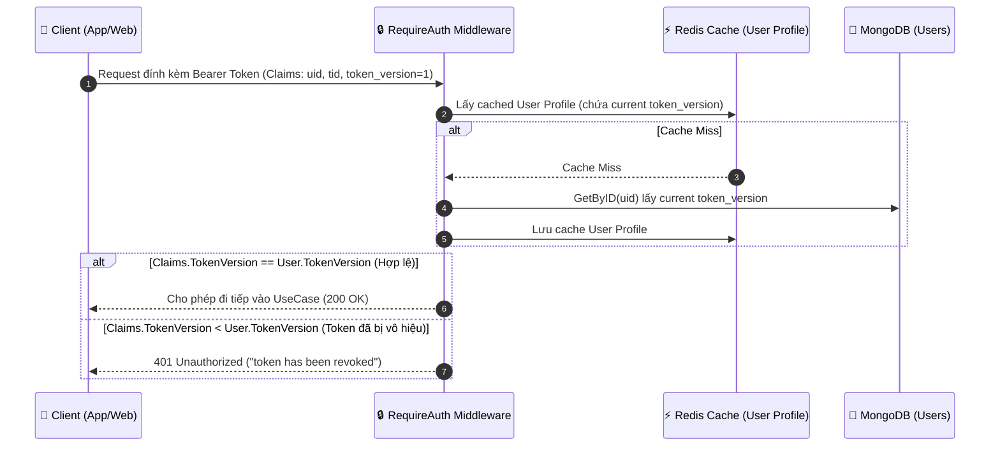
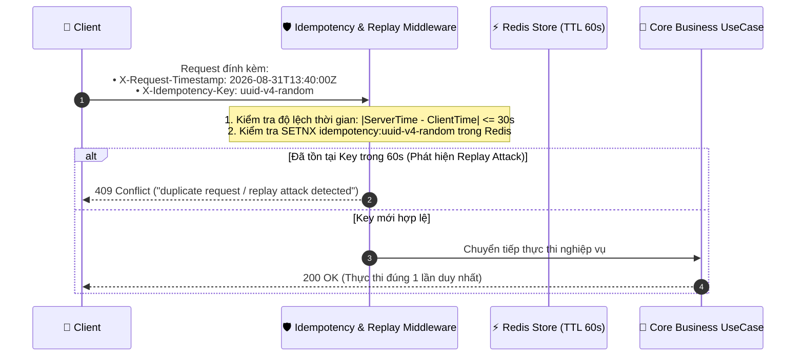

# 🛡️ Kịch Bản Tấn Công An Ninh Ứng Dụng & Kế Hoạch Phòng Thủ
## (Application Security Threat Scenarios & Defense Roadmap)

Tài liệu này đặc tả chi tiết **các kịch bản tấn công an ninh cấp ứng dụng (Application Threat Models & OWASP Top 10)** đối với mã nguồn Golang `sowfkun-verse-api`, phân tích rủi ro thực tế, cơ chế phòng thủ kỹ thuật và kế hoạch triển khai (Roadmap) cho các giai đoạn tiếp theo.

---

## 📊 Bảng Tổng Hợp Ma Trận Kịch Bản Tấn Công & Giải Pháp

| STT | Kịch Bản Tấn Công (Threat Scenario) | Mức Độ Rủi Ro | Trạng Thái | Giải Pháp Kỹ Thuật (Go Backend) | Vị Trí Triển Khai Dự Kiến |
|:---:|:---|:---:|:---:|:---|:---|
| **1** | **Instant Token Invalidation**<br/>(Dùng Token cũ sau khi đổi mật khẩu/bị đuổi việc) | 🔴 **High** | ⏳ **TODO** | Bổ sung `token_version: int` trong Entity User; `RequireAuth` so khớp claim `token_version` với cache | `internal/auth/`, `pkg/middleware/` |
| **2** | **Distributed Credential Stuffing**<br/>(Dò mật khẩu bằng Botnet đa IP) | 🟡 **Medium** | ⏳ **TODO** | Đếm số lần đăng nhập sai theo Email (`auth:failed:{email}`) trong Redis; khóa tạm 15p sau 5 lần sai | `internal/auth/application/` |
| **3** | **Replay Attack on Encrypted Payload**<br/>(Phát lại gói tin mã hóa nhiều lần) | 🟡 **Medium** | ⏳ **TODO** | Header `X-Request-Timestamp` ($\le 30\text{s}$) + `X-Idempotency-Key` lưu Redis 60s | `pkg/middleware/idempotency.go` |
| **4** | **Malicious File Upload & Stored SVG XSS**<br/>(Tải lên virus đổi đuôi, script lồng trong SVG) | 🟡 **Medium** | ⏳ **TODO** | Kiểm tra Magic Bytes nhị phân qua `http.DetectContentType`, khử mã độc SVG, đổi tên file ngẫu nhiên UUID | `pkg/utils/file/`, `internal/media/` |
| **5** | **Webhook Spoofing**<br/>(Giả mạo request webhook gửi sang đối tác) | 🟢 **Low-Med** | ⏳ **TODO** | Ký chữ ký `X-Sowfkun-Signature: sha256=hmac(payload, secret)` trên Egress Gateway | `cmd/gateway/`, `pkg/egress/` |
| **6** | **Missing Browser Security Headers**<br/>(Tấn công Clickjacking, MIME sniffing, XSS) | 🟢 **Low** | ⏳ **TODO** | Middleware tự động chèn `X-Frame-Options: DENY`, `X-Content-Type-Options: nosniff`, `CSP` | `pkg/middleware/security_headers.go` |

---

## 🔍 Chi Tiết Kỹ Thuật Từng Kịch Bản & Thiết Kế Giải Pháp

### 1️⃣ Kịch Bản 1: Thu Hồi Token Tức Thì (Instant Token Invalidation via `token_version`)

#### 🚨 Rủi Ro & Kịch Bản Khai Thác:
- JWT Token là stateless và có thời gian sống (ví dụ: `7 ngày`).
- **Tình huống nguy hiểm**:
  1. Một nhân viên bị sa thải hoặc bị thu hồi vai trò Quản trị viên (Admin).
  2. Người dùng bị lộ mật khẩu, vào trang cá nhân bấm **"Đổi Mật Khẩu"** hoặc **"Đăng Xuất Khỏi Mọi Thiết Bị"**.
  3. Chiếc Token JWT cũ của hacker/nhân viên bị sa thải **vẫn tiếp tục gọi API thành công** cho đến khi Token hết hạn `exp`.

#### 💡 Thiết Kế Giải Pháp Kỹ Thuật (Token Versioning):


- **Thực thi khi Đổi Mật Khẩu / Đăng Xuất**:
  ```go
  // Tăng token_version trong DB và xóa cache Redis
  db.Users.UpdateOne(ctx, bson.M{"_id": uid}, bson.M{"$inc": bson.M{"token_version": 1}})
  redisClient.Del(ctx, "user:profile:" + uid)
  ```

---

### 2️⃣ Kịch Bản 2: Dò Mật Khẩu Bằng Mạng Botnet Phân Tán (Distributed Credential Stuffing)

#### 🚨 Rủi Ro & Kịch Bản Khai Thác:
- Hiện tại hệ thống có Rate Limiter theo IP (Token Bucket).
- Hacker dùng mạng lưới 1.000 proxy/VPN IPs khác nhau. Mỗi IP chỉ gửi 1 request thử mật khẩu vào tài khoản VIP `ceo@company.com`.
- Rate Limiter theo IP không bị kích hoạt vì mỗi IP chỉ gọi 1 lần, nhưng tài khoản nạn nhân đang bị tấn công vét cạn từ điển (Dictionary Attack).

#### 💡 Thiết Kế Giải Pháp Kỹ Thuật:
- Tạo Redis Key tracking theo Email tài khoản: `auth:failed_attempts:{sha256(email)}` (TTL: 15 phút).
- Mỗi lần đăng nhập thất bại: `INCR auth:failed_attempts:{email}`.
- Nếu `failed_attempts >= 5`:
  - Trả về mã lỗi: `ErrAccountTemporarilyLocked` (Khóa tài khoản 15 phút).
  - Tự động bắn thông báo cảnh báo bảo mật về Email của người dùng: *"Phát hiện 5 lần đăng nhập sai liên tiếp vào tài khoản của bạn"*.
- Khi đăng nhập thành công: `DEL auth:failed_attempts:{email}`.

---

### 3️⃣ Kịch Bản 3: Tấn Công Phát Lại Gói Tin Mã Hóa (Replay Attack & Idempotency Nonce)

#### 🚨 Rủi Ro & Kịch Bản Khai Thác:
- Toàn bộ Body JSON được mã hóa AES-256-GCM (E2EE). Hacker không thể đọc được nội dung bên trong.
- Tuy nhiên, hacker trên cùng mạng LAN/Wifi có thể **bắt trộm toàn bộ chuỗi Ciphertext** của một giao dịch quan trọng (ví dụ: tạo đơn hàng, thanh toán, cấp quyền) và **bấm gửi lại gói tin đó 50 lần**.
- Server giải mã thành công 50 lần và thực thi 50 giao dịch trùng lặp!

#### 💡 Thiết Kế Giải Pháp Kỹ Thuật:


---

### 4️⃣ Kịch Bản 4: Tải Lên Tệp Tin Chứa Mã Độc & XSS Ẩn Trong SVG (File Upload Security)

#### 🚨 Rủi Ro & Kịch Bản Khai Thác:
- Hacker đổi tên file thực thi `webshell.php` thành `avatar.png` hoặc `document.pdf`.
- Hacker tải lên file ảnh vector `.svg` có nhúng mã độc JavaScript:
  ```xml
  <svg xmlns="http://www.w3.org/2000/svg">
    <script>alert(document.cookie)</script>
  </svg>
  ```
  Khi Admin hoặc người dùng khác mở xem ảnh SVG này trên trình duyệt, script độc sẽ kích hoạt và đánh cắp JWT Token (Stored XSS).

#### 💡 Thiết Kế Giải Pháp Kỹ Thuật:
1. **Kiểm tra Magic Bytes Nhị Phân**:
   - Đọc 512 bytes đầu tiên của file và dùng hàm chuẩn Go `http.DetectContentType(buffer)` để phát hiện đúng định dạng (ví dụ: `image/png`, `image/jpeg`), cấm dựa vào đuôi mở rộng người dùng tự đặt.
2. **Khử Mã Độc File SVG (SVG Sanitization)**:
   - Dùng thư viện parser XML quét và bóc sạch toàn bộ thẻ `<script>`, `<foreignObject>`, các thuộc tính `onload=`, `onerror=`.
3. **Đổi Tên File Thành UUID**:
   - Tên file lưu trữ trên đĩa luôn là `uuid.v4() + valid_extension`, triệt tiêu hoàn toàn tấn công Path Traversal (`../../etc/passwd`).
4. **Header Ép Buộc Tải Xuống (Content-Disposition)**:
   - Khi trả file về cho trình duyệt, luôn gắn `Content-Disposition: attachment` hoặc dùng Subdomain tĩnh riêng biệt (`static.domain.com`) không chứa Cookie.

---

### 5️⃣ Kịch Bản 5: Giả Mạo Webhook Gửi Đi (Webhook Spoofing & HMAC Signature)

#### 🚨 Rủi Ro & Kịch Bản Khai Thác:
- Khi Egress Gateway của Sowfkun Verse gửi webhook thông báo sự kiện (ví dụ: `ORDER_COMPLETED`, `PAYMENT_PAID`) sang server đối tác của khách hàng.
- Hacker có thể tự tạo một HTTP request tương tự bắn vào server đối tác. Đối tác không có cơ chế xác minh request đó có thực sự đến từ Sowfkun Verse hay không.

#### 💡 Thiết Kế Giải Pháp Kỹ Thuật:
- Hệ thống cấp cho mỗi Webhook Endpoint của Tenant một chuỗi bí mật `webhook_secret`.
- Trước khi Egress Gateway bắn request đi:
  ```go
  signature := hmacSHA256(payloadBytes, webhookSecret)
  req.Header.Set("X-Sowfkun-Signature", "sha256=" + signature)
  req.Header.Set("X-Sowfkun-Timestamp", strconv.FormatInt(time.Now().Unix(), 10))
  ```
- Đối tác phía nhận chỉ cần băm lại payload với `webhook_secret` và so khớp chữ ký để đảm bảo tính toàn vẹn và nguồn gốc 100%.

---

### 6️⃣ Kịch Bản 6: Thiếu Bộ Header Bảo Vệ Trình Duyệt (Browser Security Headers)

#### 🚨 Rủi Ro & Kịch Bản Khai Thác:
- Người dùng bị tấn công Clickjacking (giao diện website bị chèn lén vào một khung `<iframe>` trong suốt trên trang web lừa đảo để dụ người dùng click chuột).
- Trình duyệt tự ý đoán kiểu dữ liệu (MIME Sniffing) dẫn đến việc thực thi nhầm mã độc text thành HTML/JS.

#### 💡 Thiết Kế Giải Pháp Kỹ Thuật:
Tạo `pkg/middleware/security_headers.go` tự động chèn các HTTP Header chuẩn vào 100% phản hồi của Backend API:
```go
func SecurityHeadersMiddleware(next http.Handler) http.Handler {
    return http.HandlerFunc(func(w http.ResponseWriter, r *http.Request) {
        w.Header().Set("X-Frame-Options", "DENY")
        w.Header().Set("X-Content-Type-Options", "nosniff")
        w.Header().Set("X-XSS-Protection", "1; mode=block")
        w.Header().Set("Referrer-Policy", "strict-origin-when-cross-origin")
        w.Header().Set("Strict-Transport-Security", "max-age=31536000; includeSubDomains")
        next.ServeHTTP(w, r)
    })
}
```

---

## 🗺️ Lộ Trình Triển Khai Kỹ Thuật (Implementation Roadmap)

| Giai Đoạn | Hạng Mục Triển Khai | Thời Lượng Dự Kiến | Độ Phức Tạp |
|---|---|:---:|:---:|
| **Giai đoạn 1 (Quick-Wins)** | 1. `SecurityHeadersMiddleware`<br/>2. Webhook HMAC Signature trong `pkg/egress` | ~30 phút | Thấp |
| **Giai đoạn 2 (Core Auth Hardening)** | 3. Token Version Invalidation (`token_version` check)<br/>4. Account Lockout sau 5 lần sai mật khẩu | ~45 phút | Trung bình |
| **Giai đoạn 3 (Transaction & Media Safety)**| 5. Idempotency & Replay Attack Middleware<br/>6. File Upload Magic Bytes Validator & SVG Sanitizer | ~45 phút | Trung bình |
