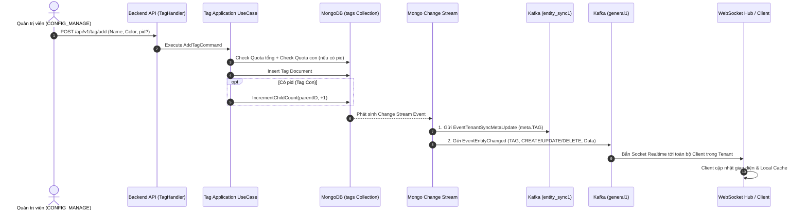

# Tag Management Workflow Documentation (Kiến Trúc Tag 2 Cấp)

Tài liệu này đặc tả toàn bộ quy trình nghiệp vụ (Business Rules), kiến trúc phân cấp 2 tầng (Tag Cha/Nhóm $\rightarrow$ Tag Con), luồng xử lý (Step-by-Step Flow), sơ đồ Mermaid và đặc tả API của phân hệ **Thẻ Phân Loại (Tag Module)** trong hệ thống Sowfkun-Verse.

---

## 1. Tổng quan & Quy tắc Nghiệp vụ Đặc thù (Business Rules)

### 1.1 Kiến Trúc Phân Cấp 2 Tầng (Self-Referencing Flat Model)
- Phân hệ Tag tổ chức theo mô hình **phẳng tự tham chiếu (Self-Referencing Flat Model)** trong duy nhất 1 collection `tags` trên database `dbConfig1`.
- Mỗi Tag bao gồm:
  - `ParentID` (`pid`):
    - `pid == ""` (hoặc omit): **Tag Cha (Cấp 1 / Nhóm Tag)**.
    - `pid != ""`: **Tag Con (Cấp 2 / Nhãn chi tiết)** mang Hex ID của Tag Cha.
  - `ChildCount` (`child_count`): Số lượng tag con trực thuộc nhóm cha, cập nhật nguyên tử qua `$inc`.
  - `Name` (`name`): Tên nhãn / tên nhóm.
  - `Description` (`desc`): Mô tả.
  - `Color` (`color`): Mã màu HEX (`#FFFFFF`).
  - `EntityTypes` (`entity_types`): Danh sách các thực thể áp dụng (`CUSTOMER`, `TICKET`,...).
- **Khóa Độ Sâu (Max Depth = 2)**: Tuyệt đối không cho phép tạo cấp 3 (Tag Con không được phép làm cha của tag khác).
- **Cố Định Nhóm Cha (Immutable Parent)**: Khi đã tạo, `ParentID` là cố định, không được phép chuyển nhóm cha khi gọi API update.

### 1.2 Kiểm Soát Quota 2 Tầng (Quota & Limits)
1. **Tầng 1 - Quota Tổng Tenant (`LimitMaxTags`)**:
   - Mọi Tag (dù là Cha hay Con) đều là 1 document độc lập $\rightarrow$ được tính chung vào Quota gói của Tenant (`TRIAL`: 20, `BASIC`: 100, `PRO`: 500).
2. **Tầng 2 - Giới Hạn Tag Con trên 1 Cha (`LimitMaxChildTagsPerParent`)**:
   - Giới hạn tối đa **30** tag con / 1 nhóm cha để đảm bảo giao diện gọn gàng.

### 1.3 Cơ Chế Xóa & Cascade Soft-Delete
- **Xóa Tag Cha**: Hệ thống tự động tìm và xóa mềm toàn bộ các Tag Con trực thuộc (`SoftDeleteManyIDs`), đồng thời giải phóng $1 + N$ slot Quota cho Tenant.
- **Xóa Tag Con Lẻ**: Xóa mềm tag con và tự động giảm `child_count` của nhóm cha tương ứng (`IncrementChildCount(parentID, -count)`).

### 1.4 Chốt chặn Phân quyền (Authorization Barrier)
- **API Ghi Dữ liệu (CUD - Add/Update/Delete)**: Bắt buộc đi qua kiểm tra quyền `CONFIG_MANAGE` thông qua `RequirePermission(string(roleDomain.PermConfigManage))`.
- **API Đọc Dữ liệu (Read/List/Detail/Options)**: Xác thực đăng nhập `RequireAuth` (công khai cho toàn bộ nhân sự trong Tenant để hiển thị Dropdown/Filter).

### 1.5 Quy tắc Options API (Golden Standard)
- **Endpoint**: `GET /api/v1/tag/list-for-options`.
- **Projection Ép Cứng**:
  ```go
  req.Projection = map[string]any{
      "pid":          1,
      "name":         1,
      "color":        1,
      "entity_types": 1,
  }
  ```
- **Local Caching & Grouping**: Trả về danh sách kèm `pid` để Client cache phẳng và tự động nhóm cha $\rightarrow$ con trên Dropdown / Cascader.

### 1.6 Cơ chế Đồng bộ Real-time (Kafka & WebSocket)
- **Kafka `entity_sync1`**: Khi có thay đổi (`insert`, `update`, `delete`), gửi sự kiện `EventTenantSyncMetaUpdate` (`entity_type = "TAG"`) sang Tenant domain để cập nhật `tenant.meta.TAG = nowMs`.
- **Kafka `general1` & WebSocket**: Phát sóng sự kiện `EventEntityChanged` (`EntityType: TAG`, `OpType: CREATE/UPDATE/DELETE`) kèm `TagBriefResponse` (chứa `id`, `pid`, `child_count`, `name`, `color`, `entity_types`) để Client cập nhật realtime ngay tức thì.

---

## 2. Sơ Đồ Quy Trình (Mermaid Flow)



---

## 3. Đặc tả Kỹ thuật API (API Specification)

### 3.1 `POST /api/v1/tag/list`
- **Mô tả**: Lấy danh sách Tag phân trang. Mặc định chỉ lấy Tag Cha (`pid == ""`).
- **Request Body**:
  ```json
  {
    "page": 1,
    "size": 20,
    "keyword": "VIP",
    "pid": ""
  }
  ```
- **Response `200 OK`**:
  ```json
  {
    "data": {
      "items": [
        {
          "id": "65c1234567890abcdef12345",
          "pid": "",
          "child_count": 3,
          "name": "Nguồn khách",
          "desc": "Phân loại theo nguồn",
          "color": "#1877F2",
          "entity_types": ["CUSTOMER"]
        }
      ],
      "total": 1,
      "page": 1,
      "size": 20
    },
    "error_code": "",
    "error_detail": ""
  }
  ```

### 3.2 `GET /api/v1/tag/detail?id=...`
- **Mô tả**: Xem thông tin chi tiết Tag Cha và danh sách toàn bộ các Tag Con trực thuộc.
- **Response `200 OK`**:
  ```json
  {
    "data": {
      "id": "65c1234567890abcdef12345",
      "pid": "",
      "child_count": 2,
      "name": "Nguồn khách",
      "desc": "Phân loại theo nguồn",
      "color": "#1877F2",
      "entity_types": ["CUSTOMER"],
      "children": [
        {
          "id": "65c1234567890abcdef12346",
          "pid": "65c1234567890abcdef12345",
          "name": "Facebook Ads",
          "color": "#1877F2",
          "entity_types": ["CUSTOMER"]
        },
        {
          "id": "65c1234567890abcdef12347",
          "pid": "65c1234567890abcdef12345",
          "name": "Google Ads",
          "color": "#EA4335",
          "entity_types": ["CUSTOMER"]
        }
      ]
    },
    "error_code": "",
    "error_detail": ""
  }
  ```

### 3.3 `GET /api/v1/tag/list-for-options`
- **Mô tả**: Lấy danh sách toàn bộ Tag của Tenant phục vụ hiển thị Dropdown, lọc danh sách và nạp Local Cache.
- **Response `200 OK`**:
  ```json
  {
    "data": [
      {
        "id": "65c1234567890abcdef12345",
        "pid": "",
        "child_count": 2,
        "name": "Nguồn khách",
        "color": "#1877F2",
        "entity_types": ["CUSTOMER"]
      },
      {
        "id": "65c1234567890abcdef12346",
        "pid": "65c1234567890abcdef12345",
        "name": "Facebook Ads",
        "color": "#1877F2",
        "entity_types": ["CUSTOMER"]
      }
    ],
    "error_code": "",
    "error_detail": ""
  }
  ```

### 3.4 `POST /api/v1/tag/add`
- **Mô tả**: Thêm mới Tag Cha (nếu `pid` rỗng) hoặc Tag Con (nếu có `pid`).
- **Request Body**:
  ```json
  {
    "pid": "65c1234567890abcdef12345",
    "entity_type": "CUSTOMER",
    "name": "Zalo OA",
    "desc": "Khách từ Zalo",
    "color": "#0068FF"
  }
  ```

### 3.5 `POST /api/v1/tag/update`
- **Mô tả**: Cập nhật thông tin Tag (không cho phép đổi `pid`).
- **Request Body**:
  ```json
  {
    "id": "65c1234567890abcdef12346",
    "name": "Facebook Ads VIP",
    "desc": "Khách trả phí cao",
    "color": "#1877F2"
  }
  ```

### 3.6 `POST /api/v1/tag/delete`
- **Mô tả**: Xóa mềm một hoặc nhiều Tag (hỗ trợ Cascade Soft-Delete khi xóa cha).
- **Request Body**:
  ```json
  {
    "ids": ["65c1234567890abcdef12345"]
  }
  ```

---

## 4. Các Mã Lỗi Thường Gặp (Common Error Codes)

| HTTP Status | Mã Lỗi (`error_code`) | Ý nghĩa & Hướng xử lý |
| :--- | :--- | :--- |
| `400 Bad Request` | `ERR_BAD_REQUEST` | Payload không hợp lệ hoặc thiếu trường bắt buộc. |
| `400 Bad Request` | `ERR_TAG_PARENT_NOT_FOUND` | Không tìm thấy Tag Cha tương ứng trong Tenant. |
| `400 Bad Request` | `ERR_TAG_MAX_DEPTH_EXCEEDED` | Vượt quá độ sâu tối đa 2 cấp (không thể tạo con của tag con). |
| `400 Bad Request` | `ERR_TAG_CHILD_LIMIT_EXCEEDED` | Vượt quá giới hạn số lượng tag con trên 1 nhóm cha (tối đa 30). |
| `400 Bad Request` | `ERR_TAG_QUOTA_EXCEEDED` | Vượt quá giới hạn tổng số lượng Tag cho phép theo Tier của Tenant. |
| `401 Unauthorized` | `ERR_UNAUTHORIZED` | Token JWT thiếu, hết hạn hoặc không hợp lệ. |
| `403 Forbidden` | `ERR_FORBIDDEN` | Tài khoản thiếu quyền `CONFIG_MANAGE`. |
| `404 Not Found` | `ERR_TAG_NOT_FOUND` | Không tìm thấy Tag cần thao tác. |
| `422 Unprocessable` | `ERR_VALIDATION_FAILED` | Định dạng màu HEX hoặc dữ liệu không hợp lệ. |
| `500 Internal Error` | `ERR_INTERNAL_SERVER` | Lỗi máy chủ hoặc lỗi cơ sở dữ liệu MongoDB. |
