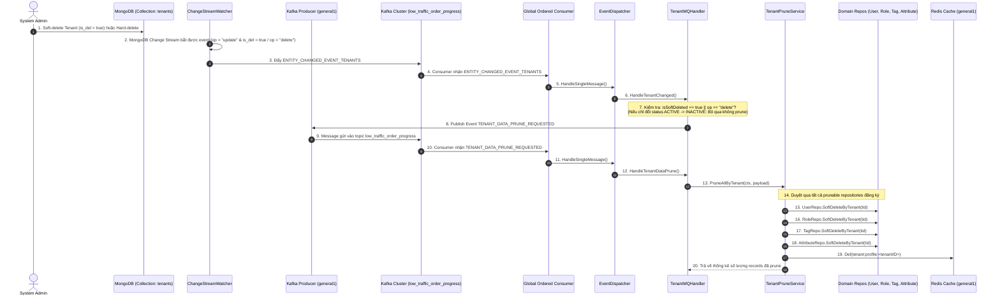

# Tenant Data Prune Workflow Documentation

Tài liệu này đặc tả quy trình vận hành, kiến trúc và luồng xử lý dọn dẹp dữ liệu theo Tenant (Tenant Data Pruning / Soft Delete) theo mô hình Event-Driven trong hệ thống Sowfkun-Verse.

---

## 1. Tổng quan & Quy tắc Nghiệp vụ Đặc thù (Overview & Business Rules)

Dịch vụ Prune dữ liệu theo Tenant (`TenantPruneService`) áp dụng các luật thép và nguyên tắc bảo vệ dữ liệu sau:

### 1.1 Ranh giới Kích hoạt Prune (Strict Prune Trigger Boundary)
- **CHỈ KÍCH HOẠT PRUNE** khi Tenant bị **Xóa vĩnh viễn (Hard Delete)** hoặc **Đánh dấu xóa mềm (Soft Delete: `is_del = true`)**.
- **TUYỆT ĐỐI KHÔNG PRUNE** khi Tenant chỉ chuyển trạng thái tạm khóa/tạm dừng (**`INACTIVE`** hoặc **`SUSPENDED`**) nhằm bảo toàn 100% dữ liệu của khách hàng đang tạm khóa dịch vụ.

### 1.2 Kiến trúc Bất đồng bộ Hướng sự kiện (Event-Driven & Decoupled Architecture)
- Quá trình Prune không chạy đồng bộ trong request HTTP nhằm tránh timeout và sập RAM khi một doanh nghiệp có số lượng bản ghi lớn.
- Khi MongoDB Change Stream phát hiện bản ghi Tenant bị xóa hoặc có trường `is_del = true`, `TenantMQHandler` sẽ xuất bản sự kiện `TENANT_DATA_PRUNE_REQUESTED` vào Kafka topic `low_traffic_order_progress`.

### 1.3 Soft Delete Trực tiếp tại Database (Database-Level Batch Soft Delete)
- Tối ưu hóa hiệu năng tầng MongoDB thông qua phương thức `SoftDeleteByTenant(ctx, tenantID, updateData)`.
- Thực thi lệnh `UpdateMany` trực tiếp trên điều kiện `{ "tid": tenantID, "is_del": { "$ne": true } }`, thiết lập `{ "is_del": true, "u_at": now, "u_by": actor }`.
- **Zero-Waste RAM**: Không tải toàn bộ documents lên RAM trước khi xóa, bảo vệ máy chủ khỏi nguy cơ Out-Of-Memory.

### 1.4 Dọn dẹp Cache Hợp nhất (Cache Purge)
- Sau khi soft-delete dữ liệu trên các collections, service tự động xóa toàn bộ cache keys liên quan tới Tenant trên cụm Redis `general1` (`tenant:profile:<tenantID>`, v.v.).

---

## 2. Quy trình Từng bước (Step-by-Step Flow)



---

## 3. Đặc tả Kỹ thuật & Data Models (Technical Specification)

### 3.1 Event Type Constants (`pkg/core/domain/event.go`)

```go
const (
    // EventTenantDataPruneRequested là sự kiện yêu cầu soft-delete toàn bộ dữ liệu của Tenant khi Tenant bị xóa hoặc soft-delete
    EventTenantDataPruneRequested = "TENANT_DATA_PRUNE_REQUESTED"
)
```

### 3.2 Payload DTO Model (`pkg/core/domain/event.go`)

```go
type TenantDataPrunePayload struct {
    TenantID  string `json:"tid"`              // ID Tenant cần dọn dẹp
    Reason    string `json:"reason,omitempty"` // Lý do prune (ví dụ: tenant_deleted, tenant_soft_deleted)
    Actor     *Actor `json:"actor,omitempty"`  // Thông tin Admin/User thực hiện thao tác
    Timestamp int64  `json:"ts"`               // Thời điểm yêu cầu (UTC Unix Milliseconds)
}
```

### 3.3 Abstract Repository Method (`pkg/database/mongodb/abstract_repository.go`)

```go
func (r *AbstractMongoRepository[T]) SoftDeleteByTenant(ctx context.Context, tenantID string, deletedInfo map[string]any) (int64, error)
```
- **Filter**: `bson.M{"tid": tenantID, "is_del": bson.M{"$ne": true}}`
- **Update**: `bson.M{"$set": bson.M{"is_del": true, "u_at": now, ...deletedInfo}}`

### 3.4 Danh sách Entities hỗ trợ Prune

| Domain / Collection | Database | Repository Method |
| :--- | :--- | :--- |
| `users` | `tenant` | `IUserRepository.SoftDeleteByTenant` |
| `roles` | `tenant` | `IRoleRepository.SoftDeleteByTenant` |
| `tags` | `app_config` | `ITagRepository.SoftDeleteByTenant` |
| `entity_attribute_sets` | `app_config` | `IAttributeRepository.SoftDeleteByTenant` |

---

## 4. Các Tình huống Xử lý & Kháng Lỗi (Error Scenarios & Fault Tolerance)

| Tình huống | Hành vi hệ thống |
| :--- | :--- |
| **Tenant chuyển trạng thái `INACTIVE` / `SUSPENDED`** | `HandleTenantChanged` phát hiện `is_del != true`, tuyệt đối **không** sinh event `TENANT_DATA_PRUNE_REQUESTED`. Dữ liệu được bảo toàn. |
| **Tenant không có dữ liệu ở một số collection** | `SoftDeleteByTenant` trả về `ModifiedCount = 0`, không gây lỗi, tiếp tục prune các entity tiếp theo. |
| **Một repository gặp lỗi DB khi prune** | `TenantPruneService` ghi nhận warning log (`⚠️ Failed to prune...`), tiếp tục xử lý các repository còn lại mà không làm sập tiến trình chung. |
| **Payload Kafka thiếu `TenantID`** | Handler và Service kiểm tra rỗng, bỏ qua an toàn để tránh soft-delete toàn bộ cơ sở dữ liệu. |
