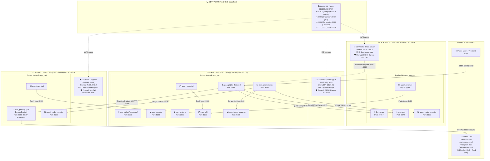
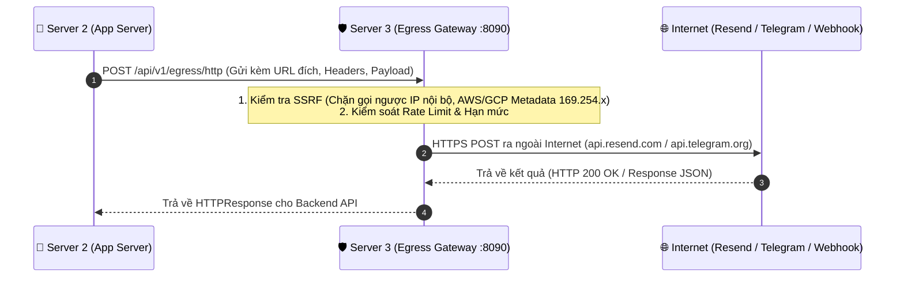
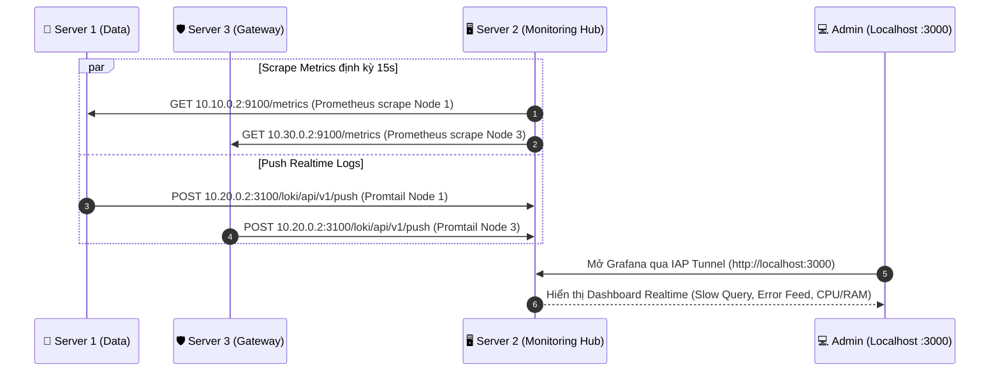

# GCP Multi-Server Deployment, VPC Peering & Zero-Trust Topology

Tài liệu đặc tả toàn diện kiến trúc kết nối mạng, luồng dữ liệu và chính sách bảo mật Zero-Trust giữa các máy chủ trên nền tảng **Google Cloud Platform (GCP)** với mô hình **3-Server Multi-Account / Multi-VPC Peering**.

---

## 1. Sơ Đồ Tổng Thể Kết Nối Giữa Các Server (Network Topology)



---

## 2. Ma Trận Quyền Kết Nối Giữa Các Node (Connectivity Matrix)

Bảng dưới đây quy định chi tiết **Node nào được phép gọi sang Node nào**, qua Cổng (Port), Giao thức và Mục đích nghiệp vụ:

| Từ Node (Source) | Tới Node (Destination) | Cổng (Port) | Giao Thức | Chiều (Flow) | Mục Đích Nghiệp Vụ |
|---|---|---|---|---|---|
| **Server 2 (`10.20.0.2`)** | **Server 1 (`10.10.0.2`)** | `27017` | TCP | Peering Ingress/Egress | Backend API truy vấn MongoDB (Primary Cluster) |
| **Server 2 (`10.20.0.2`)** | **Server 1 (`10.10.0.2`)** | `6379` | TCP | Peering Ingress/Egress | Backend API đọc/ghi Redis Cache (`general1`) |
| **Server 2 (`10.20.0.2`)** | **Server 1 (`10.10.0.2`)** | `9100` | TCP | Peering Ingress/Egress | Prometheus thu thập chỉ số CPU/RAM Node Exporter |
| **Server 2 (`10.20.0.2`)** | **Server 3 (`10.30.0.2`)** | `8090` | TCP | Peering Ingress/Egress | Backend API gửi request qua Egress Gateway (Email, Webhook, SMS, Telegram) |
| **Server 2 (`10.20.0.2`)** | **Server 3 (`10.30.0.2`)** | `9100` | TCP | Peering Ingress/Egress | Prometheus thu thập chỉ số CPU/RAM Node Exporter |
| **Server 1 (`10.10.0.2`)** | **Server 2 (`10.20.0.2`)** | `3100` | TCP | Peering Ingress/Egress | Promtail đẩy toàn bộ Container Logs MongoDB/Redis về Loki Hub |
| **Server 1 (`10.10.0.2`)** | **Server 2 (`10.20.0.2`)** | `8080` | TCP | Peering Ingress/Egress | Script cảnh báo `monitor.sh` chuyển tiếp alert Telegram qua API Gateway |
| **Server 3 (`10.30.0.2`)** | **Server 2 (`10.20.0.2`)** | `3100` | TCP | Peering Ingress/Egress | Promtail đẩy Container Logs Egress Gateway về Loki Hub |
| **Server 3 (`10.30.0.2`)** | **Internet (`0.0.0.0/0`)** | `80, 443` | TCP | Outbound Egress | Gateway thực thi gửi request ra Internet (Resend API, Telegram API, Webhooks) |
| **Google IAP (`35.235.240.0/20`)** | **Server 1 (`10.10.0.2`)** | `22, 27017, 6379, 9100` | TCP | Secure Tunnel | Dev/Admin kết nối SSH, MongoDB Compass, RedisInsight, Metrics |
| **Google IAP (`35.235.240.0/20`)** | **Server 2 (`10.20.0.2`)** | `22, 3000, 3100, 8080, 8085, 9090, 9092, 9100` | TCP | Secure Tunnel | Dev/Admin kết nối SSH, Grafana (:3000), Kafka Console (:8085), API (:8080) |
| **Google IAP (`35.235.240.0/20`)** | **Server 3 (`10.30.0.2`)** | `22, 8090, 9100` | TCP | Secure Tunnel | Dev/Admin kết nối SSH, Egress Gateway (:8090), Metrics (:9100) |
| **Tất cả Servers** | **Google Internal DNS / NTP** | `53, 123` | UDP | Egress System | Đồng bộ giờ UTC qua `time.google.com` (`216.239.35.0/24`) & phân giải tên miền (`169.254.169.254/32`) |

---

## 3. Các Luồng Dữ Liệu Trọng Yếu (Critical Data Flows)

### 3.1. Luồng Gửi Email & Webhook Ra Internet (Zero-Trust Egress Flow)



### 3.2. Luồng Thu Thập Log & Metrics Tập Trung (Central Observability Flow)



---

## 4. Tường Lửa & Chính Sách Cách Ly (Zero-Trust Firewall Policy)

### 🚫 Quy Tắc Chặn Toàn Bộ Kết Nối Trực Tiếp Ra Internet:
- **Server 1 (Data Server)**: Khóa cứng `DENY Egress 0.0.0.0/0` (`Priority 1000`). Bất kỳ mã độc nào xâm nhập cũng **không thể** gửi dữ liệu ra ngoài Internet (chống Reverse Shell và Data Exfiltration 100%).
- **Server 2 (App Server)**: Khóa cứng `DENY Egress 0.0.0.0/0` (`Priority 1000`). Toàn bộ kết nối ra bên ngoài bắt buộc phải đi qua **Server 3 (Egress Gateway)**.
- **Server 3 (Egress Gateway)**: Máy chủ duy nhất được phép mở Egress HTTP/HTTPS ra ngoài Internet, được bảo vệ nghiêm ngặt bằng bộ lọc SSRF Engine (`pkg/egress/ssrf.go`).

### 🔑 Quản Lý Truy Cập Bảo Mật Không Cần Mở Port Public (Google IAP):
- Tất cả các cổng quản trị (`22`, `3000`, `8085`, `9090`, `27017`, `6379`) đều được đóng kín đối với toàn thế giới (`0.0.0.0/0`).
- Chỉ lập trình viên/quản trị viên sở hữu tài khoản Google được cấp quyền IAM mới có thể mở Tunnel kết nối trực tiếp qua lệnh:
  ```powershell
  .\tools\sowfkun.ps1 verse-tunnel
  ```
