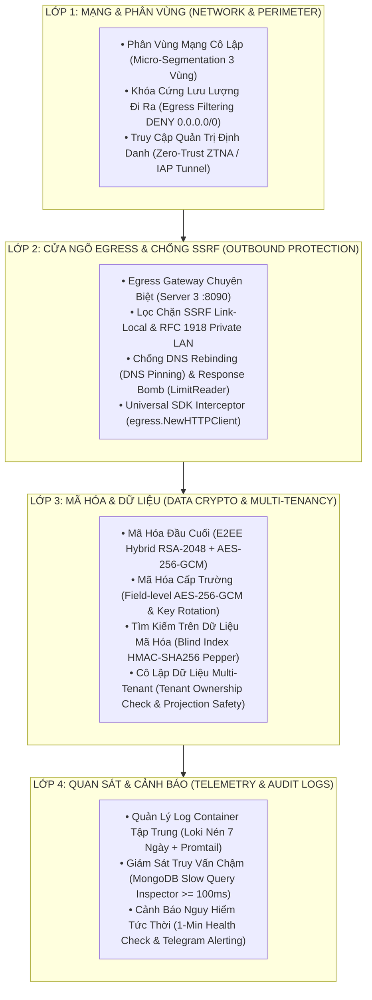

# 🛡️ Kiến Trúc Bảo Mật & Tiêu Chuẩn Kiểm Soát An Ninh Toàn Diện
## (Enterprise Security Architecture & Defense-in-Depth Checklist)

Tài liệu này chuẩn hóa toàn bộ các lớp phòng thủ an ninh thông tin theo mô hình **Phòng Thủ Chiều Sâu (Defense-in-Depth)** và **Không Tin Tưởng Bất Kỳ Ai (Zero-Trust Architecture - ZTA)**, sử dụng thuật ngữ bảo mật tiêu chuẩn quốc tế áp dụng thống nhất cho cả môi trường **Cloud (GCP, AWS, Azure)** và **On-Premise (Private DataCenter, Bare-Metal Server, Nội Bộ Doanh Nghiệp)**.

---

## 📊 Bảng Ma Trận Đối Chiếu Thuật Ngữ & Tiêu Chuẩn Kiểm Soát (Cross-Environment Mapping)

| Lĩnh Vực / Lớp Bảo Mật | Thuật Ngữ Chuẩn Quốc Tế (Universal Term) | Triển Khai On-Premise / Private DC | Triển Khai Cloud (GCP / AWS) | Trạng Thái |
| :--- | :--- | :--- | :--- | :---: |
| **Phân vùng mạng** | **Network Micro-Segmentation** | Tách 3 VLAN độc lập: Data VLAN (`10.10.0.0/24`), App VLAN (`10.20.0.0/24`), DMZ/Egress VLAN (`10.30.0.0/24`) | Multi-VPC Peering (`data-server-vpc`, `app-server-vpc`, `egress-gateway-vpc`) | ✅ **DONE** |
| **Khóa chiều đi ra** | **Strict Zero-Trust Egress Filtering** | Tường lửa Router/pfSense/UFW: `DENY ALL Outbound 0.0.0.0/0` trên Data & App VLAN | GCP Firewall Rule: `DENY Egress 0.0.0.0/0 Priority 1000` | ✅ **DONE** |
| **Quản trị an toàn** | **Zero-Trust Network Access (ZTNA) / Identity-Aware Tunnel** | VPN nội bộ (WireGuard, Tailscale) hoặc SSH Bastion Host có MFA | Google IAP (Identity-Aware Proxy `35.235.240.0/20`) | ✅ **DONE** |
| **Đặc quyền tối thiểu** | **Principle of Least Privilege (PoLP) & Host Hardening** | Gỡ bỏ root SSH, khóa sudo theo role, vô hiệu hóa credentials hệ điều hành dư thừa | Gỡ bỏ GCP Service Account (`--no-service-account --no-scopes`) | ✅ **DONE** |
| **Cổng Egress an toàn** | **Secure Egress Gateway & SSRF Firewall** | Server 3 đóng vai trò DMZ Outbound Proxy, tích hợp bộ lọc chặn Private LAN & DNS Rebinding | Egress Gateway Container (`cmd/gateway` :8090) trên Server 3 | ✅ **DONE** |
| **Bảo vệ SDK ngoại** | **Transparent Egress Interception** | `egress.NewHTTPClient()` định tuyến mọi thư viện HTTP/SDK nội bộ qua DMZ Proxy | `egress.NewHTTPClient()` định tuyến Resend, Telegram, AWS SDK qua Gateway Server 3 | ✅ **DONE** |
| **Mã hóa lưu trữ** | **Application-Level Field Encryption & Blind Index** | AES-256-GCM cho trường dữ liệu nhạy cảm (SĐT/Email) + HMAC Blind Index Pepper tìm kiếm | AES-256-GCM + Blind Index HMAC-SHA256 Pepper trên Database MongoDB | ✅ **DONE** |
| **Mã hóa đường truyền** | **Hybrid End-to-End Encryption (E2EE)** | Khóa lai RSA-2048 + AES-256-GCM bảo vệ payload JSON giữa Client & Server | Khóa lai RSA-2048 + AES-256-GCM bảo vệ payload Web/Mobile | ✅ **DONE** |
| **Bảo vệ trình duyệt** | **Browser Security Headers & Clickjacking Defense** | `SecurityHeadersMiddleware`: `X-Frame-Options: DENY`, `nosniff`, `HSTS`, `Referrer-Policy` | `SecurityHeadersMiddleware` chèn headers chuẩn vào 100% response | ✅ **DONE** |
| **Chống DoS bộ nhớ** | **Payload Size Limiting (OOM Mitigation)** | `http.MaxBytesReader` giới hạn tối đa 2MB cho Request Body | `http.MaxBytesReader` giới hạn 2MB tại Payload & Danger Middleware | ✅ **DONE** |
| **Che giấu dữ liệu Log**| **PII & Secret Sanitization in Logs** | `sanitizeRequestBody` tự động mask password, token, otp thành `***MASKED***` | Mask trường nhạy cảm trước khi lưu Kafka/OpenSearch | ✅ **DONE** |
| **Cô lập dữ liệu** | **Multi-Tenant Logical Isolation & Boundary Safety** | Kiểm tra quyền sở hữu Tenant ID tại UseCase & Projection Safety (`tid`, `is_del`) | Kiểm tra quyền sở hữu Tenant ID tại UseCase & Projection Safety (`tid`, `is_del`) | ✅ **DONE** |
| **Quan sát & Cảnh báo** | **Continuous Health Telemetry & Air-Gapped Alerting** | `monitor.sh` (1m check nguy hiểm, 3h report định kỳ), MongoDB Profiling Level 1 (`slowms: 300ms`), Egress Gateway `:8090` | `monitor.sh` quét 1m, báo cáo 3h, gửi 1 chiều qua Egress Gateway `:8090` | ✅ **DONE** |
| **Cách ly 1 chiều DMZ** | **True One-Way Air-Gapped DMZ Matrix** | IPTables chain `AIRGAP-INPUT` / `AIRGAP-OUTPUT` khóa 100% kết nối chủ động từ Gateway/Data/Cache ngược vào Core App | IPTables Host Kernel + Multi-VPC Ingress/Egress Deny Rules | ✅ **DONE** |

---

## 🏛️ 1. Chi Tiết Các Lớp Phòng Thủ Đã Hoàn Thành (Defense Layers)

---

### 🌐 LỚP 1: BẢO MẬT HẠ TẦNG MẠNG & PHÂN VÙNG (Network Micro-Segmentation)

1. **Phân Vùng 3 Vùng Mạng Cô Lập (3-Tier Network Segmentation)**:
   - **Vùng Dữ Liệu (Data Zone - `10.10.0.0/24`)**: Chỉ chạy MongoDB và Redis Cache, không có bất kỳ IP Public hay quyền ra Internet nào.
   - **Vùng Ứng Dụng (App Zone - `10.20.0.0/24`)**: Chạy Go API Backend, Kafka Message Broker, và Trung tâm Giám sát Grafana/Loki/Prometheus.
   - **Vùng Cửa Ngõ Ra Ngoài (DMZ / Egress Zone - `10.30.0.0/24`)**: Chạy máy chủ Egress Gateway duy nhất có quyền gửi lưu lượng ra Internet bên ngoài.
2. **Khóa Cứng Lưu Lượng Internet Đi Ra (Strict Zero-Trust Egress Deny)**:
   - Toàn bộ máy chủ thuộc Vùng Dữ Liệu và Vùng Ứng Dụng bị áp dụng chính sách **`DENY ALL Outbound 0.0.0.0/0`**. Ngăn ngừa tuyệt đối nguy cơ hacker mở kết nối điều khiển từ xa (Reverse Shell) hoặc âm thầm gửi trộm dữ liệu khách hàng ra máy chủ bên ngoài (Data Exfiltration).
3. **Kênh Truy Cập Quản Trị Xác Thực Định Danh (Zero-Trust Network Access - ZTNA)**:
   - Toàn bộ các cổng dịch vụ quản trị (`22`, `3000`, `3100`, `8085`, `9090`, `9092`, `9100`, `27017`, `6379`) đều được đóng kín 100% đối với Internet toàn cầu.
   - Quản trị viên/Lập trình viên chỉ có thể truy cập thông qua kênh hầm mã hóa có chứng thực danh tính (Google IAP / ZTNA Tunnel).
4. **Nguyên Tắc Đặc Quyền Tối Thiểu (Principle of Least Privilege - PoLP)**:
   - Máy chủ bị tước bỏ toàn bộ Service Account và Token hệ điều hành dư thừa (`--no-service-account --no-scopes`), vô hiệu hóa hoàn toàn nguy cơ chiếm quyền Cloud Project / Host OS nếu máy chủ bị xâm nhập.

---

### 🛡️ LỚP 2: CỬA NGÕ RA NGOÀI & PHÒNG CHỐNG SSRF (Secure Egress Gateway & SSRF Defense)

1. **Máy Chủ Cửa Ngõ Egress Chuyên Biệt (Dedicated Egress Gateway Service)**:
   - Mọi kết nối ra ngoài Internet (gửi Email Resend, Telegram Alerts, SMS OTP, Webhooks, Third-party APIs) đều phải tập trung định tuyến qua Server 3 (`10.30.0.2:8090`).
2. **Bộ Lọc Chống Tấn Công SSRF Đa Tầng (Multi-Layer SSRF Defense Engine)**:
   - **Chặn dải Cloud Metadata**: Tự động chặn toàn bộ yêu cầu phân giải và kết nối tới IP Link-Local `169.254.0.0/16` (Cloud Metadata AWS/GCP `169.254.169.254`).
   - **Chặn dải mạng nội bộ (RFC 1918 Private IP)**: Chặn `10.0.0.0/8`, `172.16.0.0/12`, `192.168.0.0/16`, Loopback `127.0.0.0/8`, Carrier-grade NAT `100.64.0.0/10`, và IPv6 ULA.
3. **Chống Tấn Công Đổi DNS (DNS Rebinding Mitigation via DNS Pinning)**:
   - Phân giải DNS và kiểm tra IP hợp lệ trước, sau đó ép buộc socket TCP kết nối trực tiếp đến IP đã ghim thông qua `net.Dialer.Control`, ngăn chặn việc thay đổi DNS ở thời điểm giữa lúc kiểm tra và khi bắt tay TCP.
4. **Chống Tấn Công Tràn Bộ Nhớ (Response Bomb Mitigation)**:
   - Giới hạn dung lượng nhận phản hồi tối đa bằng `io.LimitReader` (mặc định 2MB) để tránh việc máy chủ bị tấn công tràn RAM (OOM Crash).
5. **Bộ Chuyển Hướng SDK Trong Suốt (Universal SDK Egress Interceptor)**:
   - Hàm tiện ích `egress.NewHTTPClient()` cung cấp `http.RoundTripper` tùy biến, tự động bọc và chuyển hướng mọi SDK của bên thứ 3 (Resend Email, Telegram, AWS SDK, Stripe, Twilio) xuyên qua Egress Gateway mà không làm thay đổi cách gọi hàm nghiệp vụ.

---

### 🔐 LỚP 3: MÃ HÓA ỨNG DỤNG & CÔ LẬP DỮ LIỆU (Data Cryptography & Multi-Tenancy)

1. **Mã Hóa Đầu Cuối, Chống Replay & Ngụy Trang Header (E2EE, Anti-Replay & Camouflage)**:
   - Cơ chế bắt tay lai RSA-2048 và AES-256-GCM bảo vệ toàn bộ dữ liệu JSON giữa Client và Server.
   - **Ngụy trang Header & Chim mồi (Noise Injection):** Session ID ngụy trang thành `X-Trace-Context` (không fallback), đi kèm các header chim mồi bắt buộc `X-Session-ID` (giả lập), `X-Edge-Routing`, `X-Client-Fingerprint`, `X-Device-Entropy` để chống botnet/crawler.
   - **Chống Tấn Công Phát Lại (Anti-Replay trên CUD):** Request body bọc thành envelope `{ts, nonce, payload}` mã hóa AES-256-GCM. Backend kiểm tra Freshness 5 phút và chống trùng nonce qua Redis `SetNX` (`replay_nonce:<session_id>:<ts>:<nonce>`).
2. **Mã Hóa Cấp Trường Khi Lưu Trữ (Field-Level Encryption at Rest)**:
   - Các trường dữ liệu nhạy cảm (Số điện thoại, Email cá nhân) được mã hóa bằng AES-256-GCM với khóa luân phiên `DATABASE_ENCRYPTION_KEY_v1` trước khi lưu vào MongoDB.
3. **Tìm Kiếm Trên Dữ Liệu Mã Hóa (Searchable Encryption via Blind Index)**:
   - Sử dụng mã băm HMAC-SHA256 kết hợp chuỗi gia vị bí mật (`BLIND_INDEX_PEPPER`) để tạo chỉ mục mù (Blind Index), cho phép tìm kiếm chính xác mà không cần giải mã dữ liệu trên Database.
4. **Cô Lập Dữ Liệu Đa Khách Hàng (Multi-Tenant Access Boundary Enforcement)**:
   - **Tầng UseCase**: Bắt buộc kiểm tra quyền sở hữu `if entity.TenantID != q.TenantID` trên 100% các thao tác đọc/ghi theo ID/Code.
   - **Tầng Repository**: Luôn tự động gán `"tid": 1` và `"is_del": 1` vào Projection map để bảo vệ tính toàn vẹn dữ liệu xác thực quyền sở hữu.
5. **Chống Tấn Công Tần Suất (Multi-Tier Rate Limiting via Redis Token Bucket)**:
   - Áp dụng thuật toán Token Bucket thực thi nguyên tử qua Lua Script trên Redis phân tầng độc lập cho Public, Auth và CUD APIs.
6. **Bộ Header Bảo Vệ Trình Duyệt (Browser Security Headers)**:
   - Middleware `SecurityHeadersMiddleware` tự động chèn `X-Frame-Options: DENY` (chống Clickjacking), `X-Content-Type-Options: nosniff` (chống MIME sniffing), `Strict-Transport-Security` (ép HTTPS 1 năm), `Referrer-Policy`, và `X-Permitted-Cross-Domain-Policies: none` vào 100% API responses.
7. **Chống Tấn Công DoS Bộ Nhớ (Payload Size Limit via `MaxBytesReader` 2MB)**:
   - `PayloadCryptoMiddleware` và `RequestIDMiddleware` giới hạn cứng dung lượng Request Body tối đa 2MB qua `http.MaxBytesReader` nhằm triệt tiêu hoàn toàn nguy cơ tấn công cạn kiệt RAM (OOM DoS Crash).
8. **Danh Sách Trắng CORS Động (Dynamic CORS Whitelist)**:
   - `CorsMiddleware` tự động nạp danh sách tên miền được phép từ biến môi trường `CORS_ALLOWED_ORIGINS` (hoặc `APP_URL`), ngăn chặn các cuộc gọi trái phép và hỗ trợ triển khai On-Premise linh hoạt.

---

### 📈 LỚP 4: GIÁM SÁT AN NINH, TRUY VẾT & CẢNH BÁO (Telemetry, Audit & Alerting)

1. **Ghi Log Tập Trung & Che Giấu Dữ Liệu Nhạy Cảm (OpenSearch Audit & PII Masking)**:
   - Các middleware Danger Log & Customer Activity đẩy log có cấu trúc về Kafka Producer $\rightarrow$ Kafka Consumer ghi nhận tập trung tại cụm OpenSearch.
   - Hàm `sanitizeRequestBody` tự động quét và che giấu các trường nhạy cảm (`password`, `pwd`, `token`, `otp`, `secret`, `api_key`) thành `"***MASKED***"` trước khi lưu log.
2. **Thanh Tra Truy Vấn Chậm Cơ Sở Dữ Liệu (MongoDB Slow Query Profiling)**:
   - Toàn bộ cơ sở dữ liệu nghiệp vụ (`tenant`, `app_system`, `app_config`) được cấu hình tự động **Profiling Level 1 (`slowms: 300ms`)**, lưu vết mọi truy vấn chậm vượt ngưỡng vào collection `system.profile` để kiểm toán hiệu năng và chống ReDoS/Slow Query DoS.
3. **Giám Sát Sức Khỏe & Cảnh Báo Tức Thời (Continuous Health & Danger Alerting)**:
   - Script `monitor.sh` quét nguy hiểm mỗi 1 phút (bắn Telegram `🚨 DANGER` khi CPU/RAM/Disk > 85%, kèm cơ chế chống spam 30 phút và tự động báo `🟢 RECOVERY` khi phục hồi).
   - Tự động gửi bản tin tổng hợp tình trạng hạ tầng `🔵 PERIODIC SUMMARY` mỗi 3 tiếng theo giờ Việt Nam (`+7 GMT`).
4. **Chuyển Tiếp Cảnh Báo An Toàn Qua Egress Gateway (Isolated Air-Gapped Alert Dispatching)**:
   - Mọi máy chủ trong cụm (Server 1 Cache/MQ, Netcup Mongo, Server 2 App) chuyển tiếp bản tin cảnh báo 1 chiều trực tiếp tới **Egress Gateway Server 3 (`:8090`)** $\rightarrow$ Telegram API, loại bỏ hoàn toàn việc Core API Server 2 phải lưu trữ Telegram Token hoặc mở bypass mã hóa.
5. **Ma Trận Cách Ly Một Chiều Tuyệt Đối (True One-Way Air-Gapped DMZ Matrix)**:
   - Cấu hình chuỗi IPTables `AIRGAP-INPUT` và `AIRGAP-OUTPUT` khóa cứng 100% mọi kết nối chủ động khởi tạo từ Egress Gateway, Mongo, hoặc Cache/MQ ngược vào Core App Server, triệt tiêu hoàn toàn nguy cơ quét mạng hoặc nhảy cóc (Lateral Movement) giữa các máy chủ.
